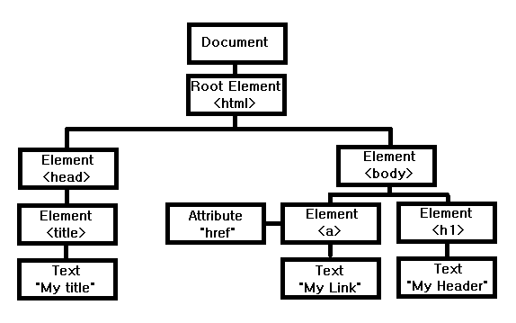

# 리엑트로 배우는 소켓 프로그래밍
<br />

## 01. React (4p)

<font size=2>state of js에서 발표한 프런트엔드 프레임워크의 사용량을 보면 React의 사용량은 지속적으로 증가한 것을 볼 수 있다.</font><br />
<font size=2>React는 페이스북에서 개발한 JavaScript UI 라이브러리이다.</font><br />
<font size=2>어떤 분들은 Framework라 부르기도 한다.</font><br />
<font size=2>특정한 형식을 강제하는 Framework와는 다르게 React는 별도의 기능만을 적용해서 제품을 개발할 수 있게 설계되어있다.</font><br />
<font size=2>여기서 말하는 별도의 기능이 바로 React의 핵심인 UI이다.</font><br /><br />

<font size=2>Angular, Vue.js와 같은 Framework는 MVC(Model-View-Controller) 모델 혹은 MVVM(Model-View-View Model) 모델을 지향한다.</font><br />
<font size=2>이런 모델에 따라 데이터와 뷰가 유기적으로 관리되고 있다.</font><br />
<font size=2>그러나 React는 이런 틀에서 벗어나 오직 사용자에게 보여지는 View만을 생각해서 만들었다.</font><br />
<font size=2>페이스북에서는 이런 View를 사용자 입장에서 어떻게 하면 자연스럽게 보일까 연구하다가 가상 DOM(Virtual DOM)을 생각하게 되었다.</font>
<br /><br /><br />

### Virtual DOM (5p)

<font size=2>DOM(Document Object Model)은 웹 페이지의 구조와 내용을 표현하는 역할을 한다.</font><br />
<font size=2>HTML, CSS와 같은 정적 파일이 브라우저에 렌더링을 시작하면 HTML 코드를 브라우저가 이해할 수 있는 구조로 변환하여 DOM 트리(DOM tree)를 생성한다.</font><br />
<font size=2>DOM 트리는 계층 구조로 표현되어 있어 요소들이 부모-자식 관계로 연결된다.</font><br />



<font size=2>HTML 문서를 파싱하여 DOM 트리를 생성하면 CSS 파일을 파싱하여 CSSOM 트리를 생성한다.</font><br />
<font size=2>그런 다음, DOM 트리와 CSSOM 트리를 결합하여 렌더 트리를 생성한다.</font><br />
<font size=2>렌더 트리는 화면에 실제로 표시되는 요소들을 포함한다.</font><br />
<font size=2>브라우저는 렌더 트리를 이용해 화면에 표시될 영역을 계산하는 레이아웃(리플로우) 과정과 노드를 화면에 픽셀로 변환하는 리페인트 과정을 거쳐 변환된 내용이 화면에 표시되어 사용자에게 웹 페이지가 보여진다.</font><br />


<font size=2>위에서 설명한 과정에 따라 초기에 렌더링된 웹 서비스가 있다고 가정하겠다.</font><br />
<font size=2>이 웹 서비스의 상단에 햄버거 버튼이 있다.</font><br />
<font size=2>사용자가 햄버거 버튼을 누르면 위에서 아래로 사이드 메뉴가 나타난다.</font><br />
<font size=2>이때 나타나는 사이드 메뉴를 CSS의 height로 조작하는데, 이런 과정을 리플로우라고 한다.</font><br />
<font size=2>리플로우는 DOM의 변화로 일어나게 된다.</font><br />
<font size=2>DOM 구조를 변경하는 과정은 일반적으로 빠르게 진행되며, CPU 자원을 적게 소모한다.</font><br />
<font size=2>그러나 DOM 트리의 깊이가 깊고 노드의 수가 많을수록 속도가 떨어진다.</font><br />
<font size=2>여기서 한 가지 생각해볼 문제가 있다.</font><br />
<font size=2>DOM 변화 속도에 왜 노드 수와 트리의 깊이가 영향을 준다는 것일까?</font>
<br /><br /><br />

### 비교 알고리즘 (7p)

<font size=2>DOM을 변경하면 변화된 노드를 찾는 데 시간이 걸린다.</font><br />
<font size=2>앞의 예시처럼 사이드 메뉴의 높이를 담당하는 노드를 찾기 위해서는 Root 노드부터 하나씩 탐색을 시작한다.</font><br />
<font size=2>이때 비교 알고리즘(Diffing Algorithm)이라는 탐색 방법을 사용한다.</font><br />
<font size=2>그래서 노드의 개수가 많고 렌더 트리의 깊이가 깊을수록 시간이 오래 걸린다.</font><br />


<font size=2></font>따라서 변화하는 리페인트, 리플로우 과정을 줄인다면 사용자에게 더 자연스러운 화면과 성능을 제공할 수 있다.<br />

```
DOM은 무조건 느린가?
React가 뜨면서 DOM이 느리다는 의견이 나왔지만 사실 DOM은 충분히 빠르다.
단지 인터렉션이 많거나 많은 변화가 있는 웹 페이지에서는 올바른 성능을 발휘하지 못할 뿐이다.
만약 정적인 페이지라면 오히려 기존 DOM을 이용해서 작업하는 게 좋을 수 있다.
```
<br /><br /><br />

### 가상 DOM의 탄생 (7p)

<font size=2>React 팀은 어떻게 하면 화면을 다시 그리는 리페인트와 리플로우 과정을 개선할 수 있을까 고민하다가 가상 DOM을 생각하게 된다.</font><br />


<font size=2>가상 DOM의 원리는 간단하다.</font><br />
<font size=2>초기에 렌더링된 렌더 트리의 모양과 메모리상에 임시로 저장해둔 렌더 트리의 모양을 비교하는 것이다.</font><br />
<font size=2>여기서 말하는 메모리에 있는 렌더 트리가 바로 가상 DOM이다.</font><br />
<font size=2>하지만 여기서 비교하는 방식은 기존의 비교 알고리즘과 다르다.</font><br />
<font size=2>기존의 비교 알고리즘은 루트 노드부터 비교 분석했지만, React는 변경된 노드만 검색해서 변경 사항을 반영한다.</font><br />
<font size=2>그 변경 사항을 계속해서 실제 DOM에 반영하지 않고 딱 한 번에 몰아서 실제 변경 사항을 반영한다.</font><br />
<font size=2>이런 일련의 과정을 조화(Reconciliation) 과정이라고 한다.</font><br /><br />

<font size=2>가상 DOM을 사용하는 이유는 렌더 트리를 직접 조작하는 것보다 가상 DOM을 수정하여 필요한 변경 사항을 파악하고 반영하는 것이 효율적이기 때문이다.</font><br />
<font size=2>가상 DOM은 메모리상에 존재하기 때문에 실제 DOM을 조작하는 것보다 빠르게 변경 사항을 파악하고 적용할 수 있다.</font><br />
<font size=2>이를 통해 웹 애플리케이션의 성능을 높일 수 있다.</font>
<br /><br /><br />

### React 대표 기능 (8p)

<font size=2>이제는 React를 어떻게 사용하는지 알아보겠다.</font><br />
<font size=2>사실 React 사용법만 제대로 설명하려고 해도 책 한 권 분량이 나온다.</font><br />
<font size=2>이 책에서는 실전에서 바로바로 사용할 수 있는 주요 기능만 설명하려 한다.</font><br />
<font size=2>이 기능을 이용해서 앞으로 진행될 모든 예제를 만들어볼 것이다.</font>
<br /><br /><br />


### React 프로젝트 준비 (8p)

<font size=2>React 프로젝트를 시작하려면 제일 먼저 npm (Node Package Manager)을 설치해야 한다.</font><br />
<font size=2>npm은 nodejs에서 사용할 수 있는 패키지 (소프트웨어) 관리 툴을 말한다.</font><br />
<font size=2>과거에는 필요한 라이브러리가 있다면 직접 다운로드해서 프로젝트에 파일을 삽입하거나 혹은 CDN 주소를 import 했지만</font><br />
<font size=2>이제는 npm에서 제공하는 명령어를 통해서 손쉽게 이용하고 관리할 수 있다.</font><br />

```
 npm install jquery
```

<font size=2>위 명령어는 npm을 이용해서 프로젝트에 jquery를 설치하는 명령어이다.</font><br />
<font size=2>npdejs 사이트에 접속해서 자신의 운영체제에 맞는 LTS 버전을 다운로드한다.</font><br />
<font size=2>아래처럼 터미널에서 nodejs와 npm 버전 정보를 입력해서 정상적으로 출력되면 성공이다.</font><br />

```
 > node -v
 node version 출력
 > npm -v
 npm version 출력
```

<font size=2>이제 위에서 준비한 npm을 이용해서 React 프로젝트를 만든다.</font><br />
<font size=2>React 프로젝트를 시작하기 위해선 npm install react 명령어로 React를 설치하면 된다.</font><br />
<font size=2>그러나 이렇게 설치하면 바펠이나 웹팩 등 다양한 설정을 하나씩 수동으로 해야 되기 때문에 번거롭다.</font><br />
<font size=2>그래서 React 프로젝트를 간단하게 시작할 수 있는 CRA(creat-react-app)라는 간편한 도구를 사용한다.</font><br />
<font size=2>CRA는 React 프로젝트를 개발하는 데 필요한 여러 가지 도구와 설정들이 미리 포함된 종합선물 패키지 역할을 한다.</font><br />
<font size=2>다음에는 CRA를 이요해서 만든 간단한 input 예제를 소개하겠다.</font><br />
<font size=2>input 예제 코드를 보면서 React에서 제공되는 대표 기능을 살펴보겠다.</font><br />

```
vite로 시작하는 React?
React 프로젝트를 간편하게 시작하기 위해서 무조건 CRA를 사용해야 하는 건 아니다.
요즘에는 vite라는 번들링 툴을 이용해서 더욱 빠르게 프로젝트를 시작할 수 있다.
하지만 CRA에서 제공되는 부수적인 기능(lint, pwa 등)이 없기 때문에 따로 설치해야 해서 번거롭다
▪ 참고 : https://vitejs.dev/guide
```
<br /><br /><br />

### React 대표 함수 (10p)

<font size=2>이번 input 예제는 직접 구현하지 않는다.</font><br />
<font size=2>구현된 예제 이미지와 코드를 보면서 React의 기능을 알아보려고 한다.</font><br />
<font size=2>다음 파트에서 더 머진 React 예제를 만들어 볼 것이다.</font><br />
<font size=2>다음 그림의 input 박스는 간단하게 텍스트를 입력받는 기능이 있다.</font><br />
<font size=2>입력받은 내용은 바로 하단에 출력된다.</font><br />
<font size=2>처음에 출력되는 'Hi'는 input 박스의 초기값이다.</font><br />
<font size=2>만약 input 박스에 'Hello'를 입력하면 아래처럼 그대로 노출된다.</font><br />


<font size=2>이제 코드를 살펴보겠다.</font><br />

```
// 1
import React, { useState, useEffect, useRef } from "react";
import ./App.css;

const App = () => {
    // 2
    const textRef = useRef("");
    // 3
    const [ text, setText ] = useState("");
    // 4
    useEffect(() => {
        setText("Hi");
        console.log("once");
    }, []);
    // 5
    useEffect(() => {
        console.log(textRef.current);
    }, [text]);
    // 6
    const onTextStateChangeHandler = (e) => {
        const msg = e.target.value;
        setText(msg);
    };
    return (
        // 7
        <div className="App">
            <input 
                ref={textRef}
                className="text-input"
                type="text"
                value={text}
                onChange={onTextStateChangeHandler}
                placeholder="Enter yout Message"
            />
            <div>Message: {text}</div>
        </div>
    );

    export default App;
}
```

<font size=2>사실 이번 예제의 input 박스는 리엑트 기능을 설명하기 위한 억지스러운 점이 있다.</font><br />
<font size=2>하지만 간단할수록 확실히 이해할 수 있다는 장점이 있다.</font><br />
<font size=2>하나씩 살펴보겠다.</font><br /><br />
<font size=2>1. 상태</font><br />
<font size=2>React의 핵심은 바로 상태(status) 관리이다.</font><br />
<font size=2>React는 상태를 이용해서 모든 변수와 레이어 변화를 다룰 수 있다.</font><br />
<font size=2>이런 상태를 관리하기 위해선 React에서 제공하는 함수를 추가해야 한다.</font><br />
<font size=2>대표적인 함수로는 useState, useEffect, useRef가 있으며 이러한 함수를 훅(hook) 함수라고 한다.</font><br />
<font size=2>React 버전 16.8 이상부터는 함수형 컴포넌트 클래스형 컴포넌트를 대체하는 주요한 방식이 되었다.</font><br />
<font size=2>이전에는 클래스형 컴포넌트를 사용하여 상태 관리와 생명주기 메소드를 다뤘지만, 함수형 컴포넌트에서는 이러한 기능을 훅 함수를 통해 제공한다.</font><br />
<font size=2>또한 사용자가 원하는 커스텀 훅(Custom hook)을 제작할 수도 있다.</font><br /><br />

<font size=2>2. useRef()</font><br />
<font size=2>useRef는 DOM 요소나 컴포넌트 안에서 유지하고 싶은 변수를 관리하는 데 사용된다.</font><br />
<font size=2>useRef로 생성한 변수는 컴포넌트의 모든 렌더링 사이에 값이 유지되며, 필요에 따라 값을 갱신할 수 있다.</font><br />
<font size=2>useRef는 리액트에서 DOM API에 접근할 수 있는 기능을 제공한다.</font><br />
<font size=2>일반적인 자바스크립트 환경이라면 다음과 같이 DOM에 접근해야 한다.</font><br />

```
▪ 자바스크립트 : document.querySelector("input");
▪ 리액트 : const textRef = useRef("");
```

<font size=2>그러나 리액트에서는 useRef를 이용해서 DOM에 접근할 수 있다.</font><br />
<font size=2>예제에서 작성한 input 태그를 보면 ref 속성이 정의된 것을 확인할 수 있다.</font><br />

```
<input
 ref={textRef}
 ...
/>
```

<font size=2>ref에 위에서 작성한 textRef를 추가하면 textRef.current라는 속성으로 input 태그에 접근할 수 있다.</font><br />
<font size=2>주석 5번에서 textRef.current를 console.log()로 출력하고 있습니다.</font><br /><br />

<font size=2>3. useState()</font><br />
<font size=2>useState는 대표적인 상태 관리 함수로서, useState 함수를 호출하면 상태값과 상태를 갱신하는 함수가 반환된다.</font><br />
<font size=2>이를 통해 상태를 변경하면 리액트는 자동으로 해당 컴포넌트를 리렌더링하여 업데이트된 상태를 반영한다.</font><br />
<font size=2>useState를 정의하는 방법은 아래와 같다.</font><br />

```
 const [ text, setText ] = useState("");
```
<font size=2>위에서 정의된 text 변수는 input 태그의 value에 등록하여 setText 함수 내용이 업데이트될 때마다 동일하게 출력합니다.</font><br />

```
 <input
  value={text}
  onChange={onTextStateChangeHandler}
  ...
 />
```

<font size=2>리액트에서는 이벤트를 등록하는 방법은 매우 간단하다.</font><br />
<font size=2>input에 onChange 이벤트를 등록하기 위해 미리 정의된 onTextStateChangeHandler()를 작성했다.</font><br />
<font size=2>주석 6번의 onTextStateChangeHandler() 함수 내부를 보면 이벤트 파라미터인 e를 이용해서 setText() 내용을 업데이트하는 걸 볼 수 있다.</font><br />

```
 const onTextStateChangeHandler = (e) => {
    const msg = e.target.value;
    setText(msg);
 };
```
<br /><br />

<font size=2>4. useEffect()</font><br />
<font size=2>useEffect()는 리액트에서 컴포넌트들이 최초로 렌더링된 이후에 호출되는 함수이다.</font><br />
<font size=2>useEffect는 컴포넌트가 마운트 / 언마운트되었을 때나 특정 상태가 변경되었을 때 원하는 동작을 수행할 수 있게 도와준다.</font><br />
<font size=2>이를 통해 API 호출, 이벤트 등록, 상태 감지 등의 작업을 처리할 수 있다.</font><br />
<font size=2>그래서 내부적으로 렌더링 시점 이후에 동작되는 로직들을 주로 추가한다.</font><br />

```
// 4
useEffect(() => {
    setText("Hi");
    console.log("once");
}, []);

// 5
useEffect(() => { 
    console.log(textRef.current);
}, [text]);
```
<br />

<font size=2>위에는 두 개의 useEffect()가 있다.</font><br />
<font size=2>4번의 useEffect()의 경우 두 번째 인자로 빈 배열이 들어있다.</font><br />
<font size=2>그러나 5번의 useEffect()에는 text의 상태값이 배열 형태로 들어있다.</font><br />
<font size=2>이 차이는 한 번만 실행시킬 것이냐 아니면 상태가 변할 때마다 실행할 것이냐이다.</font><br />
<font size=2>만약 두 번째 인자로 아무 값도 넣지 않는다면 무한 반복할 수 있으니 주의해야 한다.</font><br /><br />

<font size=2>5. 스타일</font><br />
<font size=2>리액트에서는 기본적으로 스타일을 할당할 때 className이라는 속성으로 관리한다.</font><br />
<font size=2>예제를 만들면서 다양한 형태의 스타일 방법을 사용할 예정이다.</font><br /><br />

<font size=2>리액트는 위에서 설명한 기능 말고도 다양하고 놀라운 기능들이 있다.</font><br />
<font size=2>그러나 우리가 만들 예제들은 위의 재료만으로도 충분히 구현할 수 있다.</font><br />
<font size=2>가장 핵심적인 기능만을 이용해 빠르게 학습하고 이해의 폭을 조금씩 넓혀가는 것도 기술을 익히는 하나의 방법이다.</font><br />
<font size=2>만약 리액트의 추가 기능이 더 필요하다면 리액트의 대표 문서를 참고해라.</font><br />

```
 * https://react.dev/learn
```
<br /><br />

### to-do 리스트 (14p)

<font size=2>앞에서 리액트의 핵심 개념을 살펴봤다.</font><br />
<font size=2>이번에는 직접 구현해보면서 리액트의 진가를 확인해보겠다.</font><br />
<font size=2>우리가 작성할 예제는 to-do 리스트이다.</font><br />


<font size=2>화면 왼쪽 하단에는 + 버튼이 있다.</font><br />
<font size=2>+ 버튼을 클릭하면 왼쪽에 오늘 날짜가 생성된다.</font><br />
<font size=2>오른쪽으로는 to-do 리스트를 작성할 수 있는 영역이 활성화 된다.</font><br /><br />

<font size=2>자신이 해야 할 일을 작성하고 Add 버튼을 클릭하면 상단으로 체크박스 리스트가 생성된다.</font><br />
<font size=2>체크박스에 체크하면 자동으로 글에 줄이 그어진다.</font><br />
<font size=2>또한 날짜를 클릭하면 해당 날짜에 존재하는 리스트가 나타난다.</font><br />
<font size=2>여기서는 테스트를 위해 날짜에서 시, 분, 초까지 나오도록 했다.</font><br /><br />

### 프로젝트 초기 설정 (15p)

<font size=2>먼저 빈 폴더를 생성한다. CRA를 이용해서 프로젝트를 만든다.</font><br />

```
 > mkdir react-ex
 > cd react-ex

 > npx create-react-app react-app
 Need to install the following packages:
  create-react-app
 Ok to proceed? (y) y

 > cd react-app
 > npm run start 
```

<font size=2>create-react-app 다음에 오는 부분이 여러분들이 지정한 프로젝트명이다.</font><br />

```
 npx create-react-app [프로젝트명]
```

<font size=2>npm run start 또는 yarn start 명령어를 치고 서버가 실행되면 브라우저를 열어준다.</font><br />
<font size=2>주소는 http://localhost:3000이고, 다음과 같은 화면이 나오면 성공이다.</font><br />


<font size=2>이제는 CRA에서 기본으로 설정된 파일 중에 사용하지 않을 파일들을 삭제하겠다.</font><br />

```
 App.test.js -
 logo.svg -
 reportWebVitals.js -
 setupTests.js -
 index.css -
 App.css -
```

<font size=2>위 파일들을 삭제하게 되면 "Module not found"라는 오류 문구가 나타난다.</font><br />


<font size=2>이유는 삭제한 파일을 App.jsx와 index.jsx 파일에서 사용하고 있기 때문이다.</font><br />
<font size=2>바로 App.jsx와 index.jsx를 수정해준다.</font><br /><br />

<font size=2>App.js의 방금 지웠던 import 항목들과 로고를 사용하는 부분을 삭제한다.</font><br />

```
const App = () => {
  return (
    <div className="App">
      <header className="App-header">
        <p>
          Edit <code>src/App.tsx</code> and save to reload.
        </p>
        <a
          className="App-link"
          href="https://reactjs.org"
          target="_blank"
          rel="noopener noreferrer"
        >
          Learn React
        </a>
      </header>
    </div>
  );
}

export default App;
```

<font size=2>마지막으로 index.jsx의 React.StrictMode 태그를 제거하고 저장한다.</font><br />

```
import React from 'react';
import ReactDOM from 'react-dom/client';
import App from './App';

const root = ReactDOM.createRoot(
  document.getElementById('root') as HTMLElement
);

root.render(
  <App />
);

```

```
ReactStrictMode는 무엇인가?

리엑트에서는 자바스크립트의 strict mode와 비슷한 문법을 지원한다.
이름에서 유추할 수 있듯이 특정한 문법을 엄격하게 규정해 우리가 만든 서비스가 운영 환경에서 안전하게 동작하도록 하는 역할을 한다.
React.StrictMode의 대표적인 기능으로는 컴포넌트의 생명주기를 확인하고 문제있는 부분을 개발자에게 알려주는 역할이다.

아직 리액트 사용에 미숙한 분들을 이유도 없이 useEffect()가 두 번 실행된다고 의문을 제기한다.
이렇게 두 번 실행되는 원인은 React.StrictMode에서 개발자에게 해당 컴포넌트는 안전하지 않다는 것을 알리는 동작이다.
이걸 double-invoking이라고 부르기도 한다.

React.StrictMode의 이런 경고 행위는 개발단계에서만 적용되고 운영에 배포가 되면 자동으로 사라진다.
그러나 예상치 못한 동작으로 인해서 개발단계에서 개발자들에게 혼란을 야기할 수 있다.
이 책에서는 복잡한 부분을 제거하고 핵심에만 집중할 수 있도록 React.StrictMode를 삭제했다.
```

### Input 컴포넌트 (20p)

<font size=2>먼저 필요한 컴포넌트부터 만든다.</font><br />
<font size=2>우리가 만들 컴포넌트는 글을 작성하는 Input 컴포넌트이다.</font><br />
<font size=2>컴포넌트를 만들기 위해 src 폴더 아래 components라는 폴더를 생성하고 그 아래에 input 폴더를 생성한다.</font><br /><br />
<font size=2>input 폴더 아래로 input.js와 input.module.css 파일을 만든다</font><br />
<font size=2>폴더의 구조는 아래와 같다.</font><br />


<font size=2>이제 input.js부터 코드를 작성한다.</font><br />

```
 // 1
 import React from "react";
 import styles from "./Input.module.css";

 // 2
 const Input = ({ onChange, onClick, value }) => {
  return (
    <form className={styles.inputBox} onSubmit={onClick}>
      <input
        className={styles.input}
        type="text"
        placeholder="What is your goal?"
        onChange={onChange}
        value={value}
      />
      <button type="submit" className={styles.button}>
        Send
      </button>
    </form>
  );
 }

 export default Input;
```

<font size=2>1. react를 import한다.</font><br />
<font size=2>훅 함수가 없다면 해당 import 문은 삭제해도 무방하다.</font><br />
<font size=2>또한 module.css로 작성된 스타일 객체를 불러온다.</font><br />

```
module.css란 뭔가?

.css로 제작할 경우 전역 범위에 해당하는 스타일이 적용되기 때문에 스타일 이름을 지정할 때 신중하게 작성해야 한다.
이런 단점을 쉽게 해결하고자 CRA에서는 module이라는 개념을 추가하여 전역 범위에 해당하는 스타일이 아닌 스타일을 import한 파일에만 스타일이 적용되도록 했다.

개발자 도구에서 확인해보면 다음과 같이 클래스명에 임의 해시(hash)값이 할당된 것을 알 수 있다.
이런 방법으로 전역 범위에 적용될 수 있는 스타일을 방지한다.

ex.
<div class="homeContainer_img_wrap__akjBn">
...
```

<font size=2>2. Input 컴포넌트의 props로 onChange 함수와 value와 Add 버튼을 클릭할 때 동작하는 onClick 함수를 받는다.</font><br />
<font size=2>다음으로 Input.module.css는 아래와 같이 작성한다.</font><br />

```
.inputBox {
  display: flex;
  flex-direction: row;
  gap: 5px;
  padding: 10px;
}
.input {
  flex: 1 1 auto;
  border: 0;
  outline: none;
  padding: 10px;
  background-color: #cecece;
  border-radius: 5px;
}
.button {
  cursor: pointer;
}
```

### Input 컴포넌트 (22p)

<font size=2>Goal 컴포넌트를 위해 폴더를 생성한다.</font><br />
<font size=2>components 폴더 아래 goal 폴더를 만들어준다.</font><br />
<font size=2>goal 폴더 아래 우리가 필요한 Goal.js와 Goal.module.css를 추가한다.</font><br /><br />

<font size=2>다음으로 Goal.js부터 만들어보겠다.</font><br />

```
// 1
import React from "react";
import styles from "./Goal.module.css";

const Goal = ({ id, status, msg, onCheckChange }) => {

  return (
    <div className={styles.goalWrap}>
      <label
        className={status ? styles.textDisabled : styles.text}
        htmlFor={id}
      >
        {
          // 2
          status && <div className={styles.clean} />
        }
        <input
          type="checkbox"
          id={id}
          name={id}
          data-msg={msg}
          onChange={onCheckChange}
          checked={status}
        />
        {msg}
      </label>
    </div>
  );
};

export default Goal;
```

<font size=2>Goal.js 또한 위에서 만든 Input.js와 비슷하다.</font><br />
<font size=2>1. props로 라벨을 구분할 수 있는 id 값과 to-do 메시지, 체크 상태인지를 구분하는 status 값을 받는다.</font><br />
<font size=2>또한 check 이벤트를 등록할 수 있는 함수를 추가한다.</font><br />
<font size=2>2. status 값이 true라면 to-do 메세지에 줄을 긋는 역할을 한다.</font><br /><br />

<font size=2>다음은 Goal.module.css이다.</font><br />

```
.goalWrap {
  display: flex;
  flex-direction: row;
  padding: 10px;
  gap: 5px;
}
.text {
  color: #edd200;
  cursor: pointer;
  position: relative;
  font-weight: bold;
  display: flex;
  flex-direction: row;
}
.textDisabled {
  color: rgba(189, 189, 189, 0.5);
  cursor: pointer;
  position: relative;
  font-weight: bold;
  display: flex;
  flex-direction: row;
}
.clean {
  content: "";
  display: block;
  position: absolute;
  right: 0;
  top: 8px;
  width: lac(100% - 20px);
  height: 2px;
  background-color: #edd200;
}
```

<font size=2>마지막으로 위에서 작성한 컴포넌트를 쉽게 불러올 수 있도록 components 폴더 아래에 index.js를 작성한다.</font><br />

```
export { default as Input } from "./input/Input";
export { default as Goal } from "./goal/Goal";
```

### MainContainer (25p)

```
필요한 라이브러리
 • dayjs : 날짜 관련 객체를 관리하고 생성하는 라이브러리이다.
 • react-icons : 간단하게 아이콘 이미지를 사용할 수 있는 라이브러리이다.
```

<font size=2>먼저 npm이나 yarn을 이용해서 필요한 라이브러리를 추가한다.</font><br />

```
> npm install dayjs
> npm install react-icons
```

<font size=2>지금부터 작성할 MainContainer는 컴포넌트의 부모 역할을 하며 다양한 상태를 종합적으로 관리하는 역할을 한다.</font><br /><br />

<font size=2>첫 번째로 폴더를 생성한다.</font><br />
<font size=2>src 폴더 아래에 containers 폴더를 만들고 그 아래 mainContainer 폴더를 추가한다.</font><br />
<font size=2>마지막으로 MainContainer.js와 MainContainer.module.css 파일까지 만들면 준비가 완료된다.</font><br /><br />

<font size=2>본격적으로 MainContainer.js를 작성해보겠다.</font><br />

```
// 1
import React, { useState } from "react";
import styles from "./MainContainer.module.css";
import dayjs from "dayjs";
import { Input, Goal } from "../../components";
import { MdPlaylistAdd } from "react-icons/md";

const MainContainer = () => {
  // 2
  const [ memoData, setMemoData ] = useState(new Map());
  const [ currentDate, setCurrentDate ] = useState("");
  const [ goalMsg, setGoalMsg ] = useState("");

  // 3
  const onAddDateHandler = () => {
    const tempCurrentDate = dayjs().format("YYYY.MM.DD HH:mm:ss");
    if ( memoData.has(tempCurrentDate) ) return;

    setCurrentDate(tempCurrentDate);
    setMemoData((prev) => new Map(prev).set(tempCurrentDate, []));
  };

  // 4
  const onDateClick = (e) => {
    const { id } = e.target.dataset;
    setCurrentDate(id);
  };

  // 5
  const onMsgClickHandler = (e) => {
    e.preventDefault();
    const newGoalList = memoData.get(currentDate);
    setMemoData((prev) => 
      new Map(prev).set(currentDate, [
        ...newGoalList,
        { msg: goalMsg, status: false },
      ])
    );
    setGoalMsg("");
  };
  
  // 6
  const onChangeMsgHandler = (e) => {
    setGoalMsg(e.target.value);
  };

  // 7
  const onCheckChange = (e) => {
    const checked = e.target.checked;
    const msg = e.target.dataset.msg;
    const currentGoalList = memoData.get(currentDate);
    const newGoal = currentGoalList.map((v) => {
      let temp = { ...v };
      if ( v.msg === msg ) {
        temp = { msg: v.msg, status: checked };
      }
      return temp;
    });
    setMemoData((prev) => new Map(prev).set(currentDate, [...newGoal]));
  };

  return (
    <div className={styles.memnoContainer}>
      <div className={styles.memoWrap}>
        <nav className={styles.sidebar}>
          <ul className={styles.dateList}>
            {
              // 8
              Array.from(memoData.keys()).map((v) => (
                <li
                  className={styles.li}
                  key={v}
                  data-id={v}
                  onClick={onDateClick}
                >
                  {v}
                </li>
              ))
            }
          </ul>
          <div className={styles.addWrap}>
            <MdPlaylistAdd
              size="30"
              color="#edd200"
              style={{ cursor: "pointer" }}
              onClick={onAddDateHandler}
            />
          </div>
        </nav>
        <section className={styles.content}>
          {memoData.size > 0 && (
            <>
              <ul className={styles.goals}>
                {memoData.get(currentDate).map((v, i) => (
                  <li key={`goal_${i}`}>
                    <Goal
                      id={`goal_${i}`}
                      msg={v.msg}
                      status={v.status}
                      onCheckChange={onCheckChange}
                    />
                  </li>
                ))}
              </ul>
              <Input
                value={goalMsg}
                onClick={onMsgClickHandler}
                onChange={onChangeMsgHandler}
              />
            </>
          )}
        </section>
      </div>
    </div>
  );
};

export default MainContainer;
```

<font size=2>1. 앞에서 만든 컴포넌트와 필요한 라이브러리를 불러온다.</font><br />
<font size=2>2. 날짜에 맞는 to-do 리스트와 현재 클릭한 날짜, 목표를 작성하는 input value 변수를 작성한다.</font><br />

```
 const [ memoData, setMemoData ] = useState(new Map());

 각 날짜에 맞는 to-do 리스트를 관리하기 위해서 Map 객체를 이용했다.
 Map 객체는 키-값 형태로 키로는 날짜를 할당하고 값으로는 to-do 리스트를 할당한다.
 앞으로 Map 객체를 이용해서 다양한 데이터를 저장할 예정이다.
```

<font size=2>3. onAddDateHandler()는 화면에 '+' 버튼을 누르면 호출된다.</font><br />

```
const tempCurrentDate = dayjs().format("YYYY.MM.DD HH:mm:ss");
if ( memoData.has(tempCurrentDate) ) return;
setCurrentDate(tempCurrentDate);
setMemoData((prev) => new Map(prev).set(tempCurrentDate, []));

tempCurrentDate는 dayjs를 이용해서 현재 날짜로 설정했다.
이 데이터를 이용해서 Map 객체를 할당한다.
초기 데이터 값으로는 빈 배열이 들어 있다.

setMemoData()를 보면 (prev)라는 파라미터 값을 확인할 수 있다.
리엑트의 useState 내부에 함수를 정의하면 바로 전 상태값을 사용할 수 있는 prev와 같은 파라미터를 제공한다.
```

<font size=2>4. onDateClick()은 왼쪽에 있는 날짜를 클릭하면 호출된다.</font><br />
<font size=2>5. onMsgClickHandler()는 목표를 작성한 후 Add 버튼을 클릭하면 실행된다.</font><br />

```
const newGoalList = memoData.get(currentDate);
setMemoData((prev) => 
  new Map(prev).set(currentDate, [
    ...newGoalList,
    { msg: goalMsg, status: false },
  ])
);

먼저 memoData에서 현재 날짜에 해당하는 to-do 리스트 데이터를 불러온다.
불러온 to-do 데이터와 새로 작성한 to-do 목록을 배열에 추가한 후에 setMemoData()를 업데이트한다.

위 로직에서 status: false라는 값이 보인다.
이 status는 체크박스에서 체크했을 때 true로 변환되며 글에 밑줄을 긋는 역할을 한다.
```

<font size=2>6. onChangeMsgHandler()는 input 박스의 onChange 이벤트에 등록되고 to-do 목록을 작성할 때 호출된다.</font><br />
<font size=2>7. onCheckChange()는 체크박스를 클릭했을 때 실행된다.</font><br />

```
const checked = e.target.checked;
const msg = e.target.dataset.msg;
const currentGoalList = memoData.get(currentDate);
const newGoal = currentGoalList.map((v) => {
  let temp = { ...v };
  if ( v.msg === msg ) {
    temp = { msg: v.msg, status: checked };
  }
  return temp;
});
setMemoData((prev) => new Map(prev).set(currentDate, [...newGoal]));

파라미터로 전달받은 이벤트 객체(e)에서 체크 유무와 메시지 내용을 확인할 수 있다.
전달받은 to-do 항목과 가지고 있는 to-do 리스트의 값을 순회하며 비교한다.
동일한 값이 있다면 status를 알맞게 변환한다.
```

<font size=2>8. Map 객체를 배열로 변환하는 과정이다.</font><br />

```
Array.from(memoData.keys()).map((v) => {
  <li
    className={styles.li}
    key={v}
    data-id={v}
    onClick={onDateClick}
  >
    {v}
  </li>
})

Array.from()을 이용해서 Map의 key() 메소드를 이용해서 배열로 반환한다.
```

<font size=2>이제 App.js에서 기존 내용을 모두 삭제하고 다음과 같이 업데이트한다.</font><br />

```
import MainContainer from "./containers/mainContainer/MainContainer";

const App = () => {
  return <MainContainer />;
}

export default App;
```

<font size=2>MainContainer.module.css는 다음과 같이 작성한다.</font><br />

```
.memoContainer {
  display: flex;
  justify-content: center;
  align-items: center;
  height: 100vh;
}
.memoWrap {
  width: 700px;
  height: 500px;
  border-radius: 10px;
  display: flex;
  flex-direction: row;
  overflow: hidden;
}
.sidebar {
  background-color: #363636;
  height: inherit;
  width: 200px;
}
.dateList {
  list-style: none;
  margin: 0;
  padding: 10px;
  height: 425px;
  overflow: auto;
}
.li {
  cursor: pointer;
  padding: 10px;
  position: relative;
  color: #fff;
  font-weight: bold;
}
.li::after {
  content: "";
  position: absolute;
  top: 0;
  left: 0;
  height: 0.5px;
  width: 180px;
  background-color: #cecece;
}
.li:first-of-type::after {
  height: 0;
}
.content {
  width: 500px;
  height: inherit;
  background-color: #000;
  display: flex;
  flex-direction: column;
  gap: 10px;
}
.addWrap {
  text-align: right;
  padding: 10px;
}
.goals {
  padding: 0;
  margin: 0;
  list-style: none;
  flex: 1 1 auto;
  overflow: auto;
}
```

<font size=2>우리가 구현한 예제가 잘 실행되는지 확인해보자.</font><br />
<font size=2>먼저 프로젝트 폴더 루프에서 터미널을 실행해준다.</font><br />
<font size=2>그리고 다음 명령어를 실행한다.</font><br />

```
> npm run start
```

<font size=2>이제 '+' 버튼을 클릭해서 자신이 원하는 to-do 항목을 작성하면 된다.</font><br />
<font size=2>'To wash my hands'라고 작성하겠다.</font><br />


<font size=2>잘 등록되었다.</font><br />
<font size=2>이번에는 다양한 리스트를 작성하고 새로운 날짜도 등록해보겠다.</font><br />


<font size=2>모든 기능이 정상적으로 동작하는 걸 확인할 수 있다.</font><br /><br />

<font size=2>리액트의 기본적인 설명은 끝났다.</font><br />
<font size=2>이번에 리액트의 핵심 원리와 상태 관리를 학습했다.</font><br />
<font size=2>또한 함수형 컴포넌트 제작 방식을 이용해서 훅 함수인 useState, useEffect를 살펴봤다.</font><br />
<font size=2>마지막으로 Map 객체를 이용해서 어떻게 데이터를 다루는지도 예제를 통해서 확인했다.</font><br />
<font size=2>다음에는 리액트와 카운터파트를 이루는 서버 사이드를 알아보겠다.</font><br />