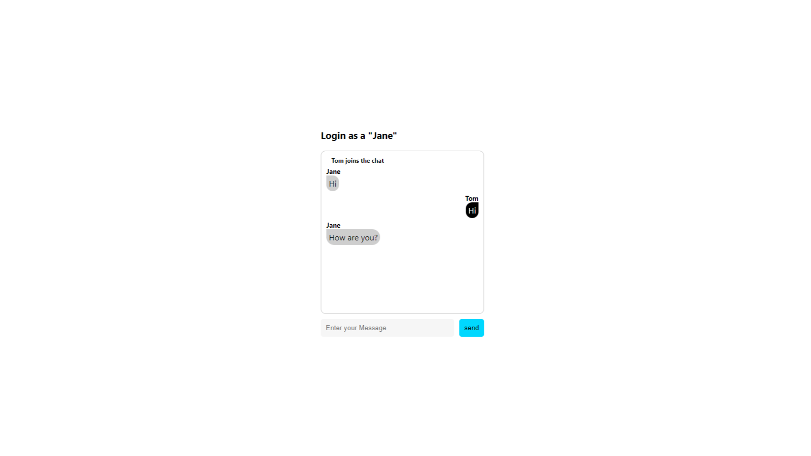

### broadcast를 구현한 IOchat (103p)

<font size=2>위 문제의 핵심 해결책은 본인이 보낸 메시지를 본인이 받지 않으면서 모두에게 전송하는 것이다.</font><br />
<font size=2>이걸 broadcast라고 부른다.</font><br />
<font size=2>미리 앞에서 ws 모듈을 이용한 소켓 서버 설정을 기억하나?</font><br />

```
const broadCastHandler = (msg) => {
  wss.clients.forEach(function each(client, i) {
    if (client !== ws && client.readyState === WebSocket.OPEN) {
      client.send(msg);
    }
  });
};
```

<font size=2>ws 모듈을 이용할 땐 broadcast 기능을 사용하기 위해 직접 구현했다.</font><br />
<font size=2>클라이언트 객체를 순회하며 메시지를 보낸 당사자를 제외하고 전송하는 로직이다.</font><br />
<font size=2>그렇다면 socket.io는 어떻게 broadcast를 처리할까?</font><br /><br />

<font size=2>위에서 사용한 로직을 그대로 사용한다.</font><br />
<font size=2>바뀌는 건 단지 서버 사이드 로직이다.</font><br />
<font size=2>클라이언트 사이드의 내용을 그대로 복사하면 된다.</font><br />

### 서버 사이드 (104p)

<font size=2>server.js</font><br />
<font size=2>아래는 변경된 server.js의 모습이다.</font><br />

```
const { Server } = require("socket.io");

const io = new Server("5000", {
  cors: {
    origin: "http://localhost:3000",
  },
});

io.sockets.on("connection", (socket) => {
  socket.on("message", (data) => {
    // 1
    socket.broadcast.emit("sMessage", data);
  });

  socket.on("login", (data) => {
    // 2
    socket.broadcast.emit("sLogin", data);
  });

  socket.on("disconnect", () => {
    console.log("user disconnected");
  });
});
```

<font size=2>1~2. 엄청 복잡할 줄 알았던 broadcast의 로직이 너무나 간단하다.</font><br />
<font size=2>단지 socket에서 제공하는 broadcast 객체만 사용했을 뿐이다.</font><br />
<font size=2>과연 정상적으로 동작할지 확인해보겠다.</font><br />
<font size=2>동일하게 서버와 클라이언트를 실행할 터미널 두 개를 열고 각각 서버와 클라이언트를 실행해준다.</font><br />
<font size=2>그리고 http://localhost:5000 으로 접속한다.</font><br />



<font size=2>동일하게 Tom, Jane으로 로그인하고 대화를 시도했다.</font><br />
<font size=2>드디어 일반적인 채팅창과 같은 결과를 얻을 수 있었다.</font><br />
<font size=2>하지만 채팅을 하게 되면 무조건 모든 사람에게 메시지가 전달되는 방식이 아니라, 특정한 사람에게만 메시지를 전송하는 1:1 대화를 하고 싶다.</font><br />
<font size=2>과연 이것도 socket.io는 간단하게 구현할 수 있을까?</font><br />