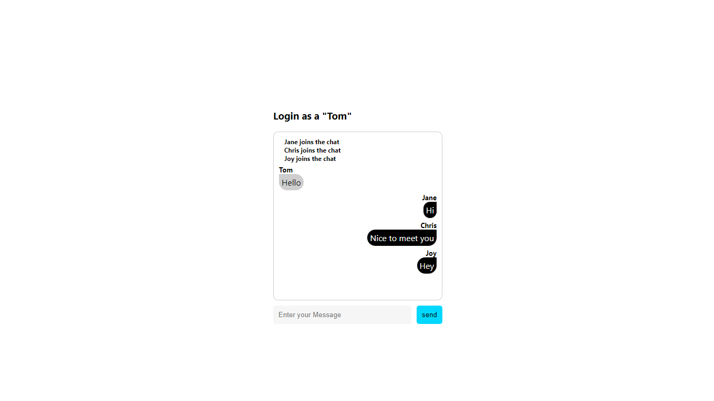
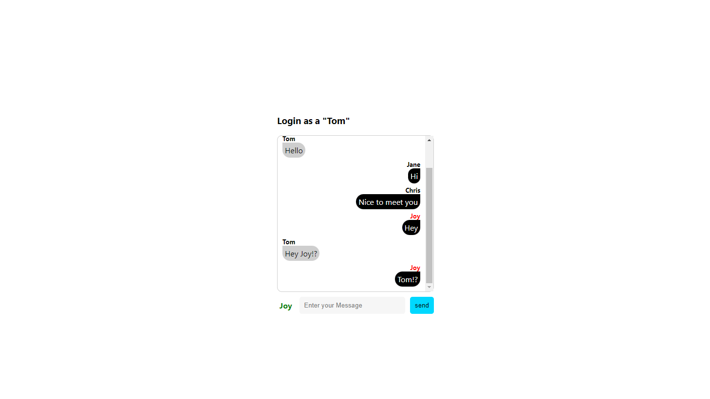
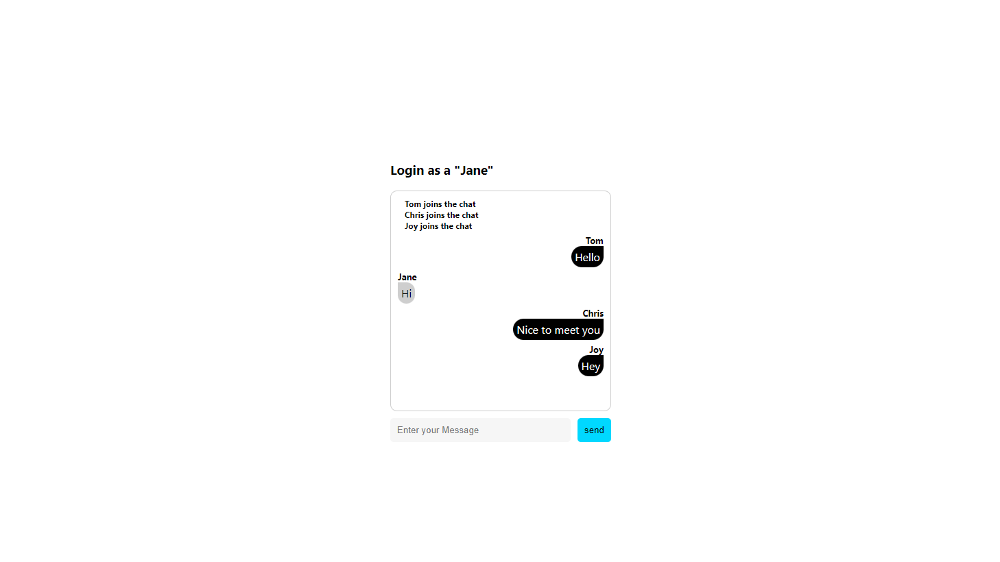
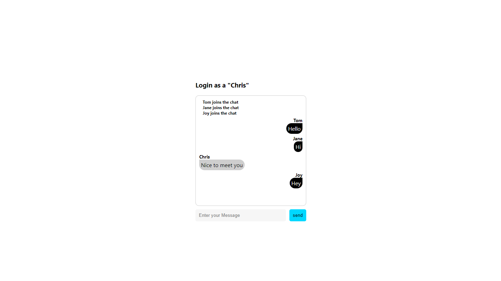
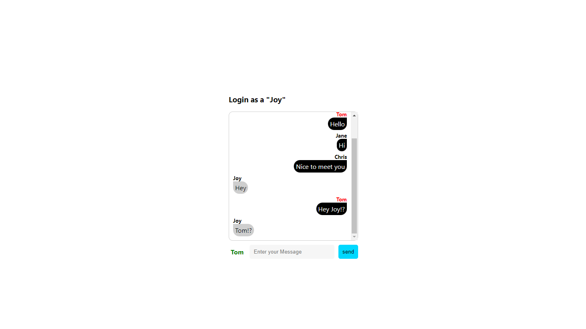

### private를 구현한 IOchat (105p)

<font size=2>private 대화를 구현하기 위해선 UI도 조금은 달라져야 한다.</font><br />
<font size=2>일단 대화할 수 있는 상대를 선택할 수 있어야 한다.</font><br /><br />

<font size=2>Tom으로 로그인한 대화창이 있다. 대화상대는 Jane, Chris이다.</font><br />
<font size=2>만약 Tom이 Chris와 대화하고 싶다면 Chris의 대화 아이디를 먼저 클릭한다.</font><br />
<font size=2>클릭하면 Chris의 아이디가 빨간색으로 표시된다.</font><br />
<font size=2>또한 메시지 입력 창 왼쪽에 Chris라는 이름이 초록색으로 노출되는 UI를 구현한다.</font><br />

### 클라이언트 사이드 (106p)

<font size=2>앞에서 만든 클라이언트 사이드와 동일하다.</font><br />
<font size=2>단지 App.js, App.css만 변경되는 것 뿐이다.</font><br />

### App.js

```
import React, { useRef, useEffect, useState } from "react";
import './App.css';
import logo from "./images/iologo.png";
import { io } from "socket.io-client";

const webSocket = io("http://localhost:5000");

const App = () => {
  const messagesEndRef = useRef(null);
  const [ userId, setUserId ] = useState("");
  const [ isLogin, setIsLogin ] = useState(false);
  const [ msg, setMsg ] = useState("");
  const [ msgList, setMsgList ] = useState([]);
  // 1
  const [ privateTarget, setPrivateTarget ] = useState("");

  useEffect(() => {
    if ( !webSocket ) return;

    const sMessageCallback = (msg) => {
      // 2
      const { data, id, target } = msg;
      setMsgList((prev) => [
        ...prev,
        {
          msg: data,
          // 3
          type: target ? "private" : "other",
          id: id,
        },
      ]);
    }

    webSocket.on("sMessage", sMessageCallback);

    return () => {
      webSocket.off("sMessage", sMessageCallback);
    };
  }, []);

  useEffect(() => {
    if ( !webSocket ) return;

    const sLoginCallback = (msg) => {
      setMsgList((prev) => [
        ...prev,
        {
          msg: `${msg} joins the chat`,
          type: "welcome",
          id: "",
        },
      ]);
    }

    webSocket.on("sLogin", sLoginCallback);

    return () => {
      webSocket.off("sLogin", sLoginCallback);
    }
  }, []);

  useEffect(() => {
    scrollToBottom();
  }, [msgList]);

  const scrollToBottom = () => {
    messagesEndRef.current?.scrollIntoView({ behavior: "smooth" });
  };

  const onSubmitHandler = (e) => {
    e.preventDefault();
    webSocket.emit("login", userId);
    setIsLogin(true);
  };

  const onChangeUserIdHandler = (e) => {
    setUserId(e.target.value);
  };

  const onSendSubmitHandler = (e) => {
    e.preventDefault();

    // 4
    const sendData = {
      data: msg,
      id: userId,
      target: privateTarget,
    };
    webSocket.emit("message", sendData);
    setMsgList((prev) => [...prev, { msg: msg, type: "me", id: userId }]);
    setMsg("");
  };

  const onChangeMsgHandler = (e) => {
    setMsg(e.target.value);
  };

  // 5
  const onSetPrivateTarget = (e) => {
    const { id } = e.target.dataset;
    setPrivateTarget((prev) => ( prev === id ? "" : id ));
  };

  return (
    <div className="app-container">
      <div className="wrap">
        {isLogin ? (
          <div className="chat-box">
            <h3>Login as a "{userId}"</h3>
            <ul className="chat">
              {msgList.map((v, i) => 
                v.type === "welcome" ? (
                  <li className="welcome">
                    <div className="line" />
                    <div>{v.msg}</div>
                    <div className="line" />
                  </li>
                ) : (
                  <li 
                    className={v.type} 
                    key={`${i}_li`}
                    name={v.id}
                    data-id={v.id}
                    onClick={onSetPrivateTarget}
                  >
                    <div 
                      className={v.id === privateTarget ? "private-user" : "userId"}
                      data-id={v.id}
                      name={v.id}
                    >
                      {v.id}
                    </div>
                    <div className={v.type}>{v.msg}</div>
                  </li>
                )
              )}
              <li ref={messagesEndRef} />
            </ul>
            <form
              className="send-form"
              onSubmit={onSendSubmitHandler}
            >
              {privateTarget && (
                <div className="private-target">{privateTarget}</div>
              )}
              <input 
                placeholder="Enter your Message"
                onChange={onChangeMsgHandler}
                value={msg}
              />
              <button type="submit">send</button>
            </form>
          </div>
        ) : (
          <div className="login-box">
            <div className="login-title">
              
              <div>IOChat</div>
            </div>
            <form className="login-form" onSubmit={onSubmitHandler}>
              <input 
                placeholder="Enter your ID"
                onChange={onChangeUserIdHandler}
                value={userId}
              />
              <button type="submit">Login</button>
            </form>
          </div>
        )}
      </div>
    </div>
  );
}

export default App;
```

<font size=2>1. 1:1 대화 상대를 지목하고 저장할 수 있는 변수가 필요하다.</font><br />
<font size=2>그래서 privateTarget이라는 변수를 생성해서 클릭한 아이디의 값을 저장한다.</font><br /><br />

<font size=2>2. 서버에서 받는 데이터 중 target이라는 값이 있다면 'private'이라는 스타일을 적용하고, 없다면 기존에 'other'라는 스타일을 적용한다.</font><br />

```
const { data, id, target } = msg;
setMsgList((prev) => [
  ...prev,
  {
    msg: data,
    type: target ? "private" : "other",
    id: id,
  },
]);
```

<font size=2>'private'으로 메시지가 올 경우 채팅창에 빨간색으로 보낸 사람의 아이디가 표시된다.</font><br /><br />

<font size=2>3. 메시지를 보낼때 privateTarget에 저장된 아이디 값을 함께 전송한다.</font><br /><br />

<font size=2>4. 아이디를 클릭했을 때 privateTarget 변수에 아이디를 저장하는 함수이다.</font><br /><br />

### App.css (111p)

```
.app-container {
  height: 100vh;
  display: flex;
  flex-direction: column;
  align-items: center;
  justify-content: center;
}
.app-container > .wrap > .login-box > .login-title {
  display: flex;
  flex-direction: row;
  font-size: 2rem;
  align-items: center;
  justify-content: center;
  gap: 5px;
}
.app-container > .wrap > .login-box > .login-title > img {
  border-radius: 50%;
}
.app-container > .wrap > .login-box > .login-form {
  display: flex;
  flex-direction: row;
  gap: 10px;
  margin-top: 20px;
}
.app-container > .wrap > .login-box > .login-form input {
  width: 100%;
  border: 0;
  padding: 10px;
  border-radius: 5px;
  background-color: #f6f6f6;
}
.app-container > .wrap > .login-box > .login-form > button {
  border: 0;
  padding: 10px;
  border-radius: 5px;
  background-color: #00d8ff;
  color: #fff;
}
.app-container > .wrap > .chat-box .chat {
  list-style: none;
  padding: 10px;
  margin: 0;
  border: 1px solid #cecece;
  border-radius: 10px;
  width: 300px;
  height: 300px;
  overflow: auto;
}
.app-container > .wrap > .chat-box .chat li.me {
  text-align: left;
}
.app-container > .wrap > .chat-box .chat li.other {
  text-align: right;
  cursor: pointer;
}
.app-container > .wrap > .chat-box .chat li.private {
  text-align: right;
  color: red;
  cursor: pointer;
}
.app-container > .wrap > .chat-box .chat li.welcome {
  display: flex;
  flex-direction: row;
  align-items: center;
  font-size: 12px;
  font-weight: bold;
  gap: 10px;
}
.app-container > .wrap > .chatbox .chat li.welcome > .line {
  height: 0.5px;
  flex: 1 1 auto;
  padding: 0 10px;
  background-color: #cecece;
}
.app-container > .wrap > .chat-box .chat div.me {
  padding: 5px;
  display: inline-block;
  border-top-right-radius: 20px;
  border-bottom-left-radius: 20px;
  border-bottom-right-radius: 20px;
  background-color: #cecece;
}
.app-container > .wrap > .chat-box .chat div.other {
  padding: 5px;
  display: inline-block;
  border-top-left-radius: 20px;
  border-bottom-left-radius: 20px;
  border-bottom-right-radius: 20px;
  background-color: #000;
  color: #fff;
}
.app-container > .wrap > .chat-box .chat div.private {
  padding: 5px;
  display: inline-block;
  border-top-left-radius: 20px;
  border-bottom-left-radius: 20px;
  border-bottom-right-radius: 20px;
  background-color: #000;
  color: #fff;
}
.app-container > .wrap > .chat-box .chat .userId {
  margin-top: 5px;
  font-size: 13px;
  font-weight: bold;
}
.app-container > .wrap > .chat-box .chat .private-user {
  margin-top: 5px;
  font-size: 13px;
  font-weight: bold;
  color: red;
}
.app-container > .wrap > .chat-box .send-form {
  margin-top: 10px;
  display: flex;
  flex-direction: row;
  align-items: center;
  gap: 10px;
}
.app-container > .wrap > .chat-box .send-form input {
  width: 100%;
  border: 0;
  padding: 10px;
  border-radius: 5px;
  background-color: #f6f6f6;
}
.app-container > .wrap > .chat-box .send-form button {
  border: 0;
  padding: 10px;
  border-radius: 5px;
  background-color: #00d8ff;
}
.app-container > .wrap > .chat-box .send-form .private-target {
  border: 0;
  padding: 5px;
  color: green;
  font-weight: bold;
}
```

### 서버 사이드 (115p)

<font size=2>다음으로는 드디어 server.js이다.</font><br />
<font size=2>서버 사이드 또한 기본적인 코드는 동일하다.</font><br />
<font size=2>앞 예제에서 작성했던 코드를 복사한 후에 private 코딩을 위한 부분만 수정하겠다.</font><br />

```
const { Server } = require("socket.io");

const io = new Server("5000", {
  cors: {
    origin: "http://localhost:3000",
  },
});

// 1
const clients = new Map();

io.sockets.on("connection", (socket) => {
  console.log("user connected");
  socket.on("message", (res) => {
    const { target } = res;
    // 2
    const toUser = clients.get(target);
    target
      ? io.sockets.to(toUser).emit("sMessage", res)
      : socket.broadcast.emit("sMessage", res);
  });

  socket.on("login", (data) => {
    // 3
    clients.set(data, socket.id);
    socket.broadcast.emit("sLogin", data);
  });

  socket.on("disconnect", () => {
    console.log("user disconnected");
  });
});
```

<font size=2>1. 접속한 사용자 아이디를 저장하기 위한 Map 객체를 생성했다.</font><br />
<font size=2>clients 객체는 누구에게 메시지를 보낼지 검색하는 임시 사용자 데이터베이스라고 생각하면 된다.</font><br /><br />

<font size=2>2~3. 연결된 부분이기 때문에 동시에 설명하겠다.</font><br />
<font size=2>3번의 clients 객체에 데이터를 저장하는 부분을 확인할 수 있다.</font><br />

```
clients.set(data, socket.id);

여기서 중요한 건 바로 socket.id라는 속성이다.
socket.io에서는 기본적으로 연결된 소켓의 고유 번호인 socket.id라는 값을 가지고 있다.
socket.id 값은 다음과 같은 무작위의 값으로 각각의 연결될 소켓을 구분한다.

 iCss-z8dDLLmYVgIPAAAD

이 값을 클라이언트에서 보내온 아이디 값과 매칭해서 clients 객체에 저장한다.

 const toUser = clients.get(target);
 target
    ? io.sockets.to(toUser).emit("sMessage", res)
    : socket.broadcast.emit("sMessage", res);

2번을 보면 clients 객체에서 검색된 socket.id 값을 이용해서 특정한 사용자에게 보내는 로직이다.
io.sockets.to() 함수를 이용해서 private한 메시지를 전송할 수 있다.
만약 target 정보가 없다면 일반적인 broadcast를 실행한다.
```

```
클라이언트에서는 socket.id 값을 바로 알 수 없나?

알 수 있다. 우리 예제에서는 사용자 아이디를 서버에 전송해서 socket.id와 매칭했다.
그러나 클라이언트에서도 바로 socket.id를 서버로 전송할 수 있다.

 const webSocket = io("http://localhost:5000");

우리가 생성한 webSocket 객체의 id 속성을 접근하면 서버와 동일한 id 값을 얻을 수 있다.

 const.log(webSocket.id);
 YU1C4D8yCHaC0g9WAAAT
```

<font size=2>모든 준비는 끝났고 결과를 확인해보겠다.</font><br />
<font size=2>앞 예제에서 했던 과정과 동일하게 두 개의 터미널에 각각 서버와 클라이언트를 실행하고 http://localhost:5000을 실행한다.</font><br />
<font size=2>이번에는 private을 테스트하기 위해 4개의 채팅창을 열고 확인하겠다.</font><br />



<font size=2>Tom, Jane, Chris, Joy로 로그인했고 위와 같이 대화를 진행했다.</font><br />
<font size=2>그러나 Tom은 Joy에게만 메시지를 전송하고 싶다. Tom은 Joy 아이디를 누르고 메시지를 전송한다.</font><br />






<font size=2>Tom의 메시지를 받은 Joy도 Tom에게만 메시지를 전송했다.</font><br /><br />

<font size=2>지금까지 기본적인 socket.io의 3가지 통신 방법을 알아봤다.</font><br />
<font size=2>나를 포함한 모두에게 전송되는 public과 나를 제외하고 모두에게 전송하는 broadcast, 마지막으로 특정한 개인에게 전송되는 private이다.</font><br />
<font size=2>다음에는 socket.io가 제공하는 다른 기능도 추가적으로 알아보겠다.</font><br />