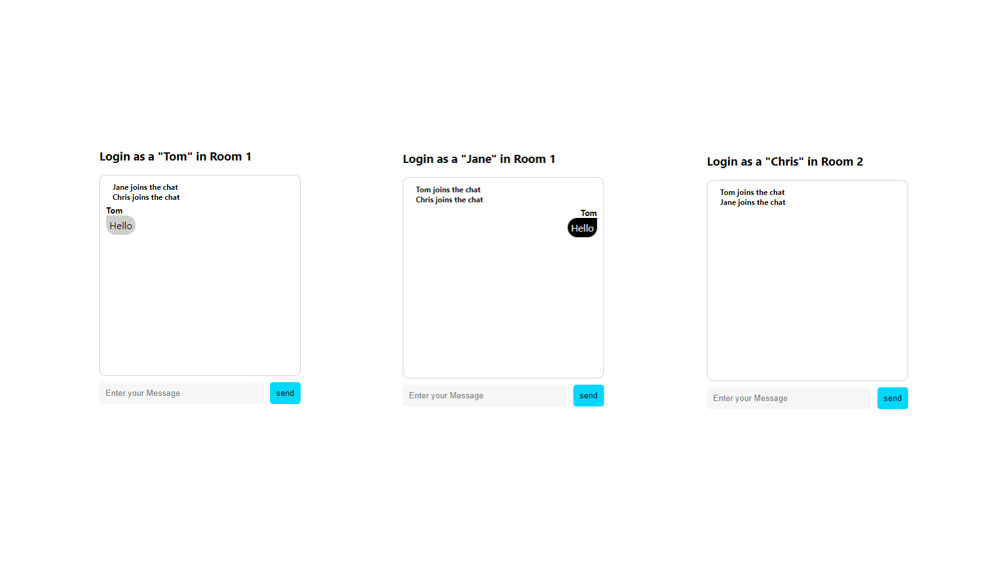
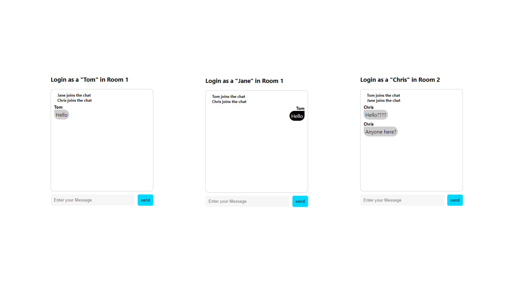

### 룸 생성 (119p)

<font size=2>socket.io는 룸(room)이라는 개념이 있다.</font><br />
<font size=2>여기서 말하는 룸은 우리가 흔히 생각하는 단체 대화방이다.</font><br /><br />

<font size=2>앞에서는 socket.io에서 생성되는 socket ID를 이용해서 private 통신을 진행했다.</font><br />
<font size=2>사실은 private 통신 또한 개인의 방이 생성되어 가능한 매커니즘이다.</font><br />
<font size=2>우리도 모르는 사이에 룸이라는 개념을 이용한 것이다.</font><br />
<font size=2>socket.io의 룸을 이용해 채팅의 단체방과 비슷한 예제를 만들어 보겠다. 예제를 이용해 룸의 개념을 학습한다.</font><br /><br />

<font size=2>이번 예제는 로그인 화면에서 방 번호를 선택하는 UI를 추가한다.</font><br />
<font size=2>선택한 방에 들어가면 상단에 "Login as a Tom in Room 1"이라는 텍스트가 노출된다.</font><br />
<font size=2>추가적으로 같은 방을 선택한 사용자끼리만 대화가 가능하게 만들겠다.</font><br /><br />

### 클라이언트 사이드 (120p)

<font size=2>앞에서 사용한 예제를 그대로 사용한다. 단지 방 선택을 위한 UI가 추가된다. 기존에 사용한 코드를 그대로 복사한다.</font><br />

### App.js

```
import React, { useRef, useEffect, useState } from "react";
import './App.css';
import logo from "./images/iologo.png";
import { io } from "socket.io-client";

const webSocket = io("http://localhost:5000");

const App = () => {
  const messagesEndRef = useRef(null);
  const [ userId, setUserId ] = useState("");
  const [ isLogin, setIsLogin ] = useState(false);
  const [ msg, setMsg ] = useState("");
  const [ msgList, setMsgList ] = useState([]);
  const [ privateTarget, setPrivateTarget ] = useState("");
  // 1
  const [ roomNumber, setRoomNumber ] = useState("1");

  useEffect(() => {
    if ( !webSocket ) return;

    const sMessageCallback = (msg) => {
      const { data, id, target } = msg;
      setMsgList((prev) => [
        ...prev,
        {
          msg: data,
          type: target ? "private" : "other",
          id: id,
        },
      ]);
    }

    webSocket.on("sMessage", sMessageCallback);

    return () => {
      webSocket.off("sMessage", sMessageCallback);
    };
  }, []);

  useEffect(() => {
    if ( !webSocket ) return;

    const sLoginCallback = (msg) => {
      setMsgList((prev) => [
        ...prev,
        {
          msg: `${msg} joins the chat`,
          type: "welcome",
          id: "",
        },
      ]);
    }

    webSocket.on("sLogin", sLoginCallback);

    return () => {
      webSocket.off("sLogin", sLoginCallback);
    }
  }, []);

  useEffect(() => {
    scrollToBottom();
  }, [msgList]);

  const scrollToBottom = () => {
    messagesEndRef.current?.scrollIntoView({ behavior: "smooth" });
  };

  // 2
  const onSubmitHandler = (e) => {
    e.preventDefault();
    webSocket.emit("login", { userId: userId, roomNumber: roomNumber });
    setIsLogin(true);
  };

  const onChangeUserIdHandler = (e) => {
    setUserId(e.target.value);
  };

  const onSendSubmitHandler = (e) => {
    e.preventDefault();
    const sendData = {
      data: msg,
      id: userId,
      target: privateTarget,
    };
    webSocket.emit("message", sendData);
    setMsgList((prev) => [...prev, { msg: msg, type: "me", id: userId }]);
    setMsg("");
  };

  const onChangeMsgHandler = (e) => {
    setMsg(e.target.value);
  };

  const onSetPrivateTarget = (e) => {
    const { id } = e.target.dataset;
    setPrivateTarget((prev) => ( prev === id ? "" : id ));
  };

  // 3
  const onRoomChangeHandler = (e) => {
    setRoomNumber(e.target.value);
  }

  return (
    <div className="app-container">
      <div className="wrap">
        {isLogin ? (
          <div className="chat-box">
            <h3>Login as a "{userId}" in Room {roomNumber}</h3>
            <ul className="chat">
              {msgList.map((v, i) => 
                v.type === "welcome" ? (
                  <li className="welcome">
                    <div className="line" />
                    <div>{v.msg}</div>
                    <div className="line" />
                  </li>
                ) : (
                  <li 
                    className={v.type} 
                    key={`${i}_li`}
                    name={v.id}
                    data-id={v.id}
                    onClick={onSetPrivateTarget}
                  >
                    <div 
                      className={v.id === privateTarget ? "private-user" : "userId"}
                      data-id={v.id}
                      name={v.id}
                    >
                      {v.id}
                    </div>
                    <div className={v.type} data-id={v.id} name={v.id}>{v.msg}</div>
                  </li>
                )
              )}
              <li ref={messagesEndRef} />
            </ul>
            <form
              className="send-form"
              onSubmit={onSendSubmitHandler}
            >
              {privateTarget && (
                <div className="private-target">{privateTarget}</div>
              )}
              <input 
                placeholder="Enter your Message"
                onChange={onChangeMsgHandler}
                value={msg}
              />
              <button type="submit">send</button>
            </form>
          </div>
        ) : (
          <div className="login-box">
            <div className="login-title">
              
              <div>IOChat</div>
            </div>
            <form className="login-form" onSubmit={onSubmitHandler}>
              <select onChange={onRoomChangeHandler}>
                <option value="1">Room 1</option>
                <option value="2">Room 2</option>
              </select>
              <input 
                placeholder="Enter your ID"
                onChange={onChangeUserIdHandler}
                value={userId}
              />
              <button type="submit">Login</button>
            </form>
          </div>
        )}
      </div>
    </div>
  );
}

export default App;
```

<font size=2>1. 선택한 방 번호를 저장하기 위한 변수 설정이다.</font><br /><br />
<font size=2>2. 로그인 버튼을 클릭할 때 실행된다.</font><br />

```
  webSocket.emit("login", { userId: userId, roomNumber: roomNumber });

  기존에는 사용자 아이디만 전송했다면 이번에는 사용자가 속한 방 번호를 같이 전송한다.
```
<br />

<font size=2>3. 방 번호를 선택했을 때 실행되는 함수이다.</font><br /><br />

### App.css ( 125p )

```
.app-container {
  height: 100vh;
  display: flex;
  flex-direction: column;
  align-items: center;
  justify-content: center;
}
.app-container > .wrap > .login-box > .login-title {
  display: flex;
  flex-direction: row;
  font-size: 2rem;
  align-items: center;
  justify-content: center;
  gap: 5px;
}
.app-container > .wrap > .login-box > .login-title > img {
  border-radius: 50%;
}
.app-container > .wrap > .login-box > .login-form {
  display: flex;
  flex-direction: row;
  gap: 10px;
  margin-top: 20px;
}
.app-container > .wrap > .login-box > .login-form select {
  border: 0;
  cursor: pointer;
}
.app-container > .wrap > .login-box > .login-form input {
  width: 100%;
  border: 0;
  padding: 10px;
  border-radius: 5px;
  background-color: #f6f6f6;
}
.app-container > .wrap > .login-box > .login-form > button {
  border: 0;
  padding: 10px;
  border-radius: 5px;
  background-color: #00d8ff;
  color: #fff;
}
.app-container > .wrap > .chat-box .chat {
  list-style: none;
  padding: 10px;
  margin: 0;
  border: 1px solid #cecece;
  border-radius: 10px;
  width: 300px;
  height: 300px;
  overflow: auto;
}
.app-container > .wrap > .chat-box .chat li.me {
  text-align: left;
}
.app-container > .wrap > .chat-box .chat li.other {
  text-align: right;
  cursor: pointer;
}
.app-container > .wrap > .chat-box .chat li.private {
  text-align: right;
  color: red;
  cursor: pointer;
}
.app-container > .wrap > .chat-box .chat li.welcome {
  display: flex;
  flex-direction: row;
  align-items: center;
  font-size: 12px;
  font-weight: bold;
  gap: 10px;
}
.app-container > .wrap > .chatbox .chat li.welcome > .line {
  height: 0.5px;
  flex: 1 1 auto;
  padding: 0 10px;
  background-color: #cecece;
}
.app-container > .wrap > .chat-box .chat div.me {
  padding: 5px;
  display: inline-block;
  border-top-right-radius: 20px;
  border-bottom-left-radius: 20px;
  border-bottom-right-radius: 20px;
  background-color: #cecece;
}
.app-container > .wrap > .chat-box .chat div.other {
  padding: 5px;
  display: inline-block;
  border-top-left-radius: 20px;
  border-bottom-left-radius: 20px;
  border-bottom-right-radius: 20px;
  background-color: #000;
  color: #fff;
}
.app-container > .wrap > .chat-box .chat div.private {
  padding: 5px;
  display: inline-block;
  border-top-left-radius: 20px;
  border-bottom-left-radius: 20px;
  border-bottom-right-radius: 20px;
  background-color: #000;
  color: #fff;
}
.app-container > .wrap > .chat-box .chat .userId {
  margin-top: 5px;
  font-size: 13px;
  font-weight: bold;
}
.app-container > .wrap > .chat-box .chat .private-user {
  margin-top: 5px;
  font-size: 13px;
  font-weight: bold;
  color: red;
}
.app-container > .wrap > .chat-box .send-form {
  margin-top: 10px;
  display: flex;
  flex-direction: row;
  align-items: center;
  gap: 10px;
}
.app-container > .wrap > .chat-box .send-form input {
  width: 100%;
  border: 0;
  padding: 10px;
  border-radius: 5px;
  background-color: #f6f6f6;
}
.app-container > .wrap > .chat-box .send-form button {
  border: 0;
  padding: 10px;
  border-radius: 5px;
  background-color: #00d8ff;
}
.app-container > .wrap > .chat-box .send-form .private-target {
  border: 0;
  padding: 5px;
  color: green;
  font-weight: bold;
}
```

### 서버사이드 (129p)

<font size=2>이번에는 server.js를 구현하겠다. 기존 코드에서 약간만 변경하면 된다.</font><br />
<font size=2>추가된 코드를 보면서 socket.io가 제공하는 룸의 개념을 살펴보겠다.</font><br />

```
const { Server } = require("socket.io");

const io = new Server("5000", {
  cors: {
    origin: "http://localhost:3000",
  },
});

const clients = new Map();

io.sockets.on("connection", (socket) => {
  console.log("user connected");
  socket.on("message", (res) => {
    const { target } = res;
    if( target ) {
      const toUser = clients.get(target);
      io.sockets.to(toUser).emit("sMessage", res);
      return;
    }
    // 1
    const myRooms = Array.from(socket.rooms);
    if( myRooms.length > 1 ) {
      socket.broadcast.in(myRooms[1]).emit("sMessage", res);
      return;
    }
    socket.broadcast.emit("sMessage", res);
  });

  socket.on("login", (data) => {
    const { userId, roomNumber } = data;
    // 2
    socket.join(roomNumber);
    clients.set(userId, socket.id);
    socket.broadcast.emit("sLogin", userId);
  });

  socket.on("disconnect", () => {
    console.log("user disconnected");
  });
});
```

<font size=2>1~2. 클라이언트에서 Login 버튼을 누른 후에 전송된 방 번호를 이용해서 socket.join() 번호를 넘겨준다.</font><br />
<font size=2>join()은 접속한 사용자를 특정한 방에 배정할 수 있는 함수이다.</font><br />

```
const myRooms = Array.from(socket.rooms);
if( myRooms.length > 1 ) {
  socket.broadcast.in(myRooms[1]).emit("sMessage", res);
  return;
}

socket.rooms라는 속성을 사용했다.
socket.rooms라는 속성은 해당 접속자가 어떤 방에 속해있는지 나타낸다.
```

```
socket.rooms

socket.rooms로 사용자가 어디에 속해 있는지 알 수 있다.
console.log(socket.rooms)로 내용을 확인해 보겠다.
Set(2) { 'iCss-z8DLLmYVgIPAAAD', '1' }

socket.rooms는 Set이라는 자료구조를 사용해 룸을 관리한다.
첫 번째 값에는 임의의 값이 들어있다. 이 값은 앞에서 미리 확인한 socket.id가 동일하다.
결국 소켓의 접속한 모든 사용자는 개인의 방이 존재한다는 사실을 확인했다.

두 번째 값에는 우리가 임의로 설정한 방 번호가 있다.
Set 데이터에 쉽게 접근하기 위해 Array.from()을 이용해 배열 구조로 변경했다.
```

```
무조건 방 하나에만 들어가야 하나?

아니다. 코드를 통해서 동시에 여러 방에 소속될 수 있다.
  socket.broadcast.in('1').in('2').in('3').emit("sMessage", res);

아래 코드처럼 in(또는 to) 메소드를 이용해서 한 번에 여러 방에 소속될 수 있다.

또한 특정 방에 소속되고 싶지 않다면 except()를 이용할 수도 있다.
  socket.broadcast.in('1').in('2').except('3').emit("sMessage", res);

배열로 변경된 방 정보를 이용해 1보다 크면 가공의 방에 속한 것으로 판단해서 지정된 방에만 메시지를 전송한다.
socket.broadcast.in()을 이용하면 지정된 방에만 데이터를 전송할 수 있다.
broadcast를 붙인 이유는 내가 보낸 메시지는 스스로 받지 않기 위함이다.
```

<font size=2>이제 제대로 구현이 되었는지 확인하겠다.</font><br />
<font size=2>동일하게 서버와 클라이언트를 실행할 수 있는 터미널을 두 개 열어준다.</font><br />
<font size=2>이후에 http://localhost:5000으로 접속한다.</font><br />

<font size=2>먼저 Tom으로 로그인하고 방 번호 1을 선택한다.</font><br />
<font size=2>정확한 테스트를 위해 브라우저 창을 두 개 더 실행하겠다.</font><br />
<font size=2>Jane은 방 1로 Chris는 방 2로 선택하고 들어가겠다.</font><br /><br />

<font size=2>모두 입장이 완료되면 Tom이 채팅방에 "Hello"를 입력해 전송한다.</font><br />



<font size=2>예상대로 같은 방에 속해 있는 Jane만 메시지를 받았나?</font><br />
<font size=2>정확한 테스트를 위해 Chris를 포함한 모두와 메시지를 나누겠다.</font><br />



<font size=2>앞의 그림처럼 1번 방 사람들만 대화하고 Chris의 메시지는 Tom, Jane에게 전달되지 않은 걸 볼 수 있다.</font><br />

```
방 떠나기

socket.join([roomId])을 이용해서 방에 접속했다면 socket.leave([roomId])를 이용해서 방을 떠날 수 있다.
또한 socket.io의 disconnect 이벤트로 연결이 끊어지면 자동으로 방에서 나가게 된다.
```