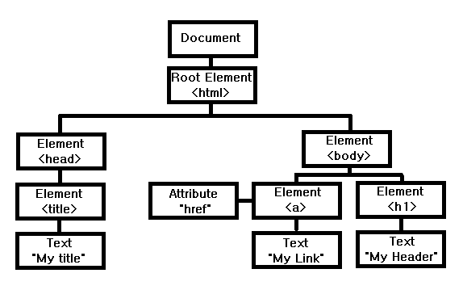
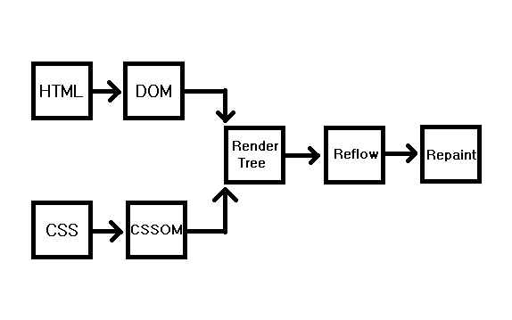

# 리엑트로 배우는 소켓 프로그래밍

## 01. React

state of js에서 발표한 프런트엔드 프레임워크의 사용량을 보면 React의 사용량은 지속적으로 증가한 것을 볼 수 있다.
React는 페이스북에서 개발한 JavaScript UI 라이브러리이다.
어떤 분들은 Framework라 부르기도 한다.
특정한 형식을 강제하는 Framework와는 다르게 React는 별도의 기능만을 적용해서 제품을 개발할 수 있게 설계되어있다.
여기서 말하는 별도의 기능이 바로 React의 핵심인 UI이다.

Angular, Vue.js와 같은 Framework는 MVC(Model-View-Controller) 모델 혹은 MVVM(Model-View-View Model) 모델을 지향한다.
이런 모델에 따라 데이터와 뷰가 유기적으로 관리되고 있다.
그러나 React는 이런 틀에서 벗어나 오직 사용자에게 보여지는 View만을 생각해서 만들었다.
페이스북에서는 이런 View를 사용자 입장에서 어떻게 하면 자연스럽게 보일까 연구하다가 가상 DOM(Virtual DOM)을 생각하게 되었다.

### 01-1. Virtual DOM
DOM(Document Object Model)은 웹 페이지의 구조와 내용을 표현하는 역할을 한다.
HTML, CSS와 같은 정적 파일이 브라우저에 렌더링을 시작하면 HTML 코드를 브라우저가 이해할 수 있는 구조로 변환하여 DOM 트리(DOM tree)를 생성한다.
DOM 트리는 계층 구조로 표현되어 있어 요소들이 부모-자식 관계로 연결된다.

HTML 문서를 파싱하여 DOM 트리를 생성하면 CSS 파일을 파싱하여 CSSOM 트리를 생성한다.
그런 다음, DOM 트리와 CSSOM 트리를 결합하여 렌더 트리를 생성한다.
렌더 트리는 화면에 실제로 표시되는 요소들을 포함한다.
브라우저는 렌더 트리를 이용해 화면에 표시될 영역을 계산하는 레이아웃(리플로우) 과정과 노드를 화면에 픽셀로 변환하는 리페인트 과정을 거쳐 변환된 내용이 화면에 표시되어 사용자에게 웹 페이지가 보여진다.

위에서 설명한 과정에 따라 초기에 렌더링된 웹 서비스가 있다고 가정하겠다.
이 웹 서비스의 상단에 햄버거 버튼이 있다.
사용자가 햄버거 버튼을 누르면 위에서 아래로 사이드 메뉴가 나타난다.
이때 나타나는 사이드 메뉴를 CSS의 height로 조작하는데, 이런 과정을 리플로우라고 한다.
리플로우는 DOM의 변화로 일어나게 된다.
DOM 구조를 변경하는 과정은 일반적으로 빠르게 진행되며, CPU 자원을 적게 소모한다.
그러나 DOM 트리의 깊이가 깊고 노드의 수가 많을수록 속도가 떨어진다.
여기서 한 가지 생각해볼 문제가 있다.
DOM 변화 속도에 왜 노드 수와 트리의 깊이가 영향을 준다는 것일까?

### 01-2. 비교 알고리즘
