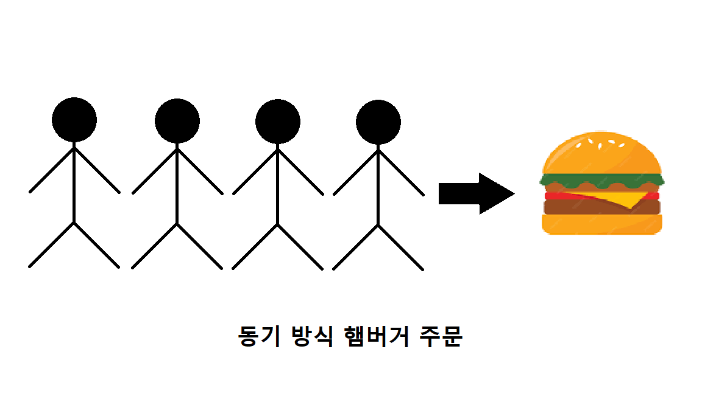
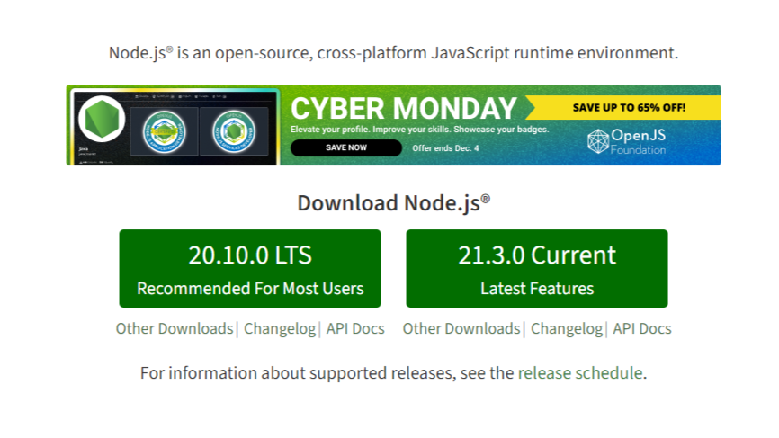

# 리엑트로 배우는 소켓 프로그래밍
<br />

## 01. React (4p)
<br />

<font size=2>state of js에서 발표한 프런트엔드 프레임워크의 사용량을 보면 React의 사용량은 지속적으로 증가한 것을 볼 수 있다.</font><br />
<font size=2>React는 페이스북에서 개발한 JavaScript UI 라이브러리이다.</font><br />
<font size=2>어떤 분들은 Framework라 부르기도 한다.</font><br />
<font size=2>특정한 형식을 강제하는 Framework와는 다르게 React는 별도의 기능만을 적용해서 제품을 개발할 수 있게 설계되어있다.</font><br />
<font size=2>여기서 말하는 별도의 기능이 바로 React의 핵심인 UI이다.</font><br /><br />

<font size=2>Angular, Vue.js와 같은 Framework는 MVC(Model-View-Controller) 모델 혹은 MVVM(Model-View-View Model) 모델을 지향한다.</font><br />
<font size=2>이런 모델에 따라 데이터와 뷰가 유기적으로 관리되고 있다.</font><br />
<font size=2>그러나 React는 이런 틀에서 벗어나 오직 사용자에게 보여지는 View만을 생각해서 만들었다.</font><br />
<font size=2>페이스북에서는 이런 View를 사용자 입장에서 어떻게 하면 자연스럽게 보일까 연구하다가 가상 DOM(Virtual DOM)을 생각하게 되었다.</font>
<br /><br /><br />

### 01-1. Virtual DOM (5p)
<br />

<font size=2>DOM(Document Object Model)은 웹 페이지의 구조와 내용을 표현하는 역할을 한다.</font><br />
<font size=2>HTML, CSS와 같은 정적 파일이 브라우저에 렌더링을 시작하면 HTML 코드를 브라우저가 이해할 수 있는 구조로 변환하여 DOM 트리(DOM tree)를 생성한다.</font><br />
<font size=2>DOM 트리는 계층 구조로 표현되어 있어 요소들이 부모-자식 관계로 연결된다.</font><br />


<font size=2>HTML 문서를 파싱하여 DOM 트리를 생성하면 CSS 파일을 파싱하여 CSSOM 트리를 생성한다.</font><br />
<font size=2>그런 다음, DOM 트리와 CSSOM 트리를 결합하여 렌더 트리를 생성한다.</font><br />
<font size=2>렌더 트리는 화면에 실제로 표시되는 요소들을 포함한다.</font><br />
<font size=2>브라우저는 렌더 트리를 이용해 화면에 표시될 영역을 계산하는 레이아웃(리플로우) 과정과 노드를 화면에 픽셀로 변환하는 리페인트 과정을 거쳐 변환된 내용이 화면에 표시되어 사용자에게 웹 페이지가 보여진다.</font><br />


<font size=2>위에서 설명한 과정에 따라 초기에 렌더링된 웹 서비스가 있다고 가정하겠다.</font><br />
<font size=2>이 웹 서비스의 상단에 햄버거 버튼이 있다.</font><br />
<font size=2>사용자가 햄버거 버튼을 누르면 위에서 아래로 사이드 메뉴가 나타난다.</font><br />
<font size=2>이때 나타나는 사이드 메뉴를 CSS의 height로 조작하는데, 이런 과정을 리플로우라고 한다.</font><br />
<font size=2>리플로우는 DOM의 변화로 일어나게 된다.</font><br />
<font size=2>DOM 구조를 변경하는 과정은 일반적으로 빠르게 진행되며, CPU 자원을 적게 소모한다.</font><br />
<font size=2>그러나 DOM 트리의 깊이가 깊고 노드의 수가 많을수록 속도가 떨어진다.</font><br />
<font size=2>여기서 한 가지 생각해볼 문제가 있다.</font><br />
<font size=2>DOM 변화 속도에 왜 노드 수와 트리의 깊이가 영향을 준다는 것일까?</font>
<br /><br /><br />

### 01-2. 비교 알고리즘 (7p)
<br />

<font size=2>DOM을 변경하면 변화된 노드를 찾는 데 시간이 걸린다.</font><br />
<font size=2>앞의 예시처럼 사이드 메뉴의 높이를 담당하는 노드를 찾기 위해서는 Root 노드부터 하나씩 탐색을 시작한다.</font><br />
<font size=2>이때 비교 알고리즘(Diffing Algorithm)이라는 탐색 방법을 사용한다.</font><br />
<font size=2>그래서 노드의 개수가 많고 렌더 트리의 깊이가 깊을수록 시간이 오래 걸린다.</font><br />


<font size=2></font>따라서 변화하는 리페인트, 리플로우 과정을 줄인다면 사용자에게 더 자연스러운 화면과 성능을 제공할 수 있다.<br />

```
DOM은 무조건 느린가?
React가 뜨면서 DOM이 느리다는 의견이 나왔지만 사실 DOM은 충분히 빠르다.
단지 인터렉션이 많거나 많은 변화가 있는 웹 페이지에서는 올바른 성능을 발휘하지 못할 뿐이다.
만약 정적인 페이지라면 오히려 기존 DOM을 이용해서 작업하는 게 좋을 수 있다.
```
<br /><br /><br />

### 01-2. 가상 DOM의 탄생 (7p)
<br />

<font size=2>React 팀은 어떻게 하면 화면을 다시 그리는 리페인트와 리플로우 과정을 개선할 수 있을까 고민하다가 가상 DOM을 생각하게 된다.</font><br />


<font size=2>가상 DOM의 원리는 간단하다.</font><br />
<font size=2>초기에 렌더링된 렌더 트리의 모양과 메모리상에 임시로 저장해둔 렌더 트리의 모양을 비교하는 것이다.</font><br />
<font size=2>여기서 말하는 메모리에 있는 렌더 트리가 바로 가상 DOM이다.</font><br />
<font size=2>하지만 여기서 비교하는 방식은 기존의 비교 알고리즘과 다르다.</font><br />
<font size=2>기존의 비교 알고리즘은 루트 노드부터 비교 분석했지만, React는 변경된 노드만 검색해서 변경 사항을 반영한다.</font><br />
<font size=2>그 변경 사항을 계속해서 실제 DOM에 반영하지 않고 딱 한 번에 몰아서 실제 변경 사항을 반영한다.</font><br />
<font size=2>이런 일련의 과정을 조화(Reconciliation) 과정이라고 한다.</font><br /><br />

<font size=2>가상 DOM을 사용하는 이유는 렌더 트리를 직접 조작하는 것보다 가상 DOM을 수정하여 필요한 변경 사항을 파악하고 반영하는 것이 효율적이기 때문이다.</font><br />
<font size=2>가상 DOM은 메모리상에 존재하기 때문에 실제 DOM을 조작하는 것보다 빠르게 변경 사항을 파악하고 적용할 수 있다.</font><br />
<font size=2>이를 통해 웹 애플리케이션의 성능을 높일 수 있다.</font>
<br /><br /><br />

## 02. React 대표 기능 (8p)
<br />

<font size=2>이제는 React를 어떻게 사용하는지 알아보겠다.</font><br />
<font size=2>사실 React 사용법만 제대로 설명하려고 해도 책 한 권 분량이 나온다.</font><br />
<font size=2>이 책에서는 실전에서 바로바로 사용할 수 있는 주요 기능만 설명하려 한다.</font><br />
<font size=2>이 기능을 이용해서 앞으로 진행될 모든 예제를 만들어볼 것이다.</font>
<br /><br /><br />


### 02-1. React 프로젝트 준비 (8p)
<br />

<font size=2>React 프로젝트를 시작하려면 제일 먼저 npm (Node Package Manager)을 설치해야 한다.</font><br />
<font size=2>npm은 nodejs에서 사용할 수 있는 패키지 (소프트웨어) 관리 툴을 말한다.</font><br />
<font size=2>과거에는 필요한 라이브러리가 있다면 직접 다운로드해서 프로젝트에 파일을 삽입하거나 혹은 CDN 주소를 import 했지만</font><br />
<font size=2>이제는 npm에서 제공하는 명령어를 통해서 손쉽게 이용하고 관리할 수 있다.</font><br />

```
 npm install jquery
```

<font size=2>위 명령어는 npm을 이용해서 프로젝트에 jquery를 설치하는 명령어이다.</font><br />
<font size=2>npdejs 사이트에 접속해서 자신의 운영체제에 맞는 LTS 버전을 다운로드한다.</font><br />
<font size=2>아래처럼 터미널에서 nodejs와 npm 버전 정보를 입력해서 정상적으로 출력되면 성공이다.</font><br />

```
 > node -v
 node version 출력
 > npm -v
 npm version 출력
```

<font size=2>이제 위에서 준비한 npm을 이용해서 React 프로젝트를 만든다.</font><br />
<font size=2>React 프로젝트를 시작하기 위해선 npm install react 명령어로 React를 설치하면 된다.</font><br />
<font size=2>그러나 이렇게 설치하면 바펠이나 웹팩 등 다양한 설정을 하나씩 수동으로 해야 되기 때문에 번거롭다.</font><br />
<font size=2>그래서 React 프로젝트를 간단하게 시작할 수 있는 CRA(creat-react-app)라는 간편한 도구를 사용한다.</font><br />
<font size=2>CRA는 React 프로젝트를 개발하는 데 필요한 여러 가지 도구와 설정들이 미리 포함된 종합선물 패키지 역할을 한다.</font><br />
<font size=2>다음에는 CRA를 이요해서 만든 간단한 input 예제를 소개하겠다.</font><br />
<font size=2>input 예제 코드를 보면서 React에서 제공되는 대표 기능을 살펴보겠다.</font><br />

```
vite로 시작하는 React?
React 프로젝트를 간편하게 시작하기 위해서 무조건 CRA를 사용해야 하는 건 아니다.
요즘에는 vite라는 번들링 툴을 이용해서 더욱 빠르게 프로젝트를 시작할 수 있다.
하지만 CRA에서 제공되는 부수적인 기능(lint, pwa 등)이 없기 때문에 따로 설치해야 해서 번거롭다
▪ 참고 : https://vitejs.dev/guide
```
<br /><br /><br />

### 02-2. React 대표 함수 (10p)
<br />

<font size=2>이번 input 예제는 직접 구현하지 않는다.</font><br />
<font size=2>구현된 예제 이미지와 코드를 보면서 React의 기능을 알아보려고 한다.</font><br />
<font size=2>다음 파트에서 더 머진 React 예제를 만들어 볼 것이다.</font><br />
<font size=2>다음 그림의 input 박스는 간단하게 텍스트를 입력받는 기능이 있다.</font><br />
<font size=2>입력받은 내용은 바로 하단에 출력된다.</font><br />
<font size=2>처음에 출력되는 'Hi'는 input 박스의 초기값이다.</font><br />
<font size=2>만약 input 박스에 'Hello'를 입력하면 아래처럼 그대로 노출된다.</font><br />


<font size=2>이제 코드를 살펴보겠다.</font><br />

```
// 1
import React, { useState, useEffect, useRef } from "react";
import ./App.css;

const App = () => {
    // 2
    const textRef = useRef("");
    // 3
    const [ text, setText ] = useState("");
    // 4
    useEffect(() => {
        setText("Hi");
        console.log("once");
    }, []);
    // 5
    useEffect(() => {
        console.log(textRef.current);
    }, [text]);
    // 6
    const onTextStateChangeHandler = (e) => {
        const msg = e.target.value;
        setText(msg);
    };
    return (
        // 7
        <div className="App">
            <input 
                ref={textRef}
                className="text-input"
                type="text"
                value={text}
                onChange={onTextStateChangeHandler}
                placeholder="Enter yout Message"
            />
            <div>Message: {text}</div>
        </div>
    );

    export default App;
}
```

<font size=2>사실 이번 예제의 input 박스는 리엑트 기능을 설명하기 위한 억지스러운 점이 있다.</font><br />
<font size=2>하지만 간단할수록 확실히 이해할 수 있다는 장점이 있다.</font><br />
<font size=2>하나씩 살펴보겠다.</font><br /><br />
<font size=2>1. 상태</font><br />
<font size=2>React의 핵심은 바로 상태(status) 관리이다.</font><br />
<font size=2>React는 상태를 이용해서 모든 변수와 레이어 변화를 다룰 수 있다.</font><br />
<font size=2>이런 상태를 관리하기 위해선 React에서 제공하는 함수를 추가해야 한다.</font><br />
<font size=2>대표적인 함수로는 useState, useEffect, useRef가 있으며 이러한 함수를 훅(hook) 함수라고 한다.</font><br />
<font size=2>React 버전 16.8 이상부터는 함수형 컴포넌트 클래스형 컴포넌트를 대체하는 주요한 방식이 되었다.</font><br />
<font size=2>이전에는 클래스형 컴포넌트를 사용하여 상태 관리와 생명주기 메소드를 다뤘지만, 함수형 컴포넌트에서는 이러한 기능을 훅 함수를 통해 제공한다.</font><br />
<font size=2>또한 사용자가 원하는 커스텀 훅(Custom hook)을 제작할 수도 있다.</font><br /><br />

<font size=2>2. useRef()</font><br />
<font size=2>useRef는 DOM 요소나 컴포넌트 안에서 유지하고 싶은 변수를 관리하는 데 사용된다.</font><br />
<font size=2>useRef로 생성한 변수는 컴포넌트의 모든 렌더링 사이에 값이 유지되며, 필요에 따라 값을 갱신할 수 있다.</font><br />
<font size=2>useRef는 리액트에서 DOM API에 접근할 수 있는 기능을 제공한다.</font><br />
<font size=2>일반적인 자바스크립트 환경이라면 다음과 같이 DOM에 접근해야 한다.</font><br />
```
▪ 자바스크립트 : document.querySelector("input");
▪ 리액트 : const textRef = useRef("");
```
<font size=2>그러나 리액트에서는 useRef를 이용해서 DOM에 접근할 수 있다.</font><br />
<font size=2>예제에서 작성한 input 태그를 보면 ref 속성이 정의된 것을 확인할 수 있다.</font><br />
```
<input
 ref={textRef}
 ...
/>
```
<font size=2>ref에 위에서 작성한 textRef를 추가하면 textRef.current라는 속성으로 input 태그에 접근할 수 있다.</font><br />
<font size=2>주석 5번에서 textRef.current를 console.log()로 출력하고 있습니다.</font><br /><br />

<font size=2>3. useState()</font><br />
<font size=2>useState는 대표적인 상태 관리 함수로서, useState 함수를 호출하면 상태값과 상태를 갱신하는 함수가 반환된다.</font><br />
<font size=2>이를 통해 상태를 변경하면 리액트는 자동으로 해당 컴포넌트를 리렌더링하여 업데이트된 상태를 반영한다.</font><br />
<font size=2>useState를 정의하는 방법은 아래와 같다.</font><br />
```
 const [ text, setText ] = useState("");
```
<font size=2>위에서 정의된 text 변수는 input 태그의 value에 등록하여 setText 함수 내용이 업데이트될 때마다 동일하게 출력합니다.</font><br />
```
 <input
  value={text}
  onChange={onTextStateChangeHandler}
  ...
 />
```
<font size=2>리액트에서는 이벤트를 등록하는 방법은 매우 간단하다.</font><br />
<font size=2>input에 onChange 이벤트를 등록하기 위해 미리 정의된 onTextStateChangeHandler()를 작성했다.</font><br />
<font size=2>주석 6번의 onTextStateChangeHandler() 함수 내부를 보면 이벤트 파라미터인 e를 이용해서 setText() 내용을 업데이트하는 걸 볼 수 있다.</font><br />
```
 const onTextStateChangeHandler = (e) => {
    const msg = e.target.value;
    setText(msg);
 };
```
<br /><br />
<font size=2>4. useEffect()</font><br />
<font size=2>useEffect()는 리액트에서 컴포넌트들이 최초로 렌더링된 이후에 호출되는 함수이다.</font><br />
<font size=2>useEffect는 컴포넌트가 마운트 / 언마운트되었을 때나 특정 상태가 변경되었을 때 원하는 동작을 수행할 수 있게 도와준다.</font><br />
<font size=2>이를 통해 API 호출, 이벤트 등록, 상태 감지 등의 작업을 처리할 수 있다.</font><br />
<font size=2>그래서 내부적으로 렌더링 시점 이후에 동작되는 로직들을 주로 추가한다.</font><br />

```
// 4
useEffect(() => {
    setText("Hi");
    console.log("once");
}, []);

// 5
useEffect(() => { 
    console.log(textRef.current);
}, [text]);
```

<br />
<font size=2>위에는 두 개의 useEffect()가 있다.</font><br />
<font size=2>4번의 useEffect()의 경우 두 번째 인자로 빈 배열이 들어있다.</font><br />
<font size=2>그러나 5번의 useEffect()에는 text의 상태값이 배열 형태로 들어있다.</font><br />
<font size=2>이 차이는 한 번만 실행시킬 것이냐 아니면 상태가 변할 때마다 실행할 것이냐이다.</font><br />
<font size=2>만약 두 번째 인자로 아무 값도 넣지 않는다면 무한 반복할 수 있으니 주의해야 한다.</font><br /><br />

<font size=2>5. 스타일</font><br />
<font size=2>리액트에서는 기본적으로 스타일을 할당할 때 className이라는 속성으로 관리한다.</font><br />
<font size=2>예제를 만들면서 다양한 형태의 스타일 방법을 사용할 예정이다.</font><br /><br />

<font size=2>리액트는 위에서 설명한 기능 말고도 다양하고 놀라운 기능들이 있다.</font><br />
<font size=2>그러나 우리가 만들 예제들은 위의 재료만으로도 충분히 구현할 수 있다.</font><br />
<font size=2>가장 핵심적인 기능만을 이용해 빠르게 학습하고 이해의 폭을 조금씩 넓혀가는 것도 기술을 익히는 하나의 방법이다.</font><br />
<font size=2>만약 리액트의 추가 기능이 더 필요하다면 리액트의 대표 문서를 참고해라.</font><br />

```
 * https://react.dev/learn
```
<br /><br />

### 03. to-do 리스트 (14p)
<font size=2>앞에서 리액트의 핵심 개념을 살펴봤다.</font><br />
<font size=2>이번에는 직접 구현해보면서 리액트의 진가를 확인해보겠다.</font><br />
<font size=2>우리가 작성할 예제는 to-do 리스트이다.</font><br />


<font size=2>화면 왼쪽 하단에는 + 버튼이 있다.</font><br />
<font size=2>+ 버튼을 클릭하면 왼쪽에 오늘 날짜가 생성된다.</font><br />
<font size=2>오른쪽으로는 to-do 리스트를 작성할 수 있는 영역이 활성화 된다.</font><br /><br />

<font size=2>자신이 해야 할 일을 작성하고 Add 버튼을 클릭하면 상단으로 체크박스 리스트가 생성된다.</font><br />
<font size=2>체크박스에 체크하면 자동으로 글에 줄이 그어진다.</font><br />
<font size=2>또한 날짜를 클릭하면 해당 날짜에 존재하는 리스트가 나타난다.</font><br />
<font size=2>여기서는 테스트를 위해 날짜에서 시, 분, 초까지 나오도록 했다.</font><br /><br />

### 03-01. 프로젝트 초기 설정 (15p)
<font size=2>먼저 빈 폴더를 생성한다. CRA를 이용해서 프로젝트를 만든다.</font><br />

```
 > mkdir react-ex
 > cd react-ex

 > npx create-react-app react-app
 Need to install the following packages:
  create-react-app
 Ok to proceed? (y) y

 > cd react-app
 > npm run start 
```

<font size=2>create-react-app 다음에 오는 부분이 여러분들이 지정한 프로젝트명이다.</font><br />

```
 npx create-react-app [프로젝트명]
```

<font size=2>npm run start 또는 yarn start 명령어를 치고 서버가 실행되면 브라우저를 열어준다.</font><br />
<font size=2>주소는 http://localhost:3000이고, 다음과 같은 화면이 나오면 성공이다.</font><br />


<font size=2>이제는 CRA에서 기본으로 설정된 파일 중에 사용하지 않을 파일들을 삭제하겠다.</font><br />

```
 App.test.js -
 logo.svg -
 reportWebVitals.js -
 setupTests.js -
 index.css -
 App.css -
```

<font size=2>위 파일들을 삭제하게 되면 "Module not found"라는 오류 문구가 나타난다.</font><br />


<font size=2>이유는 삭제한 파일을 App.jsx와 index.jsx 파일에서 사용하고 있기 때문이다.</font><br />
<font size=2>바로 App.jsx와 index.jsx를 수정해준다.</font><br /><br />

<font size=2>App.js의 방금 지웠던 import 항목들과 로고를 사용하는 부분을 삭제한다.</font><br />

```
const App = () => {
  return (
    <div className="App">
      <header className="App-header">
        <p>
          Edit <code>src/App.tsx</code> and save to reload.
        </p>
        <a
          className="App-link"
          href="https://reactjs.org"
          target="_blank"
          rel="noopener noreferrer"
        >
          Learn React
        </a>
      </header>
    </div>
  );
}

export default App;
```

<font size=2>마지막으로 index.jsx의 React.StrictMode 태그를 제거하고 저장한다.</font><br />

```
import React from 'react';
import ReactDOM from 'react-dom/client';
import App from './App';

const root = ReactDOM.createRoot(
  document.getElementById('root') as HTMLElement
);

root.render(
  <App />
);

```

```
ReactStrictMode는 무엇인가?

리엑트에서는 자바스크립트의 strict mode와 비슷한 문법을 지원한다.
이름에서 유추할 수 있듯이 특정한 문법을 엄격하게 규정해 우리가 만든 서비스가 운영 환경에서 안전하게 동작하도록 하는 역할을 한다.
React.StrictMode의 대표적인 기능으로는 컴포넌트의 생명주기를 확인하고 문제있는 부분을 개발자에게 알려주는 역할이다.

아직 리액트 사용에 미숙한 분들을 이유도 없이 useEffect()가 두 번 실행된다고 의문을 제기한다.
이렇게 두 번 실행되는 원인은 React.StrictMode에서 개발자에게 해당 컴포넌트는 안전하지 않다는 것을 알리는 동작이다.
이걸 double-invoking이라고 부르기도 한다.

React.StrictMode의 이런 경고 행위는 개발단계에서만 적용되고 운영에 배포가 되면 자동으로 사라진다.
그러나 예상치 못한 동작으로 인해서 개발단계에서 개발자들에게 혼란을 야기할 수 있다.
이 책에서는 복잡한 부분을 제거하고 핵심에만 집중할 수 있도록 React.StrictMode를 삭제했다.
```

### 03-02. Input 컴포넌트 (20p)
<font size=2>먼저 필요한 컴포넌트부터 만든다.</font><br />
<font size=2>우리가 만들 컴포넌트는 글을 작성하는 Input 컴포넌트이다.</font><br />
<font size=2>컴포넌트를 만들기 위해 src 폴더 아래 components라는 폴더를 생성하고 그 아래에 input 폴더를 생성한다.</font><br /><br />
<font size=2>input 폴더 아래로 input.js와 input.module.css 파일을 만든다</font><br />
<font size=2>폴더의 구조는 아래와 같다.</font><br />


<font size=2>이제 input.js부터 코드를 작성한다.</font><br />

```
 // 1
 import React from "react";
 import styles from "./Input.module.css";

 // 2
 const Input = ({ onChange, onClick, value }) => {
  return (
    <form className={styles.inputBox} onSubmit={onClick}>
      <input
        className={styles.input}
        type="text"
        placeholder="What is your goal?"
        onChange={onChange}
        value={value}
      />
      <button type="submit" className={styles.button}>
        Send
      </button>
    </form>
  );
 }

 export default Input;
```

<font size=2>1. react를 import한다.</font><br />
<font size=2>훅 함수가 없다면 해당 import 문은 삭제해도 무방하다.</font><br />
<font size=2>또한 module.css로 작성된 스타일 객체를 불러온다.</font><br />

```
module.css란 뭔가?

.css로 제작할 경우 전역 범위에 해당하는 스타일이 적용되기 때문에 스타일 이름을 지정할 때 신중하게 작성해야 한다.
이런 단점을 쉽게 해결하고자 CRA에서는 module이라는 개념을 추가하여 전역 범위에 해당하는 스타일이 아닌 스타일을 import한 파일에만 스타일이 적용되도록 했다.

개발자 도구에서 확인해보면 다음과 같이 클래스명에 임의 해시(hash)값이 할당된 것을 알 수 있다.
이런 방법으로 전역 범위에 적용될 수 있는 스타일을 방지한다.

ex.
<div class="homeContainer_img_wrap__akjBn">
...
```

<font size=2>2. Input 컴포넌트의 props로 onChange 함수와 value와 Add 버튼을 클릭할 때 동작하는 onClick 함수를 받는다.</font><br />
<font size=2>다음으로 Input.module.css는 아래와 같이 작성한다.</font><br />

```
.inputBox {
  display: flex;
  flex-direction: row;
  gap: 5px;
  padding: 10px;
}
.input {
  flex: 1 1 auto;
  border: 0;
  outline: none;
  padding: 10px;
  background-color: #cecece;
  border-radius: 5px;
}
.button {
  cursor: pointer;
}
```

### 03-02. Input 컴포넌트 (22p)
<font size=2>Goal 컴포넌트를 위해 폴더를 생성한다.</font><br />
<font size=2>components 폴더 아래 goal 폴더를 만들어준다.</font><br />
<font size=2>goal 폴더 아래 우리가 필요한 Goal.js와 Goal.module.css를 추가한다.</font><br /><br />

<font size=2>다음으로 Goal.js부터 만들어보겠다.</font><br />

```
// 1
import React from "react";
import styles from "./Goal.module.css";

const Goal = ({ id, status, msg, onCheckChange }) => {

  return (
    <div className={styles.goalWrap}>
      <label
        className={status ? styles.textDisabled : styles.text}
        htmlFor={id}
      >
        {
          // 2
          status && <div className={styles.clean} />
        }
        <input
          type="checkbox"
          id={id}
          name={id}
          data-msg={msg}
          onChange={onCheckChange}
          checked={status}
        />
        {msg}
      </label>
    </div>
  );
};

export default Goal;
```

<font size=2>Goal.js 또한 위에서 만든 Input.js와 비슷하다.</font><br />
<font size=2>1. props로 라벨을 구분할 수 있는 id 값과 to-do 메시지, 체크 상태인지를 구분하는 status 값을 받는다.</font><br />
<font size=2>또한 check 이벤트를 등록할 수 있는 함수를 추가한다.</font><br />
<font size=2>2. status 값이 true라면 to-do 메세지에 줄을 긋는 역할을 한다.</font><br /><br />

<font size=2>다음은 Goal.module.css이다.</font><br />

```
.goalWrap {
  display: flex;
  flex-direction: row;
  padding: 10px;
  gap: 5px;
}
.text {
  color: #edd200;
  cursor: pointer;
  position: relative;
  font-weight: bold;
  display: flex;
  flex-direction: row;
}
.textDisabled {
  color: rgba(189, 189, 189, 0.5);
  cursor: pointer;
  position: relative;
  font-weight: bold;
  display: flex;
  flex-direction: row;
}
.clean {
  content: "";
  display: block;
  position: absolute;
  right: 0;
  top: 8px;
  width: lac(100% - 20px);
  height: 2px;
  background-color: #edd200;
}
```

<font size=2>마지막으로 위에서 작성한 컴포넌트를 쉽게 불러올 수 있도록 components 폴더 아래에 index.js를 작성한다.</font><br />

```
export { default as Input } from "./input/Input";
export { default as Goal } from "./goal/Goal";
```

### 03-03. MainContainer (25p)

```
필요한 라이브러리
 • dayjs : 날짜 관련 객체를 관리하고 생성하는 라이브러리이다.
 • react-icons : 간단하게 아이콘 이미지를 사용할 수 있는 라이브러리이다.
```

<font size=2>먼저 npm이나 yarn을 이용해서 필요한 라이브러리를 추가한다.</font><br />

```
> npm install dayjs
> npm install react-icons
```

<font size=2>지금부터 작성할 MainContainer는 컴포넌트의 부모 역할을 하며 다양한 상태를 종합적으로 관리하는 역할을 한다.</font><br /><br />

<font size=2>첫 번째로 폴더를 생성한다.</font><br />
<font size=2>src 폴더 아래에 containers 폴더를 만들고 그 아래 mainContainer 폴더를 추가한다.</font><br />
<font size=2>마지막으로 MainContainer.js와 MainContainer.module.css 파일까지 만들면 준비가 완료된다.</font><br /><br />

<font size=2>본격적으로 MainContainer.js를 작성해보겠다.</font><br />

```
// 1
import React, { useState } from "react";
import styles from "./MainContainer.module.css";
import dayjs from "dayjs";
import { Input, Goal } from "../../components";
import { MdPlaylistAdd } from "react-icons/md";

const MainContainer = () => {
  // 2
  const [ memoData, setMemoData ] = useState(new Map());
  const [ currentDate, setCurrentDate ] = useState("");
  const [ goalMsg, setGoalMsg ] = useState("");

  // 3
  const onAddDateHandler = () => {
    const tempCurrentDate = dayjs().format("YYYY.MM.DD HH:mm:ss");
    if ( memoData.has(tempCurrentDate) ) return;

    setCurrentDate(tempCurrentDate);
    setMemoData((prev) => new Map(prev).set(tempCurrentDate, []));
  };

  // 4
  const onDateClick = (e) => {
    const { id } = e.target.dataset;
    setCurrentDate(id);
  };

  // 5
  const onMsgClickHandler = (e) => {
    e.preventDefault();
    const newGoalList = memoData.get(currentDate);
    setMemoData((prev) => 
      new Map(prev).set(currentDate, [
        ...newGoalList,
        { msg: goalMsg, status: false },
      ])
    );
    setGoalMsg("");
  };
  
  // 6
  const onChangeMsgHandler = (e) => {
    setGoalMsg(e.target.value);
  };

  // 7
  const onCheckChange = (e) => {
    const checked = e.target.checked;
    const msg = e.target.dataset.msg;
    const currentGoalList = memoData.get(currentDate);
    const newGoal = currentGoalList.map((v) => {
      let temp = { ...v };
      if ( v.msg === msg ) {
        temp = { msg: v.msg, status: checked };
      }
      return temp;
    });
    setMemoData((prev) => new Map(prev).set(currentDate, [...newGoal]));
  };

  return (
    <div className={styles.memnoContainer}>
      <div className={styles.memoWrap}>
        <nav className={styles.sidebar}>
          <ul className={styles.dateList}>
            {
              // 8
              Array.from(memoData.keys()).map((v) => (
                <li
                  className={styles.li}
                  key={v}
                  data-id={v}
                  onClick={onDateClick}
                >
                  {v}
                </li>
              ))
            }
          </ul>
          <div className={styles.addWrap}>
            <MdPlaylistAdd
              size="30"
              color="#edd200"
              style={{ cursor: "pointer" }}
              onClick={onAddDateHandler}
            />
          </div>
        </nav>
        <section className={styles.content}>
          {memoData.size > 0 && (
            <>
              <ul className={styles.goals}>
                {memoData.get(currentDate).map((v, i) => (
                  <li key={`goal_${i}`}>
                    <Goal
                      id={`goal_${i}`}
                      msg={v.msg}
                      status={v.status}
                      onCheckChange={onCheckChange}
                    />
                  </li>
                ))}
              </ul>
              <Input
                value={goalMsg}
                onClick={onMsgClickHandler}
                onChange={onChangeMsgHandler}
              />
            </>
          )}
        </section>
      </div>
    </div>
  );
};

export default MainContainer;
```

<font size=2>1. 앞에서 만든 컴포넌트와 필요한 라이브러리를 불러온다.</font><br />
<font size=2>2. 날짜에 맞는 to-do 리스트와 현재 클릭한 날짜, 목표를 작성하는 input value 변수를 작성한다.</font><br />

```
 const [ memoData, setMemoData ] = useState(new Map());

 각 날짜에 맞는 to-do 리스트를 관리하기 위해서 Map 객체를 이용했다.
 Map 객체는 키-값 형태로 키로는 날짜를 할당하고 값으로는 to-do 리스트를 할당한다.
 앞으로 Map 객체를 이용해서 다양한 데이터를 저장할 예정이다.
```

<font size=2>3. onAddDateHandler()는 화면에 '+' 버튼을 누르면 호출된다.</font><br />

```
const tempCurrentDate = dayjs().format("YYYY.MM.DD HH:mm:ss");
if ( memoData.has(tempCurrentDate) ) return;
setCurrentDate(tempCurrentDate);
setMemoData((prev) => new Map(prev).set(tempCurrentDate, []));

tempCurrentDate는 dayjs를 이용해서 현재 날짜로 설정했다.
이 데이터를 이용해서 Map 객체를 할당한다.
초기 데이터 값으로는 빈 배열이 들어 있다.

setMemoData()를 보면 (prev)라는 파라미터 값을 확인할 수 있다.
리엑트의 useState 내부에 함수를 정의하면 바로 전 상태값을 사용할 수 있는 prev와 같은 파라미터를 제공한다.
```

<font size=2>4. onDateClick()은 왼쪽에 있는 날짜를 클릭하면 호출된다.</font><br />
<font size=2>5. onMsgClickHandler()는 목표를 작성한 후 Add 버튼을 클릭하면 실행된다.</font><br />

```
const newGoalList = memoData.get(currentDate);
setMemoData((prev) => 
  new Map(prev).set(currentDate, [
    ...newGoalList,
    { msg: goalMsg, status: false },
  ])
);

먼저 memoData에서 현재 날짜에 해당하는 to-do 리스트 데이터를 불러온다.
불러온 to-do 데이터와 새로 작성한 to-do 목록을 배열에 추가한 후에 setMemoData()를 업데이트한다.

위 로직에서 status: false라는 값이 보인다.
이 status는 체크박스에서 체크했을 때 true로 변환되며 글에 밑줄을 긋는 역할을 한다.
```

<font size=2>6. onChangeMsgHandler()는 input 박스의 onChange 이벤트에 등록되고 to-do 목록을 작성할 때 호출된다.</font><br />
<font size=2>7. onCheckChange()는 체크박스를 클릭했을 때 실행된다.</font><br />

```
const checked = e.target.checked;
const msg = e.target.dataset.msg;
const currentGoalList = memoData.get(currentDate);
const newGoal = currentGoalList.map((v) => {
  let temp = { ...v };
  if ( v.msg === msg ) {
    temp = { msg: v.msg, status: checked };
  }
  return temp;
});
setMemoData((prev) => new Map(prev).set(currentDate, [...newGoal]));

파라미터로 전달받은 이벤트 객체(e)에서 체크 유무와 메시지 내용을 확인할 수 있다.
전달받은 to-do 항목과 가지고 있는 to-do 리스트의 값을 순회하며 비교한다.
동일한 값이 있다면 status를 알맞게 변환한다.
```

<font size=2>8. Map 객체를 배열로 변환하는 과정이다.</font><br />

```
Array.from(memoData.keys()).map((v) => {
  <li
    className={styles.li}
    key={v}
    data-id={v}
    onClick={onDateClick}
  >
    {v}
  </li>
})

Array.from()을 이용해서 Map의 key() 메소드를 이용해서 배열로 반환한다.
```

<font size=2>이제 App.js에서 기존 내용을 모두 삭제하고 다음과 같이 업데이트한다.</font><br />

```
import MainContainer from "./containers/mainContainer/MainContainer";

const App = () => {
  return <MainContainer />;
}

export default App;
```

<font size=2>MainContainer.module.css는 다음과 같이 작성한다.</font><br />

```
.memoContainer {
  display: flex;
  justify-content: center;
  align-items: center;
  height: 100vh;
}
.memoWrap {
  width: 700px;
  height: 500px;
  border-radius: 10px;
  display: flex;
  flex-direction: row;
  overflow: hidden;
}
.sidebar {
  background-color: #363636;
  height: inherit;
  width: 200px;
}
.dateList {
  list-style: none;
  margin: 0;
  padding: 10px;
  height: 425px;
  overflow: auto;
}
.li {
  cursor: pointer;
  padding: 10px;
  position: relative;
  color: #fff;
  font-weight: bold;
}
.li::after {
  content: "";
  position: absolute;
  top: 0;
  left: 0;
  height: 0.5px;
  width: 180px;
  background-color: #cecece;
}
.li:first-of-type::after {
  height: 0;
}
.content {
  width: 500px;
  height: inherit;
  background-color: #000;
  display: flex;
  flex-direction: column;
  gap: 10px;
}
.addWrap {
  text-align: right;
  padding: 10px;
}
.goals {
  padding: 0;
  margin: 0;
  list-style: none;
  flex: 1 1 auto;
  overflow: auto;
}
```

<font size=2>우리가 구현한 예제가 잘 실행되는지 확인해보자.</font><br />
<font size=2>먼저 프로젝트 폴더 루프에서 터미널을 실행해준다.</font><br />
<font size=2>그리고 다음 명령어를 실행한다.</font><br />

```
> npm run start
```

<font size=2>이제 '+' 버튼을 클릭해서 자신이 원하는 to-do 항목을 작성하면 된다.</font><br />
<font size=2>'To wash my hands'라고 작성하겠다.</font><br />


<font size=2>잘 등록되었다.</font><br />
<font size=2>이번에는 다양한 리스트를 작성하고 새로운 날짜도 등록해보겠다.</font><br />


<font size=2>모든 기능이 정상적으로 동작하는 걸 확인할 수 있다.</font><br /><br />

<font size=2>리액트의 기본적인 설명은 끝났다.</font><br />
<font size=2>이번에 리액트의 핵심 원리와 상태 관리를 학습했다.</font><br />
<font size=2>또한 함수형 컴포넌트 제작 방식을 이용해서 훅 함수인 useState, useEffect를 살펴봤다.</font><br />
<font size=2>마지막으로 Map 객체를 이용해서 어떻게 데이터를 다루는지도 예제를 통해서 확인했다.</font><br />
<font size=2>다음에는 리액트와 카운터파트를 이루는 서버 사이드를 알아보겠다.</font><br />

## 04. nodejs (36p)
<font size=2>자바스크립트는 지금까지 웹을 지탱하는 중요한 요소로 동작하고 있다.</font><br />
<font size=2>1990년대 자바스크립트가 등장하면서 웹 브라우저 세계는 엄청난 진화를 시작했다.</font><br />
<font size=2>기존의 웹은 HTML과 CSS로 정적인 모습만 보여줬지만, 자바스크립트를 이용해 사용자와 웹이 동적으로 상호작용을 할 수 있게 되었다.</font><br />
<font size=2>또한 사용자 친화적인 다양한 라이브러리와 프레임워크가 대거 등장하면서 웹 플랫폼 시장을 빠른 속도로 성장시켰다.</font><br /><br />

<font size=2>현재는 자바스크립트가 브라우저 환경을 넘어서 서버와 앱과 사물 인터넷의 영역까지 제작할 수 있는 스크립트 언어가 되었다.</font><br /><br /><br />

### 04-01. nodejs의 탄생 (36p)
<font size=2>2009년 5월, 라이언 달(Ryan Dahl)이라는 개발자가 nodejs를 발표한다.</font><br />
<font size=2>당시 웹에서는 구글 크롬 브라우저에 대한 관심이 폭발적이었다.</font><br />
<font size=2>크롬 브라우저에는 구글이 새로 개발한 자바스크립트 엔진인 v8이 탑재되었기 때문이다.</font><br />
<font size=2>v8은 C++로 개발되어 자바스크립트 코드를 기반으로 기계어 코드를 생성해서 실행하기 때문에 현존하는 자바스크립트 엔진의 성능을 압도했다.</font><br />
<font size=2>이런 빠른 성능을 기반으로 자바스크립트를 이용한 다양한 시도가 있었고 그 첫 번째 자이언트 스탭이 nodejs의 탄생이었다.</font><br /><br />

<font size=2>흔히 nodejs라고 하면 서버를 먼저 떠올린다.</font><br />
<font size=2>자바스크립트를 이용해서 프런트엔드를 넘어 백엔드까지 제작을 가능하게 했기 때문이 아닐까 추측한다.</font><br />
<font size=2>정확히 말하면 nodejs는 자바스크립트를 실행시키는 런타임 환경을 말한다.</font><br />
<font size=2>nodejs 공식 사이트에서도 nodejs를 백엔드 제작 툴이 아닌 런타임 환경으로 소개하고 있다.</font><br />
<font size=2>그리고 nodejs하면 빠지지 않는 키워드가 바로 비동기와 논블로킹(non-blocking)이다.</font><br /><br /><br />

### 04-02. 멀티 스레드 기반 동기 방식 (37p)
<font size=2>흔히 nodejs의 장점이라고 하면 빠른 네트워크 처리를 많이 꼽는다.</font><br />
<font size=2>nodejs는 서버 환경에서 기존 웹 서버와는 다른 방식을 채택하고 있기 때문이다.</font><br />
<font size=2>기존 웹 서버들은 요청을 처리할 때 동기 방식으로 일을 처리한다.</font><br />
<font size=2>순차적으로 일을 처리하는 동기 방식에서는 다른 요청이 들어오면 앞의 일을 끝내야 처리할 수 있다.</font><br />
<font size=2>결국 병목이 발생하는데 이런 문제를 흔히 I/O(입출력) 블로킹이라고 한다.</font><br />
<font size=2>여기서 I/O가 나온 이유는 서버 부하의 원인이 대부분 I/O에서 발생하기 때문이다.</font><br /><br />

<font size=2>다음 그림은 동기 방식으로 작동하는 햄버거 주문 과정을 나타내고 있다.</font><br />
<font size=2>이 가게에서는 한 번에 한 명의 손님만 처리한다.</font><br />
<font size=2>한 손님이 주문하고 그 주문이 완료될 때까지 기다리는 동안 다른 손님을 주문을 할 수 없다.</font><br />
<font size=2>따라서 한 손님이 복잡한 주문을 한다면 그 주문을 처리하는 동안 다른 모든 손님은 기다려야 한다.</font><br />
<font size=2>이런 식으로 요청을 처리하는 방식은 효율성이 떨어진다.</font><br />



<font size=2>I/O 블로킹을 해결하기 위해 기존 서버는 스레드를 이용하게 됐다.</font><br />
<font size=2>멀티 스레드는 서버로 오는 요청을 병렬 처리할 수 있도록 했다.</font><br />
<font size=2>예를 들어 10명의 사람이 동시에 햄버거를 주문한다면 여러 개의 카운터를 만들어 동시에 주문을 받을 수 있다.</font><br />


<font size=2>이렇게 보면 너무 순조로운 방법 같지만 이 방법에도 한계가 있다.</font><br />
<font size=2>스레드는 서버의 CPU 자원을 나눠서 갖는 형태이기 때문에 자원이 고갈되면 요청을 처리하지 못한다.</font><br />
<font size=2>또한 공통된 자원을 어떻게 공유할 것인가에 대한 문제도 있다.</font><br />


<br /><br />

### 04-03. 이벤트 기반 비동기 방식의 등장 (38p)
<font size=2>앞서 말한 스레드의 한계를 극복하고자 비동기 방식이 등장했다.</font><br />
<font size=2>놀랍게도 비동기 방식은 단일 스레드로 동작한다.</font><br />
<font size=2>하지만 의문점이 있다.</font><br />
<font size=2>단일 스레드라면 어떻게 많은 요청을 한 번에 처리할 수 있는 것인가?</font><br />
<font size=2>이런 마법을 가능하게 만드는 기술은 바로 이벤트 기반 비동기 방식이다.</font><br /><br />

<font size=2>이벤트 기반 방식은 자바스크립트에서 사용되는 이벤트와 콜백(callback) 함수를 통해 작업을 처리하는 방식이다.</font><br />
<font size=2>이벤트가 발생하면 해당 이벤트를 감지하고, 이벤트가 발생했음을 알려주는 콜백 함수가 실행된다.</font><br />
<font size=2>이를 통해 우리는 이벤트가 발생했을 때 필요한 작업을 처리할 수 있다.</font><br />
<font size=2>예를 들어, A, B, C 세 가지 종류의 햄버거를 한 번에 주문해서 먹고 싶다고 가정해보자.</font><br />
<font size=2>만약 우리가 몸을 복사하는 초능력을 가지고 있다면 세 종류의 햄버거를 동시에 주문하고 동시에 받아올 수 있을 것이다.</font><br />
<font size=2>이처럼 몸을 복사하는 방법이 동기 방식의 멀티 스레드이다.</font><br /><br />

<font size=2>하지만 현실적으로는 그런 초능력을 가지고 있지 않기 때문에 효율적인 방법이 필요하다.</font><br />
<font size=2>그래서 음식이 완성되면 우리를 부르는 요청을 보내게 한다.</font><br />
<font size=2>이렇게 되면 음식이 완성되는 대로 빠르게 해당 위치로 이동해서 음식을 받아올 수 있다.</font><br />
<font size=2>다시 말해, 이벤트가 발생하면 콜백 함수를 실행하여 필요한 작업을 수행하는 것이다.</font><br />
<font size=2>이것이 단일 스레드 비동기 처리 방식이다.</font><br />


<font size=2>이렇게 비교하면 멀티 스레드가 무조건 성능이 좋을 것 같지만 만약 만들어지는 음식 대기 시간이 동일하다면 결국 같은 시간에 같은 결과를 만들어 낼 것이다.</font><br />
<font size=2>단일 스레드이기 때문에 앞에서 설명했던 멀티 스레드의 단점을 극복할 수 있다.</font><br />
<font size=2>그러나 만약 단일 스레드가 동작을 멈춘다면 시스템 전체에 악영향을 미칠 수 있다.</font><br />
<br /><br />

### 04-04. nodejs 웹서버 (39p)
<font size=2>앞에서 nodejs의 배경과 장단점을 살펴봤다.</font><br />
<font size=2>이제는 nodejs를 이용해서 얼마나 간단히 서버를 설계할 수 있는지 살펴보겠다.</font><br />
<font size=2>index.html을 서빙하는 nodejs 서버를 만들려고 한다.</font><br /><br />

### 04-05. 프로젝트 초기 설정 (40p)
<font size=2>먼저 nodejs를 설치한다.</font><br />
<font size=2>지금 nodejs 설정을 해두면 Part 2의 실전 예제를 원활하게 진행할 수 있다.</font><br /><br />

<font size=2>https://nodejs.org/en 사이트에 접속해서 LTS 버전을 운영체제에 맞게 다운로드 한다.</font><br />



<font size=2>다운로드 이후에 mac의 경우 터미널, Windows는 cmd 창을 열고 다음 명령어를 입력해보자.</font><br />

```
> node -v
v현재 버전
```

<font size=2>설치한 버전이 나온다면 설치 설공이다.</font><br /><br />

### 04-06. server.js (41p)
<font size=2>이제는 server.js 파일을 생성하겠다.</font><br />
<font size=2>node-server-ex라는 빈 폴더를 만들고 그 아래에 server.js 파일을 만든다.</font><br /><br />

<font size=2>server.js 파일을 열고 다음과 같이 코드를 작성한다.</font><br />

```
// 1
const http = require("http");
const fs = require("fs").promises;
const url = require("url");

// 2
const server = http
  .createServer(async (req, res) => {
    // 3
    const pathname = url.parse(req.url).pathname;
    const method = req.method;
    let data = null;

    // 4
    if (method === "GET") {
      switch (pathname) {
        case "/":
          res.writeHead(200, {
            "Content-Type": "text/html; charset=utf-8",
          });
          data = await fs.readFile("./index.html");
          res.end(data);
          break;
        default:
          res.writeHead(400, {
            "Content-Type": "text/html; charset=utf-8",
          });
          data = await fs.readFile("./index.html");
          res.end(data);
      }
    }
  })
  .listen(5000);

// 5
server.on("listening", () => {
  console.log("5000 port is running");
});

// 6
server.on("error", (err) => {
  console.log(err);
});
```

<font size=2>1. nodejs에서는 require라는 문법을 이용해서 모듈과 라이브러리를 불러올 수 있다.</font><br />
<font size=2>예제에서 사용할 http, fs, url 이라는 모듈을 각각 불러왔다.</font><br />
<font size=2> • http : 기본 모듈로 웹 서버를 만들 때 사용한다.</font><br />
<font size=2> • fs : 파일을 읽을 때 사용한다.</font><br />
<font size=2> • url : 요청 url을 파싱하여 간편하게 사용할 수 있도록 한다.</font><br />

```
http 모듈로만 서버를 만드나?

실무에서는 기본 http 모듈보다 express라는 외부 모듈을 많이 사용한다.
express 모듈을 사용하면 더 간결하게 웹 서버의 기능을 사용할 수 있다.

 * https://expressjs.com/en/guide/routing.html

우리가 위에서 작성한 라우팅 또한 express를 이용하면 더 직관적으로 코딩할 수 있다.

const express = require("express");
const app = express();

// response with "hello world" when a GET request is made to the homepage
app.get("/", function(req, res) => {
  res.send("hello world");
});
```
<br /><br />

<font size=2>2. http.createServer() 메소드를 이용해서 서버를 만든다.</font><br />
<font size=2>그 아래 36행에서 listen(5000) 메소드를 이용해서 포트 5000번으로 서버를 생성한다.</font><br />

```
 .listen(5000);
```
<br /><br />


<font size=2>3. url.parse()라는 메소드를 이용해서 접속한 url 정보를 파싱한다.</font><br />
<font size=2>만약 파싱된 정보를 살펴보고 싶다면 아래와 같이 코드에 console.log()를 추가해서 다음과 같은 속성이 있는 걸 확인할 수 있다.</font><br />

```
const method = req.method;
let data = null;

console.log(url.parse(req.url));

// 4
if( method === "GET" ) {
  ...
}
```


<font size=2>그중에서 우리는 pathname을 사용한다.</font><br />

```
Url {
  protocol: null,
  slashes: null,
  auth: null,
  host: null,
  port: null,
  hostname: null,
  hash: null,
  search: null,
  query: null,
  pathname: "/",
  path: "/",
  href: "/",
}
```
<br /><br />

<font size=2>4. method 값을 이용해서 "GET"으로 넘어온 경우 분기문 안에 들어가도록 했다.</font><br />

```
const method = req.method;

node 서버가 제공하는 req 객체에는 요청에 해당하는 다양한 정보가 들어있다.
기본적으로 HTTP 프로토콜과 REST API를 이용한 웹 서비스를 만들기 때문에 req 객체를 이용해 다양한 기능을 구현할 수 있다.
```
<br /><br />

<font size=2>5. 서버에 최초로 진입할 때 실행되는 함수이다.</font><br /><br />

<font size=2>6. 서버에 오류가 발생할 때 실행된다.</font><br /><br />

### 04-07. index.js (45p)
<font size=2>이제 node 서버가 서빙할 HTML을 만든다.</font><br />
<font size=2>위의 node-server-ex 폴더 아래 index.html을 만든다.</font><br />
<font size=2>index.html 내용은 간단하다.</font><br />

```
<!DOCTYPE html>
<html lang="en">
  <head>
    <meta charset="UTF-8" />
    <meta http-equiv="X-UA-Compatible" content="IE=edge" />
    <meta name="viewport" content="width=device-width, initial-scale=1.0" />
    <title>Document</title>
  </head>
  <style>
    body {
      background-color: #ffbb00;
    }
    .center {
      display: flex;
      flex-direction: row;
      justify-content: center;
    }
    .content {
      max-width: 900px;
      width: 100%;
    }
    h1 {
      color: #fff;
      margin-top: 50px;
    }
    section {
      line-height: 25px;
      font-size: 1rem;
    }
  </style>
  <body>
    <div class="center">
      <div class="content">
        <h1>What is a Nodejs?</h1>
        <section>
          Node.js is similar in design to, and influenced by, systems like Ruby's Event Machine and Python's Twisted. Node.js takes the event model a bit further. It presents an event loop as a runtime construct instead of as a library. In other systems, there is always a blocking call to start the event-loop. Typically, behavior is defined through callbacks at the beginning of a script, and at the end a server is started through a blocking call like EventMachine::run(). In Node.js, there is no such start-the-event-loop call. Node.js simply enters the event loop after executing the input script. Node.js exits the event loop when there are no more callbacks to perform. This behavior is like browser JavaScript — the event loop is hidden from the user.
        </section>
      </div>
    </div>
  </body>
</html>
```

<font size=2>이제 서버를 실행할 차례이다.</font><br />
<font size=2>폴더의 루트 경로로 이동한 후에 다음과 같이 node 명령어를 실행한다.</font><br />

```
> node server.js
5000 port is running
```

<font size=2>이제 브라우저를 열고 http://localhost:5000 으로 접속한다.</font><br />
<font size=2>우리가 작성한 index.html 내용이 노출되면 성공이다.</font><br /><br />

<font size=2>지금까지 nodejs의 기본적인 사용법을 학습했다.</font><br />
<font size=2>지금의 내용이면 앞으로 작성할 소켓 서버를 구현하는 데 문제가 없다.</font><br />
<font size=2>추가적인 기능이나 모듈은 예제를 진행하면서 하나씩 알아가보겠다.</font><br />
<font size=2>다음 장에서는 드디어 소켓을 이야기할 차례이다.</font><br />

## 05. 소켓 통신 (48p)
<font size=2>소켓 통신을 해야 한다면 갑자기 머리가 멍해지는 경험을 해봤는가?</font><br />
<font size=2>'소켓 통신을 들어만 봤지 이걸 어떻게 구현하는거지?'라는 생각이 들 수도 있다.</font><br />
<font size=2>사실 웹 개발을 하다 보면 소켓 통신을 필수로 해야 되는 것은 아니다.</font><br />
<font size=2>요즘 웹은 HTTP 통신만으로도 충분히 멋진 기능들을 만들어낼 수 있기 때문이다.</font><br />
<font size=2>그러나 더 효율적인 웹 서비스를 위해서라면 소켓 통신은 선택이 아닌 필수이다.</font><br />
<font size=2>예를 들어 우리가 자주 사용하는 좌석 예약 서비스 혹은 채팅 같은 실시간 응답을 요구하는 서비스에서 소켓 통신은 서비스의 주요 기능 중 하나이다.</font><br /><br />

### 05-01. 네트워크 기본 구조 (48p)
<font size=2>멀고도 가까운 단어인 소켓 통신을 알기 위해선 먼저 기초적인 네트워크 구조와 우리가 자주 사용하는 HTTP 통신을 알 필요가 있다.</font><br />

### 05-02. OSI 7계층 (48p)
<font size=2>조금은 원론적인 이야기를 해볼까 한다.</font><br />
<font size=2>컴퓨터 공학 교재에서 볼 수 있는 OSI 7계층이라는 단어이다.</font><br />
<font size=2>실제로 인프라를 구축하는 인프라팀이 아니라면 OSI 7계층 같은 단어는 많이 사용하지 않는다.</font><br />
<font size=2>특히 프런트엔드나 백엔드 개발자라면 더더욱 긴가민가할 것이다.</font><br />
<font size=2>가장 기본적인 개념 설명을 이해해야 소켓 통신의 모래성을 쌓지 않을 수 있다.</font><br /><br />

<font size=2>1980년대 인터넷이 보급되면서 네트워크 통신을 하는 회사들이 우후죽순 생겨났다.</font><br />
<font size=2>네트워크 통신을 담당하는 제조사들은 서로 다른 방식으로 통신하기 시작한다.</font><br />
<font size=2>이후에는 당연히 문제가 발생한다.</font><br />
<font size=2>어떤 제조사의 통신 모델에 맞춰야 할까?</font><br /><br />

<font size=2>이렇게 어지러운 네트워크 통신을 정리하기 위해 국제 표준화 기구인 ISO가 나서게 된다.</font><br />
<font size=2>ISO는 네트워크 통신 규약(프로토콜)과 기본적인 네트워크 통신 구조 모델을 정하는데 그게 바로 OSI 7계층이다.</font><br />


<font size=2>1. 응용계층</font><br />
<font size=2>사용자가 직접적으로 사용하는 인터넷과 이메일이 이 영역에 해당한다.</font><br />
<font size=2>주로 사용자와 인터페이스 역할을 한다.</font><br /><br />

<font size=2>2. 표현계층</font><br />
<font size=2>데이터를 표현하는 역할을 한다.</font><br />
<font size=2>표현하는 방법으로는 데이터 암호화, 복호화, 압축 등이 있다.</font><br /><br />

<font size=2>3. 세션계층</font><br />
<font size=2>두 장치 사이의 동기화를 담당한다.</font><br />
<font size=2>오류가 발생한다면 복구하는 과정이 이루어진다.</font><br /><br />

<font size=2>4. 전송 계층</font><br />
<font size=2>장치 사이의 신뢰성 있는 데이터 전송을 담당한다.</font><br />
<font size=2>그래서 오류 검출과 데이터 흐름 제어 등의 기능을 제공한다.</font><br />
<font size=2>또한 우리가 흔히 알고 있는 포트(port)를 사용해서 데이터를 전송한다.</font><br /><br />

<font size=2>5. 네트워크 계층</font><br />
<font size=2>라우팅의 역할을 맡고 있다.</font><br />
<font size=2>가장 안전하고 빠른 길을 안내한다.</font><br /><br />

<font size=2>6. 데이터 링크 계층</font><br />
<font size=2>물리적 연결을 담당하며 MAC 주소를 이용해서 통신한다.</font><br /><br />

<font size=2>7. 물리 계층</font><br />
<font size=2>전기적, 기계적인 특성을 이용해서 데이터를 전송한다.</font><br />
<font size=2>데이터는 0과 1뿐이며 데이터 전달하는 기능만 있기 때문에 오류 제어와 알고리즘 같은 역할은 할 수 없다.</font><br /><br />

<font size=2>일곱 단계마다 각각의 역할과 프로토콜의 영역이 다르다.</font><br />
<font size=2>여기서 모든 단계를 설명하는 것은 의미가 없다.</font><br />
<font size=2>중요한 점은 송신을 하는 입장에서는 각각의 단계를 거치면서 헤더 정보를 추가해서 수신자에게 보낸다는 사실이다.</font><br />
<font size=2>그러면 이 데이터 덩어리를 받은 수신자는 반대로 헤더의 정보를 해석하면서 정보를 받게 된다.</font><br /><br /><br />

### 05-03. TCP/IP 계층 (50p)
<font size=2>OSI 7계층의 탄생으로 이제 네트워크 통신에는 평화가 찾아왔다.</font><br />
<font size=2>그러나 한 가지 문제가 있다.</font><br />
<font size=2>인터넷의 발전으로 데이터를 어떻게 하면 원하는 위치에 안정적으로 전송할 수 있는 방법에 대해 고민하게 되었다.</font><br />
<font size=2>이 과정에서 OSI 7계층이라는 거대한 구조보다 조금 더 실무적이고 단순화한 모델을 찾다가 TCP/IP 4계층이 나왔다.</font><br /><br />


<font size=2>그림으로 봐도 OSI 7계층보다 조금 더 친숙할 것이다.</font><br />
<font size=2>TCP/IP는 컴퓨터 사이의 정보를 주고받을 수 있는 통신 규약(protocol)의 집합을 말한다.</font><br /><br />

<font size=2>TCP(Transmission Control Protocol)는 전송제어 프로토콜로 포트 번호를 사용하며 기기 간의 '안전한' 데이터 전송을 담당한다.</font><br />
<font size=2>여기서 '안전한'을 강조했는데 이유는 신뢰를 보장하지 않는 UDP(User Datagram Protocol)도 있기 때문이다.</font><br />
<font size=2>IP(Internet Protocol)는 기기 간의 가장 빠른 데이터 전송을 담당한다.</font><br />
<font size=2>우리가 흔히 말하는 IP 주소가 바로 여기서 나왔다.</font><br /><br />

<font size=2>우리가 실무에서 가장 많이 사용하는 데이터 통신이라고 하면 응용 계층에 있는 HTTP 프로토콜을 이용한 통신을 이야기한다.</font><br />
<font size=2>앞으로 알아볼 소켓 통신은 전송 계층에 위치한 TCP혹은 UDP 프로토콜을 사용하게 된다.</font><br />
<font size=2>결론적으로 HTTP는 사실 TCP 기반으로 만들어졌기 때문에 소켓 방식으로 만들어졌다고 볼 수 있다.</font><br />

### 05-04. 소켓 통신 (51p)

<font size=2>앞의 내용을 정리해보겠다.</font><br />
<font size=2>소켓 통신이란 TCP 혹은 UDP 프로토콜을 사용하는 두 기기 간의 연결이다.</font><br />
<font size=2>이런 연결을 하기 위해 특정한 IP 주소와 포트 번호를 이용해서 통신 연결을 유지한다.</font><br /><br />

<font size=2>여기서 중요한 포인트는 '연결'이다.</font><br />
<font size=2>클라이언트와 서버가 실시간으로 데이터를 주고받기 위해선 특정한 연결이 계속 이어져 있어야 한다.</font><br />
<font size=2>흔히 '커넥션'이라고 말하는데 HTTP 통신과는 다르게 연결을 유지하기 위해선 컴퓨터의 자원을 소모하며 커넥션이 많을 수록 부하가 발생한다.</font><br />
<font size=2>그래서 데이터 통신이 자주 일어난다면 양방향 통신인 소켓 통신을 사용하지만 데이터 통신이 자주 발생하지 않는다면 단방향 통신인 HTTP 통신이 적합하다.</font><br />

```
양방향 통신은 소켓 통신만 있을까?

HTTP를 통한 양방향 통신 기법도 있다.

 • 폴링(Polling)
  클라이언트가 특정 시간을 간격으로 계속 서버에 request를 요청하는 방식이다.
  계속 요청해서 응답이 있는지 확인하기 때문에 불필요한 요청과 부하가 발생한다.

 • 롱폴링(Long Polling)
  폴링의 무분별한 확인 요청과 서버 부하를 줄이기 위한 방법이다.
  폴링처럼 지속적으로 확인하는 것이 아닌 서버에서 이벤트가 발생하면 그때 클라이언트에 응답을 주는 방식이다.

 • 스트리밍(Streaming)
  롱 폴링처럼 연결을 맺고 끊는 것이 아니라 지속적인 연결 상태로 서버의 데이터를 클라이언트가 받을 수 있다.

  위 방식들 모두 구현이 단순하다는 장점이 주를 이루지만 HTTP 통신을 기반으로 하기 때문에 큰 헤더 정보는 서버에 부담이 될 수 있다.
  또한 폴링 같은 경우는 사실 실시간 통신으로 보기 어렵다.
```
<br /><br />

### 05-05. 소켓 통신 프로세스 (52p)

<font size=2>그렇다면 소켓 통신은 어떤 방식으로 이루어지는 걸까?</font><br />
<font size=2>위에서 살펴본 TCP/IP 통신을 토대로 말하겠다.</font><br /><br />

### 05-06. 3방향 핸드셰이크 (52p)

<font size=2>TCP 통신 혹은 소켓 통신의 원리를 말하다 보면 자연스럽게 나오는 키워드가 3방향 핸드셰이크(3-way-handshake)이다.</font><br />
<font size=2>3방향 핸드셰이크란 신뢰성 있는 연결을 위해 서버와 클라이언트 간의 사전 약속이라 말할 수 있다.</font><br />
<font size=2>앞에서 말한 것처럼 TCP 통신은 신뢰를 기반으로 동작한다.</font><br />
<font size=2>안전한 TCP 통신을 위해선 클라이언트의 요청이 안전하게 서버에 도달하기 위한 사전 작업이 필요하다.</font><br />
<font size=2>이런 사전 작업은 다음과 같이 이루어진다.</font><br /><br />

```
  1. 소켓 통신을 위해 사전에 클라이언트는 SYN이라는 패킷을 서버에 전송하고 SYN/ACK를 받기 위한 상태로 대기한다.
  2. SYN 패킷을 받은 서버는 클라이언트에서 받은 SYN 패킷과 잘 받았다는 패킷인 ACK를 하나로 만들어서 다시 클라이언트에 SYN/ACK를 전송한다.
  3. ACK를 받은 클라이언트는 다시 서버로 ACK 패킷을 보내며 잘 받았다는 요청을 보내게 된다.
```

<font size=2>위의 일련의 과정이 3단계로 이루어져 3방향 핸드셰이크라고 한다.</font><br />
<font size=2>3방향 핸드셰이크 이후 데이터를 서로 주고받을 수 있는 소켓 통신이 이뤄진다.</font><br />

```
UDP 통신은 3방향 핸드셰이크가 없나요?

UDP는 비신뢰성 연결을 지향하기 때문에 없다.
신뢰성을 보장하지 않기 때문에 UDP는 TCP와는 다르게 빠른 성능을 가지고 있다.
이런 특징을 기반으로 연속적인 데이터가 필요할 때는 UDP 프로토콜을 사용한다.
```

### 05-07. net 모듈을 이용한 TCP 서버 (53p)

<font size=2>드디어 지루했던 소켓의 이론 수업이 끝났다.</font><br />
<font size=2>사실 소켓 구현보다 이론이 더 어렵다는 생각도 든다.</font><br />
<font size=2>이제는 직접 구현해보겠다.</font><br />
<font size=2>거창한 이론과는 다르게 직접 구현한다면 이런 생각을 할 것이다.</font><br />
<font size=2>'이론은 거창하던데... 이렇게 간단하다고...?'</font><br /><br />

<font size=2>앞의 이론에 따르면 소켓은 TCP, UDP 프로토콜을 사용한다고 배웠다.</font><br />
<font size=2>그렇다면 이번에는 nodejs를 이용해서 간단한 소켓 통신을 구현해보겠다.</font><br />

### 05-08. 프로젝트 초기 설정 (54p)

<font size=2>간단하게 만들어볼 예제는 클라이언트에서 서버로 1초마다 'Hello.'를 전송하는 예제이다.</font><br />
<font size=2>아래 로그는 서버 콘솔에 노출되는 모습을 보여준다.</font><br />

```
From client: Hello.
From client: Hello.
From client: Hello.
From client: Hello.
From client: Hello.
```

<font size=2>먼저 테스트할 폴더를 생성해준다.</font><br />
<font size=2>'net-module'이라는 폴더를 생성하겠다.</font><br />
<font size=2>아래에 server.js와 client.js를 생성한다.</font><br />
<font size=2>코드 편집기에서 net-module 폴더를 연다.</font><br />

### 05-09. server.js (54p)

<font size=2>이제 서버 사이드인 server.js부터 구현을 시작하겠다.</font><br />
<font size=2>nodejs에서 제공하는 내장 모듈인 net 모듈을 사용하겠다.</font><br />

```
net 모듈

net 모듈은 TCP 스트림 기반의 비동기 네트워크 통신을 제공하는 모듈이다.
nodejs에서는 net 모듈을 통해서 간단히 서버와 클라이언트 통신을 설계할 수 있다.
하지만 net 모듈은 저수준의 TCP 통신을 제공하기때문에 브라우저와 서버의 통신은 지원하지 않는다.
```

```
server.js

// 1
const net = require("net");

// 2
const server = net.createServer((socket) => {
  // 3
  socket.on("data", (data) => {
    console.log("From client:", data.toString());
  });

  // 4
  socket.on("close", () => {
    console.log("client disconnected.");
  });

  // 5
  socket.write("welcome to server");
});

server.on("error", (err) => {
  console.log("err" + err);
});

// 6
server.listen(5000, () => {
  console.log("listen on 5000");
});
```

<font size=2>1. net 모듈을 추가한다.</font><br />
<font size=2>2. createServer()를 이용해 TCP 서버를 생성한다.</font><br />
<font size=2>3. "data"라는 구분자로 클라이언트에서 오는 값을 받는다.</font><br />
<font size=2>4. "close"는 net 모듈에 등록된 키워드로 클라이언트에서 소켓을 닫을 때 응답한다.</font><br />
<font size=2>5. write()를 이용해 서버에서 클라이언트로 메시지를 전달한다.</font><br />
<font size=2>6. 5000번 포트를 열고 기다린다.</font><br />

### 05-10. client.js (56p)

<font size=2>이번에는 client.js를 구현하겠다.</font><br />

```
client.js

const net = require("net");

// 1
const socket = net.connect({ port: 5000 });
socket.on("connect", () => {
  console.log("connected to server!");
  // 2
  setInterval(() => {
    socket.write("Hello.");
  }, 1000);
});

// 3
socket.on("data", (chunk) => {
  console.log("From Server:" + chunk);
});

// 4
socket.on("end", () => {
  console.log("disconnected.");
});

socket.on("error", (err) => {
  console.log(err);
});

// 5
socket.on("timeout", () => {
  console.log("connection timeout.");
});
```

<font size=2>1. connect()를 사용해 5000번 포트의 서버에 접속을 시도한다.</font><br />
<font size=2>2. 1초 간격으로 서버에 "Hello." 메시지를 요청한다.</font><br />
<font size=2>3. "data" 구분자로 서버에서 오는 데이터를 수신한다.</font><br />
<font size=2>4. 서버 연결이 끊길 때 응답한다.</font><br />
<font size=2>5. 연결이 지연될 때 출력한다.</font><br /><br />

<font size=2>이제 server.js부터 실행해보겠다.</font><br />
<font size=2>터미널 창을 열고 다음과 같은 명령어를 입력한다.</font><br />

```
> cd net-module
> node server.js
listen on 5000
```

<font size=2>위와 같이 나오면 server.js가 정상적으로 실행된 것이다.</font><br />
<font size=2>이번에는 별도의 터미널을 열고 클라이언트를 실행해보겠다.</font><br />

```
> cd net-module
> node client.js
connected to server!
From Server:welcome to server
```

<font size=2>클라이언트도 정상적으로 실행됐다.</font><br />
<font size=2>다시 돌아와서 서버 사이드 터미널을 확인한다.</font><br />

```
From client: Hello.
From client: Hello.
From client: Hello.
From client: Hello.
From client: Hello.
...
```

<font size=2>서버 로그를 보면 1초 간격으로 클라이언트에서 보내는 메시지가 정삭적으로 출력되는 것을 볼 수 있다.</font><br />
<font size=2>ctrl + c를 눌러서 실행을 중지한다.</font><br />

### 05-11. HTML5 웹 소켓 채팅 서비스 (57p)

<font size=2>위에서 net 모듈을 이용한 TCP 서버를 만들었다.</font><br />
<font size=2>그러나 터미널로만 실행하다 보니 조금은 지루한 느낌이 있다.</font><br />
<font size=2>이번에는 UI를 포함한 브라우저를 이용해서 통신하겠다.</font><br /><br />

<font size=2>HTML5의 등장과 함께 프런트엔드 개발 환경은 엄청난 변화를 겪게 되었다.</font><br />
<font size=2>이유는 어마어마한 API와 기능을 제공했기 때문이다.</font><br />
<font size=2>예를 들어 HTML5 이전에는 얻기 힘든 위치 정보 데이터를 브라우저 수준에서 손쉽게 다룰 수 있었다.</font><br />
<font size=2>그중 하나가 지금 알아볼 HTML5 웹 소켓이다.</font><br />

```
HTML5 웹 소켓의 한계

HTML5와 함께 등장한 웹 소켓은 IE8과 같은 하위 브라우저에서는 사용하지 못하는 단점이 있다.
또한 TCP를 기반으로 하는 브라우저는 HTTP 통신을 사용하기 때문에 비연결을 지향하는 UDP 기반으로는 사용할 수 없다.
```

```
RFC 6455

웹 소켓이나 소켓을 공부하다 보면 RFC라는 용어를 마주치게 된다.
RFC(Request For Comments)는 국제 인터넷 표준화 기구인 IETF(Internet Engineering Task Force)에서 관리하는 표준화 문서를 말한다.

인터넷 세상에서 표준은 중요하다.
표준을 통해서 신뢰성 있는 데이터 교환을 이룰 수 있고 간편한 방법으로 다양한 연결점들과 동기화할 수 있기 때문이다.
이런 표준화 작업 중에서 RFC 6455는 웹 소켓 표준을 정의한 문서이다.
시간이 있다면 인터넷에 RFC 6455를 검색해서 문서를 읽어보는 것을 추천한다.
```

<font size=2>앞에서 배웠던 리엑트를 기반으로 HTML5 웹 소켓을 이용한 채팅 서비스를 만들어 보겠다.</font><br />
<font size=2>채팅 서비스의 이름은 WebChat이다.</font><br /><br />

<font size=2>WebChat의 기능은 간단하다.</font><br />
<font size=2>첫 페이지에서 자신이 원하는 아이디를 입력하고 로그인한다.</font><br /><br />

<font size=2>로그인하게 되면 채팅 페이지로 전환된다.</font><br />
<font size=2>채팅 페이지에서는 본인이 말한 내용은 왼쪽에 정렬되고 다른 사용자가 말한 내용은 오른쪽에 정렬된다.</font><br />
<font size=2>새로운 사용자가 등장하면 'Tom joins the chat'이라는 메시지를 출력한다.</font><br />

### 05-12. 프로젝트 초기 설정 (59p)

<font size=2>먼저 html5-websocket이라는 폴더를 만들고 그 아래에 client, server라는 폴더를 생성한다.</font><br />
<font size=2>client 폴더의 경우는 npx를 이용해서 CRA로 프로젝트를 생성할 예정이다.</font><br />

```
> mkdir html5-websocket
> cd html5-websocket
> mkdir server
> npx create-react-app client
```

<font size=2>명령 실행이 완료되면 코드 편집기에서 html5-websocket 폴더를 연다.</font><br />

### 05-13. 클라이언트 사이드 (59p)

<font size=2>client 폴더 파일 중 다음과 같이 사용하지 않는 부분은 삭제하겠다.</font><br />

```
- App.test.js
- logo.svg
- reportWebVital.js
- setupTests.js
```

<font size=2>client/src/index.js에서 사용하지 않는 부분을 제거하겠다.</font><br />

```
import React from 'react';
import ReactDOM from 'react-dom/client';
import './index.css';
import App from './App';

const root = ReactDOM.createRoot(document.getElementById('root'));
root.render(
  <App />
);  
```

<font size=2>client/src/App.js의 logo 파일을 사용하는 부분도 삭제한다.</font><br />

```
import './App.css';

const App = () => {
  return (
    <div className="App">
      <header className="App-header">
        <p>
          Edit <code>src/App.js</code> and save to reload.
        </p>
        <a
          className="App-link"
          href="https://reactjs.org"
          target="_blank"
          rel="noopener noreferrer"
        >
          Learn React
        </a>
      </header>
    </div>
  );
}

export default App;
```

<font size=2>images 폴더를 생성해서 처음 진입할 때 보여지는 이미지 파일을 추가한다.</font><br />

```
> cd client/src
> mkdir images
```

```
이미지 파일 확인하기

프로젝트에 사용되는 파일은 깃허브 주소를 참고하면 된다.
https://github.com/devh-e/socket-programming-using-react/tree/master/part1/socket/html5-websocket/client/src/images
```

<font size=2>해당 주소에서 다운로드한 websocket.png 파일을 images 폴더에 넣는다.</font><br />

### 05-14. App.js (61p)

```
import React, { useState, useEffect, useRef } from "react";
import './App.css';
import logo from "./images/websocket.png";

// 1
const websocket = new WebSocket("ws://localhost:5000");

const App = () => {
  // 2
  const messagesEndRef = useRef(null);
  const [ userId, setUserId ] = useState("");
  const [ isLogin, setIsLogin ] = useState(false);
  const [ msg, setMsg ] = useState("");
  const [ msgList, setMsgList ] = useState([]);

  // 3
  useEffect(() => {
    if( !websocket ) return;

    websocket.onopen = function () {
      console.log("open", websocket.protocol);
    }

    websocket.onmessage = function (e) {
      const { data, id, type } = JSON.parse(e.data);
      setMsgList((prev) => [
        ...prev,
        {
          msg: type === "welcome" ? `${data} joins the chat` : data,
          type: type,
          id: id,
        },
      ]);
    };
  }, []);

  // 5
  useEffect(() => {
    scrollToBottom();
  }, [msgList]);

  const scrollToBottom = () => {
    messagesEndRef.current?.scrollIntoView({ behavior: "smooth" });
  };

  // 6
  const onSubmitHandler = (e) => {
    e.preventDefault();
    const sendData = {
      type: "id",
      data: userId,
    };

    websocket.send(JSON.stringify(sendData));
    setIsLogin(true);
  };

  // 7
  const onChangeUserIdHandler = (e) => {
    setUserId(e.target.value);
  };

  // 8
  const onSendSubmitHandler = (e) => {
    e.preventDefault();
    const sendData = {
      type: "msg",
      data: msg,
      id: userId,
    };

    websocket.send(JSON.stringify(sendData));
    setMsgList((prev) => [...prev, { msg: msg, type: "me", id: userId }]);
    setMsg("");
  }

  // 9
  const onChangeMsgHandler = (e) => {
    setMsg(e.target.value);
  };

  return (
    <div className="app-container">
      <div className="wrap">
        {isLogin ? (
          // 10
          <div className="chat-box">
            <h3>Login as a "{userId}"</h3>
            <ul className="chat">
              {msgList.map((v, i) => 
                v.type === "welcome" ? (
                  <li className="welcome">
                    <div className="line" />
                    <div>{v.msg}</div>
                    <div className="line" />
                  </li>
                ) : (
                  <li className={v.type} key={`${i}_li`}>
                    <div className="userId">{v.id}</div>
                    <div className={v.type}>{v.msg}</div>
                  </li>
                )
              )}
              <li ref={messagesEndRef} />
            </ul>
            <form
              className="send-form"
              onSubmit={onSendSubmitHandler}
            >
              <input 
                placeholder="Enter your Message"
                onChange={onChangeMsgHandler}
                value={msg}
              />
              <button type="submit">send</button>
            </form>
          </div>
        ) : (
          // 11
          <div className="login-box">
            <div className="login-title">
              
              <div>WebChat</div>
            </div>
            <form className="login-form" onSubmit={onSubmitHandler}>
              <input 
                placeholder="Enter your ID"
                onChange={onChangeUserIdHandler}
                value={userId}
              />
              <button type="submit">Login</button>
            </form>
          </div>
        )}
      </div>
    </div>
  );
}

export default App;
```

<font size=2>1. new WebSocket()을 이용해서 웹 소켓 객체를 초기화하고 연결하는 작업이다.</font><br />
<font size=2>웹 소켓 서버를 5000번 포트로 만들 예정이다.</font><br />
<font size=2>그래서 localhost:5000을 연결 주소로 입력했다.</font><br />

```
const websocket = new WebSocket("ws://localhost:5000");

네이티브(native)기능이기 때문에 서버처럼 별도의 모듈을 추가하는 작업은 필요하지 않다.
주의할 점은 연결할 웹 소켓 주소에 ws:을 붙인다는 것이다.
ws는 웹 소켓을 의미한다.
ws://[호스트주소]:[포트번호]로 소켓을 연결한다.
```

```
wss와 ws

wss는 ws를 보안적으로 업그레이드한 프로토콜이라고 생각하면 된다.
그래서 실제 웹 서비스에서는 wss 사용을 추천한다.
```
<br />

<font size=2>2. WebSocket에 필요한 상태 변수들을 정의한다.</font><br />

```
const [ msgList, setMsgList ] = useState([]);

메시지 내용은 배열 형태로 저장하고 리스트를 이용해서 차례로 출력된다.
```
<br />

<font size=2>3. useEffect()를 이용해서 웹 소켓의 메소드를 정의한다.</font><br />
<font size=2>• onopen : 처음 소켓이 연결되면 실행된다.</font><br />
<font size=2>• onmessage : 가장 중요한 메소드로, 서버에서 온 메세지를 받는다.</font><br />
<font size=2>• onclose : 소켓 연결이 종료되면 실행된다.</font><br /><br />

<font size=2>4. 서버에서 온 메시지를 받는다.</font><br />

```
const { data, id, type } = JSON.parse(e.data);

JSON.parse()를 사용하는 이유는 문자열 형태로 메시지가 전송되기 때문이다.
```

```
setMsgList((prev) => [
  ...prev,
  {
    msg: type === "welcome" ? `${data} joins the chat` : data,
    type: type,
    id: id,
  },
]);

받은 메시지는 msgList의 상태로 관리된다.
넘어온 값의 type은 두 가지로 welcome과 other이다.
welcome은 최초의 진입 메시지이다.
other은 남에게서 받은 메시지를 오른쪽에 나타내기 위해 사용된다.
```
<br />

<font size=2>5. 자동으로 스크롤을 내리도록 한다.</font><br />
<font size=2>scrollIntoView()를 이용해서 손쉽게 구현할 수 있다.</font><br />

```
messagesEndRef.current?.scrollIntoView({ behavior: "smooth" });
```
<br />

<font size=2>5. 로그인할 때 아이디를 입력한 후 Login 버튼을 클릭하면 실행된다.</font><br />

```
const onSubmitHandler = (e) => {
  e.preventDefault();
  const sendData = {
    type: "id",
    data: userId,
  };

  websocket.send(JSON.stringify(sendData));
  setIsLogin(true);
};

웹 소켓의 send() 메소드는 서버로 메시지를 전송할 때 사용한다.
우리가 전송할 내용은 type과 사용자 아이디이다.
또한 데이터는 문자열로 관리되기 때문에 JSON.stringify()로 변환한 후 전송한다.
```
<br />

<font size=2>7. 아이디 입력을 관리하는 함수이다.</font><br /><br />

<font size=2>8. send 버튼을 클릭하면 실행된다.</font><br />

```
const onSendSubmitHandler = (e) => {
  e.preventDefault();
  const sendData = {
    type: "msg",
    data: msg,
    id: userId,
  };

  websocket.send(JSON.stringify(sendData));
  setMsgList((prev) => [...prev, { msg: msg, type: "me", id: userId }]);
  setMsg("");
};

내가 보낸 메시지가 다른 사람들에게 모두 전송되기 위해서 send() 메소드로 내용을 전송한다.
마지막으로 setMsgList()로 현재 입력된 메시지를 바로 화면에 출력한다.
```
<br />

<font size=2>9. 메시지를 입력할 때 실행된다.</font><br /><br />

<font size=2>10. isLogin이라는 값으로 로그인 화면인지 채팅 화면인지를 구분한다.</font>
<br /><br /><br />

### 05-15. App.css (67p)

```
.app-container {
  height: 100vh;
  display: flex;
  flex-direction: column;
  align-items: center;
  justify-content: center;
}
.app-container > .wrap > .login-box > .login-title {
  display: flex;
  flex-direction: row;
  font-size: 2rem;
  align-items: center;
  justify-content: center;
  gap: 5px;
}
.app-container > .wrap > .login-box > .login-title > img {
  border-radius: 50%;
}
.app-container > .wrap > .login-box > .login-form {
  display: flex;
  flex-direction: row;
  gap: 10px;
  margin-top: 20px;
}
.app-container > .wrap > .login-box > .login-form input {
  width: 100%;
  border: 0;
  padding: 10px;
  border-radius: 5px;
  background-color: #f6f6f6;
}
.app-container > .wrap > .login-box > .login-form > button {
  border: 0;
  padding: 10px;
  border-radius: 5px;
  background-color: #00d8ff;
  color: #fff;
}
.app-container > .wrap > .chat-box .chat {
  list-style: none;
  padding: 10px;
  margin: 0;
  border: 1px solid #cecece;
  border-radius: 10px;
  width: 300px;
  height: 300px;
  overflow: auto;
}
.app-container > .wrap > .chat-box .chat li.me {
  text-align: left;
}
.app-container > .wrap > .chat-box .chat li.other {
  text-align: right;
}
.app-container > .wrap > .chat-box .chat li.welcome {
  display: flex;
  flex-direction: row;
  align-items: center;
  font-size: 12px;
  font-weight: bold;
  gap: 10px;
}
.app-container > .wrap > .chatbox .chat li.welcome > .line {
  height: 0.5px;
  flex: 1 1 auto;
  padding: 0 10px;
  background-color: #cecece;
}
.app-container > .wrap > .chat-box .chat div.me {
  padding: 5px;
  display: inline-block;
  border-top-right-radius: 20px;
  border-bottom-left-radius: 20px;
  border-bottom-right-radius: 20px;
  background-color: #cecece;
}
.app-container > .wrap > .chat-box .chat div.other {
  padding: 5px;
  display: inline-block;
  border-top-left-radius: 20px;
  border-bottom-left-radius: 20px;
  border-bottom-right-radius: 20px;
  background-color: #000;
  color: #fff;
}
.app-container > .wrap > .chat-box .chat .userId {
  margin-top: 5px;
  font-size: 13px;
  font-weight: bold;
}
.app-container > .wrap > .chat-box .send-form {
  margin-top: 10px;
  display: flex;
  flex-direction: row;
  gap: 10px;
}
.app-container > .wrap > .chat-box .send-form input {
  width: 100%;
  border: 0;
  padding: 10px;
  border-radius: 5px;
  background-color: #f6f6f6;
}
.app-container > .wrap > .chat-box .send-form button {
  border: 0;
  padding: 10px;
  border-radius: 5px;
  background-color: #00d8ff;
}
```
<br />

### 05-16. 서버 사이드 (70p)

<font size=2>이제 서버 사이드를 구현하겠다.</font><br />
<font size=2>server 폴더로 들어가 npm 패키지를 이용해 nodejs 서버를 설정한다.</font><br />
<font size=2>server 폴더 안에 server.js 파일을 생성한다.</font><br />

```
> cd server
> npm init y
```

<font size=2>package.json 파일을 열어 확인해본다.</font><br />

```
{
  "name": "server",
  "version": "1.0.0",
  "description": "",
  "main": "server.js",
  "scripts": {
    "test": "echo \"Error: no test specified\" && exit 1",
    "start": "node server.js"
  },
  "author": "dbshin",
  "license": "ISC"
}

```

### 05-17. server.js (71p)

```
필요한 라이브러리
 • ws : nodejs 소켓 구현을 위한 라이브러리이다.

 > npm install ws
```

```
왜 net 모듈을 사용하지 않고 외부 모듈인 ws를 사용하나요?

예제에서 사용하는 패키지는 ws 8 버전을 사용한다.
이렇게 외부 모듈을 사용하는 이유는 편리성 때문이다.
내부 모듈인 net 모듈을 이용해 HTTP 서버와 TCP 서버를 모두 설정할 수 있지만 많은 수작업을 동반한다.
그래서 간편하게 소켓 서버를 작성할 수 있는 ws 모듈을 사용한다.

ws 모듈은 다양한 기능을 간편하게 사용할 수 있다.
connection, message, close 관리와 스트림(stream), 브로드캐스트(broadcast)까지 큰 어려움 없이 사용할 수 있다.
하지만 서버에서만 사용할 수 있기 때문에 브라우저에서 쓰고 싶다면 HTML5에서 제공하는 웹 소켓 API를 사용해야 한다.
```

<font size=2>아래는 package.json 소스 모습이다.</font><br />

```
{
  "name": "server",
  "version": "1.0.0",
  "description": "",
  "main": "server.js",
  "scripts": {
    "test": "echo \"Error: no test specified\" && exit 1",
    "start": "node server.js"
  },
  "author": "dbshin",
  "license": "ISC",
  "dependencies": {
    "ws": "^8.15.1"
  }
}
```

```
// 1
const WebSocket = require("ws");

// 2
const wss = new WebSocket.Server({ port: 5000 });

// 3
wss.on("connection", (ws) => {
  // 4
  const broadCastHandler = (msg) => {
    wss.clients.forEach(function each(client, i) {
      if( client !== ws && client.readyState === WebSocket.OPEN ) {
        client.send(msg);
      }
    });
  };

  // 5
  ws.on("message", (res) => {
    const { type, data, id } = JSON.parse(res);

    switch(type) {
      case "id":
        broadCastHandler(
          JSON.stringify({ type: "welcome", data: data })
        );
        break;
      case "msg":
        broadCastHandler(
          JSON.stringify({ type: "other", data: data, id: id })
        );
        break;
      default:
        break;
    }
  });

  ws.on("close", () => {
    console.log("client was disconnected");
  });
});
```

<font size=2>1. ws 모듈을 추가한다.</font><br />
<font size=2>2. ws 모듈을 이용해 5000번 포트로 접속할 수 있는 웹 소켓 서버를 생성한다.</font><br />
```
 const wss = new WebSocket.Server({ port: 5000 });
```
<font size=2>3. ws 모듈에서 on()을 이용해 connection, message, close와 같은 상태를 확인할 수 있다.</font><br />
<font size=2>4. ws 모듈은 접속한 사용자에게 동일한 메세지를 출력하기 위한 브로드캐스트(broadcast)라는 메소드를 정의하고 있지 않다.</font><br />
<font size=2>그래서 브로드캐스트 기능을 하는 broadCastHandler()라는 함수를 정의했다.</font><br />
<font size=2>내가 보낸 메시지를 내가 다시 받지 않기 위해서 조건문에 client !== ws를 추가했다.</font><br />
```
if( client !== ws && client.readyState === WebSocket.OPEN ) {
  client.send(msg);
}
```

<font size=2>5. 클라이언트에서 오는 메시지를 수신한다.</font><br />
<font size=2>switch 문을 이용해서 클라이언트에서 오는 정보를 구분한다.</font><br />
<font size=2>id로 온다면 최초 메시지는 welcome 메시지이다.</font><br />
<font size=2>수신한 메시지는 우리가 정의한 broadCastHandler() 함수를 이용해 다른 사용자에게 전달된다.</font><br /><br />

<font size=2>우리가 만든 채팅 서비스를 실행해보겠다.</font><br />
<font size=2>준비물은 두 개의 터미널 창이다.</font><br />
<font size=2>먼저 server의 루트 경로로 이동해서 npm run start를 실행해준다.</font><br />

```
> cd server
> npm run start
```

<font size=2>다음은 client 폴더로 이동한 후에 npm run start를 실행한다.</font><br />

```
> cd client
> npm run start
```

<font size=2>이제 브라우저 창을 열고 http://localhost:3000으로 접속한다.</font><br />
<font size=2>먼저 "Tom"으로 로그인 한 후 새로운 브라우저 창을 열고 http://localhost:3000 으로 접속한다.</font><br />
<font size=2>그리고 "Jane"으로 로그인하게 되면 "Tom"으로 로그인한 브라우저 창에 Jane이 연결됐다는 문구가 뜰 것이다.</font><br />
<font size=2>대화창에 문구를 입력하고 "send"를 누르면 대화가 정상적으로 오고가는 것을 확인할 수 있다.</font><br /><br />

<font size=2>여기서 한 가지 확인해야 할 사항이 있다.</font><br />
<font size=2>앞의 채팅 데이터 전송이 진짜 웹 소켓으로 이루어졌는지 어떻게 알 수 있을까?</font><br />
<font size=2>확인하기 위해 개발자 도구의 네트워크 창을 열어보겠다.</font><br /><br />

<font size=2>localhost 부분을 확인해보면 처음 소켓 연결을 요청할 때 Connection이라는 항목을 볼 수 있다.</font><br />
<font size=2>Upgrade:websocket 부분도 확인된다.</font><br />
<font size=2>앞서 살펴본 3방향 핸드셰이크의 과정은 사실 클라이언트가 브라우저에게 "소켓 통신 가능하니?"라고 물어보는 것과 같다.</font><br />
<font size=2>이런 질문을 요청 헤더에 실어서 날린다.</font><br />
<font size=2>위 부분에서 클라이언트는 서버에게 "소켓 통신이 가능하다면 웹 소켓 프로토콜로 업그레이드 해줘."라고 요청하는 것이다.</font><br /><br />

<font size=2>서버는 응답으로 101이라는 상태를 전달하면 그때부터 HTTP 프로토콜이 아닌 웹 소켓 프로토콜로 통신하게 된다.</font><br />
<font size=2></font><br />
<font size=2></font><br />
<font size=2></font><br />
<font size=2></font><br />