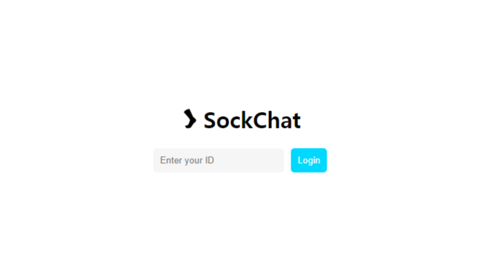
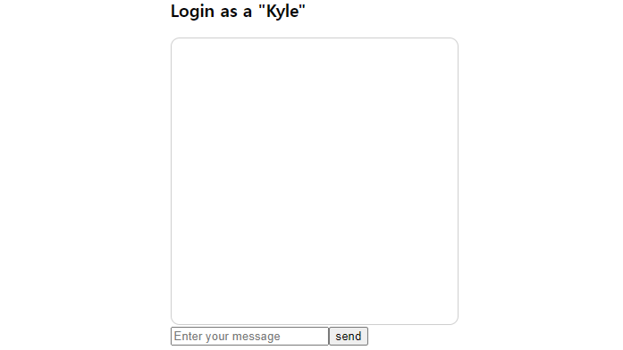
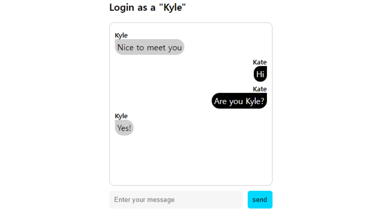
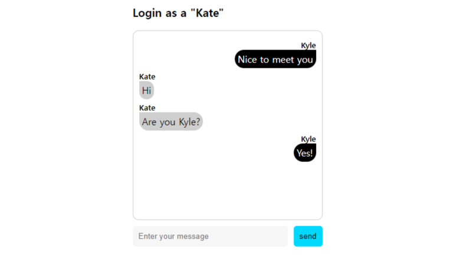

## 01. sockjs (320p)

<font size=2>다양한 실시간 서비스를 socket.io라는 라이브러리로 구현했다.</font><br />
<font size=2>socket.io는 웹 소켓을 이용한 서비스를 만들 때 아주 강력한 기능을 제공한다.</font><br />
<font size=2>그러나 이런 socket.io가 만능툴은 아니다.</font><br />
<font size=2>그 이유는 socket.io가 nodejs 서버에 친화적이기 때문이다.</font><br /><br />

<font size=2>실제로 현장에서 프런트앤드 개발자로 일하다 보면 다양한 백엔드 환경과 만나게 된다.</font><br />
<font size=2>하지만 현재 백엔드는 nodejs로 이루어진 환경보다는 자바나 파이썬으로 이루어져 있는 경우가 대부분이다.</font><br />
<font size=2>무엇보다 자바나 파이썬에서는 socket.io를 사용하는 경우가 거의 없다.</font><br />
<font size=2>그래서 HTML5 웹 소켓을 이용하거나 다양한 환경 구성을 제공하는 sockjs를 사용하게 된다.</font><br /><br />

<font size=2>sockjs는 2011년에 처음 배포된 이후로 10년 넘게 꾸준히 사랑받고 있는 웹 소켓 라이브러리이다.</font><br />
<font size=2>socket.io와 마찬가지로 다양한 브라우저와 호환을 이루며 가볍게 사용할 수 있다.</font><br />
<font size=2>무엇보다 자바, 파이썬, nodejs, Perl과 같은 환경에서도 구현할 수 있다는 장점이 있다.</font><br />
<font size=2>sockjs를 이용해서 전송된 메시지가 접속한 사용자에게 모두 제공되는 간단한 채팅 서비스를 만들겠다.</font><br /><br />

<font size=2>우리가 만들 채팅 서비스는 sockchat이다.</font><br />
<font size=2>먼저 사용자 아이디를 입력하는 창을 띄운다.</font><br />
<font size=2>아이디를 입력하고 들어가면 채팅할 수 있는 input 박스를 보여준다.</font><br />
<font size=2>대화방을 기준으로 왼쪽에는 자신이 입력한 채팅이 출력되고, 오른쪽에는 상대방이 입력한 내용이 출력되도록 구현한다.</font><br />

### 프로젝트 초기 설정 (322p)

<font size=2>socketjs라는 프로젝트 폴더를 생성하고 그 아래에 server와 client 폴더를 만든다.</font><br />
<font size=2>client 폴더 생성은 CRA를 이용한다.</font><br /><br />

<font size=2>다음으로 server 폴더로 이동해서 npm 프로젝트를 설정하고 server.js 파일을 생성한다.</font><br />

```
> cd server
> npm init
```

<font size=2>마지막으로 client 폴더에서 사용하지 않는 파일을 삭제하고 이미지 폴더를 추가한다.</font><br />

```
 - App.test.js
 - index.css
 - logo.svg
 - reportWebVitals.js
 - setupTests.js
```

<font size=2>images 폴더를 생성해서 처음 진입할 때 보여지는 이미지 파일을 추가한다.</font><br />

```
> cd client/src/
> mkdir images

이미지 파일 확인하기
https://github.com/devh-e/socket-programming-using-react/blob/master/appendix/sockjs/client/src/images/sockjs.png
```

<font size=2>깃허브에서 다운로드한 이미지 파일을 images 폴더에 넣는다.</font><br />
<font size=2>App.js에서 방금 지웠던 import 항목들과 로고를 사용하는 부분을 삭제한다.</font><br />

```
import React from "react";

const App = () => {

  return (
    <div className="App">
      <header className="App-header">
        <p>
          Edit <code>src/App.js</code> and save to reload.
        </p>
        <a
          className="App-link"
          href="https://reactjs.org"
          target="_blank"
          rel="noopner noreferrer"
        >
          Learn React
        </a>
      </header>
    </div>
  );
}

export default App;
```

<font size=2>추가적으로 index.js에서 참조하지 않는 파일과 React.stictMode를 제거한다.</font><br />

```
import React from 'react';
import ReactDOM from 'react-dom/client';
import App from './App';

const root = ReactDOM.createRoot(document.getElementById('root'));
root.render(<App />);
```

### 서버 사이드 (324p)

```
필요한 라이브러리
 • sockjs : nodejs의 sockjs를 위한 라이브러리이다.
 • nodemon : nodejs 서버를 모니터링하고 쉽게 재시작하기 위해 사용한다.
```

<font size=2>서버 사이드에 필요한 라이브러리를 설치한다.</font><br />

```
  > npm install sockjs
  > npm install nodemon
```

<font size=2>또 서버를 시작하기 위해 package.json에 아래 스크립트를 추가한다.</font><br />

```
  "start": "nodemon server.js"
```

### server.js (325p)

```
// 1
const http = require("http");
const sockjs = require("sockjs");

// 2
const sock = sockjs.createServer();

// 3
const clients = new Map();

// 4
sock.on("connection", function(conn) {
  let myId = "";

  // 5
  conn.on("data", function(message) {
    const { data, type, id } = JSON.parse(message);

    // 6
    switch(type) {
      case "id":
        myId = data;
        clients.set(data, conn);
        break;

      case "msg":
        clients.forEach((value, key, map) => {
          if( key !== myId ) {
            value.write(JSON.stringify({ data: data, id: id }));
          }
        });
        break;

      default:
        break;
    }
  });
  
  conn.on("close", function() {
    clients.delete(myId);
  });
});

// 7
const server = http.createServer();
sock.installHandlers(server, { prefix: "/sock" });
server.listen(9999, "0.0.0.0");
```

<font size=2>1. nodejs의 http 서버와 sockjs 라이브러리를 불러온다.</font><br />
<font size=2>socket.io는 소켓 서버만 생성해서 실행했다.</font><br />
<font size=2>그러나 sockjs는 웹 서버를 기반으로 동작하기 때문에 서버 설정과 함께 동작한다.</font><br /><br />

<font size=2>2. createServer()를 이용해서 sockjs 서버를 생성한다.</font><br /><br />

<font size=2>3. clients라는 Map 객체를 생성해서 접속한 사용자의 아이디 정보를 관리한다.</font><br />
<font size=2>key 값은 사용자 아이디, value는 sockjs의 객체이다.</font><br /><br />

<font size=2>4. 클라리언트 사용자가 소켓을 연결하면 'connection' 이벤트로 호출된다.</font><br />
<font size=2>sockjs는 웹 소켓을 기반으로 동작하기 때문에 소켓 이벤트 속성을 동일한다.</font><br /><br />

<font size=2>5. 'data' 이벤트로 사용자가 전송한 메시지 값을 받는다.</font><br />
<font size=2>기본적으로 문자열 형태의 데이터만 주고받을 수 있다.</font><br />
<font size=2>만약 object 형태의 데이터를 받기 위해선 JSON을 이용해서 파싱과 문자열 변환을 해야한다.</font><br /><br />

<font size=2>6. 클라이언트에서 전송된 데이터를 구분하기 위해 switch문을 사용했다.</font><br />
<font size=2>type으로 전송되는 값은 두 가지이다.</font><br />
<font size=2>하나는 화면에서 지정된 사용자 아이디이고, 마지막은 사용자가 보내온 메시지이다.</font><br />
<font size=2>사용자 아이디가 전송되면 clients라는 Map 객체에 저장된다.</font><br />
<font size=2>type이 'msg'로 넘어온 채팅 메시지를 다른 사용자들에게 보내기 위한 로직이다.</font><br />
<font size=2>socket.io의 경우는 broadcast(), emit(), to()를 이용해서 통신 타입을 지정할 수 있었다.</font><br />
<font size=2>그러나 sockjs는 기본으로 제공되는 통신 기능이 없기 때문에 사용자가 자체적으로 구현해야 하는 단점이 있다.</font><br />
<font size=2>앞에서는 clients에 저장된 로직을 순환하면서 전송자의 아이디와 동일하지 않은 객체만 write() 메소드로 메시지를 전달한다.</font><br /><br />

<font size=2>7. http 서버를 생성한다.</font><br />
<font size=2>installHandlers() 라는 메소드를 이용해서 소켓 서버와 연결한다.</font><br />
<font size=2>여기서 prefix는 sockjs 서버에 접속할 경로이다.</font><br />
<font size=2>'/sock'으로 지정했기 때문에 클라이언트에서 접속할 때 http://0.0.0.0:9999/sock으로 접속하게 된다.</font><br /><br />

### 클라이언트 사이드 (327p)

```
필요한 라이브러리
 • sockjs-client : sockjs 클라이언트를 구현하기 위한 라이브러리이다.
```

<font size=2>클라이언트에 필요한 라이브러리를 설치한다.</font><br />

```
> npm install sockjs-client
```

### App.js (328p)

```
import React, { useRef, useEffect, useState } from "react";
import "./App.css";
// 1
import SockJs from "sockjs-client";
import sockLogo from "./images/sockjs.png";

const App = () => {
  const sockJs = useRef(null);
  const messageEndRef = useRef(null);
  const [ userId, setUserId ] = useState("");
  const [ isLogin, setIsLogin ] = useState(false);
  const [ msg, setMsg ] = useState("");
  const [ msgList, setMsgList ] = useState([]);

  useEffect(() => {
    // 2
    sockJs.current = new SockJs("http://0.0.0.0:9999/sock");
  }, []);

  // 3
  useEffect(() => {
    if( !sockJs.current ) return;

    sockJs.current.onopen = function() {
      console.log("open", sockJs.current.protocol);
    };

    sockJs.current.onmessage = function(e) {
      const { data, id } = JSON.parse(e.data);

      setMsgList((prev) => [
        ...prev,
        { msg: data, type: "other", id: id },
      ]);
    };

    sockJs.current.onclose = function() {
      console.log("close");
    };
  }, []);

  // 4
  useEffect(() => {
    scrollToBottom();
  }, [msgList]);

  const scrollToBottom = () => {
    messageEndRef.current?.scrollIntoView({ behavior: "smooth" });
  };

  // 5
  const onSubmitHandler = (e) => {
    e.preventDefault();

    const sendData = {
      type: "id",
      data: userId,
    };

    sockJs.current.send(JSON.stringify(sendData));
    setIsLogin(true);
  };

  // 6
  const onChangeUserIdHandler = (e) => {
    setUserId(e.target.value);
  };

  // 7
  const onSendSubmitHandler = (e) => {
    e.preventDefault();

    const sendData = {
      type: "msg",
      data: msg,
      id: userId,
    };

    sockJs.current.send(JSON.stringify(sendData));
    setMsgList((prev) => [ ...prev, { msg: msg, type: "me", id: userId } ]);
    setMsg("");
  };

  // 8
  const onChangeMsgHandler = (e) => {
    setMsg(e.target.value);
  };

  return (
    <div className="app-container">
      <div className="wrap">
        {isLogin ? (
          // 9
          <div className="chat-box">
            <h3>Login as a "{userId}"</h3>
            <ul className="chat">
              {msgList.map((v, i) => (
                <li className={v.type} key={`${i}_li`}>
                  <div className="userId">{v.id}</div>
                  <div className={v.type}>{v.msg}</div>
                </li>
              ))}
              <li ref={messageEndRef} />
            </ul>
            <form
              className="send-form"
              onSubmit={onSubmitHandler}
            >
              <input
                placeholder="Enter your message"
                onChange={onChangeMsgHandler}
                value={msg}
              />
              <button type="submit">send</button>
            </form>
          </div>
        ) : (
          // 10
          <div className="login-box">
            <h1 className="login-title">
              
              SockChat
            </h1>
            <form className="login-form" onSubmit={onSubmitHandler}>
              <input
                placeholder="Enter your ID"
                onChange={onChangeUserIdHandler}
                value={userId}
              />
              <button type="submit">Login</button>
            </form>
          </div> 
        )}        
      </div>
    </div>
  );
}

export default App;
```

<font size=2>1. sockjs 라이브러리를 불러온다.</font><br /><br />

<font size=2>2. sockjs 객체를 리액트의 ref 속성으로 관리한다.</font><br />
<font size=2>또한 new SockJs()를 이용해서 소켓 서버에 연결한다.</font><br />
<font size=2>'/sock' 경로는 우리가 위의 server.js에 미리 지정한 경로이다.</font><br /><br />

<font size=2>3. sockjs에서 제공되는 메소드로 onopen, onmessage, oncolse가 있다.</font><br />
<font size=2>onopen의 경우 최초의 연결에 실행된다.</font><br />
<font size=2>onmessage는 서버의 메시지를 전달받는 역할을 한다.</font><br />
<font size=2>onclose는 소켓의 연결이 끊기면 실행된다.</font><br />
<font size=2>채팅 내용을 msgList라는 객체의 상태로 관리한다.</font><br />
<font size=2>서버에서 type 정보를 함께 전달받으며 type이 'other'이면 오른쪽에, 'me'이면 왼쪽에 메시지가 정렬된다.</font><br /><br />

<font size=2>4. 메시지가 하단까지 내려가면 자동으로 스크롤이 하단으로 내려지는 기능이다.</font><br />
<font size=2>scrollIntoView()라는 메소드를 이용해서 간편하게 자동으로 내려지는 기능을 구현할 수 있다.</font><br /><br />

<font size=2>5. onSubmitHandler()는 로그인 창에서 사용자 아이디를 입력한 후 Login 버튼을 누르면 실행된다.</font><br />
<font size=2>sockjs의 send()라는 메소드를 통해서 서버로 데이터를 전송할 수 있다.</font><br />
<font size=2>sockjs의 데이터는 문자열로만 전송되기 때문에 전송할 객체를 stringify()로 만들어서 전송한다.</font><br />
<font size=2>전송될 정보에는 type 정보와 사용자 아이디 정보가 포함되어 있다.</font><br /><br />

<font size=2>6. 사용자 아이디를 입력하면 실행되고, 입력된 ID는 userId를 상태로 관리된다.</font><br /><br />

<font size=2>7. onSendSubmitHandler()는 메시지를 입력하고 send를 누르면 실행된다.</font><br />
<font size=2>사용자의 메시지 정보를 send() 메시지를 이용해서 서버로 전송한다.</font><br />
<font size=2>본인이 보낸 메시지는 자신을 제외한 모든 사람에게 전송되기 때문에 자신의 메시지를 화면에 노출하기 위해 setMsgList()에 메시지 데이터를 추가한다.</font><br /><br />

<font size=2>8. 메시지를 입력하면 실행된다.</font><br /><br />

<font size=2>9. isLogin이라는 상태에 따라서 로그인 화면이나 채팅 화면을 노출하도록 한다.</font><br /><br />

<font size=2>10. 로그인 화면을 표현한다.</font><br /><br />

### App.css (333p)

```
.app-container {
  height: 100vh;
  display: flex;
  flex-direction: column;
  align-items: center;
  justify-content: center;
}
.app-container > .wrap > .login-box > .login-title {
  display: flex;
  flex-direction: row;
  font-size: 2rem;
  align-items: center;
  justify-content: center;
  gap: 5px;
}
.app-container > .wrap > .login-box > .login-title > img {
  border-radius: 50%;
}
.app-container > .wrap > .login-box > .login-form {
  display: flex;
  flex-direction: row;
  gap: 10px;
  margin-top: 20px;
}
.app-container > .wrap > .login-box > .login-form input {
  width: 100%;
  border: 0;
  padding: 10px;
  border-radius: 5px;
  background-color: #f6f6f6;
}
.app-container > .wrap > .login-box > .login-form > button {
  border: 0;
  padding: 10px;
  border-radius: 5px;
  background-color: #00d8ff;
  color: #fff;
}
.app-container > .wrap > .chat-box .chat {
  list-style: none;
  padding: 10px;
  margin: 0;
  border: 1px solid #cecece;
  border-radius: 10px;
  width: 300px;
  height: 300px;
  overflow: auto;
}
.app-container > .wrap > .chat-box .chat li.me {
  text-align: left;
}
.app-container > .wrap > .chat-box .chat li.other {
  text-align: right;
}
.app-container > .wrap > .chat-box .chat li.welcome {
  display: flex;
  flex-direction: row;
  align-items: center;
  font-size: 12px;
  font-weight: bold;
  gap: 10px;
}
.app-container > .wrap > .chat-box .chat li.welcome > .line {
  height: 0.5px;
  flex: 1 1 auto;
  padding: 0 10px;
  background-color: #cecece;
}
.app-container > .wrap > .chat-box .chat div.me {
  padding: 5px;
  display: inline-block;
  border-top-right-radius: 20px;
  border-bottom-left-radius: 20px;
  border-bottom-right-radius: 20px;
  background-color: #cecece;
}
.app-container > .wrap > .chat-box .chat div.other {
  padding: 5px;
  display: inline-block;
  border-top-left-radius: 20px;
  border-bottom-left-radius: 20px;
  border-bottom-right-radius: 20px;
  background-color: #000;
  color: #fff;
}
.app-container > .wrap > .chat-box .chat .userId {
  margin-top: 5px;
  font-size: 13px;
  font-weight: bold;
}
.app-container > .wrap > .chat-box .send-form {
  margin-top: 10px;
  display: flex;
  flex-direction: row;
  gap: 10px;
}
.app-container > .wrap > .chat-box .send-form input {
  width: 100%;
  border: 0;
  padding: 10px;
  border-radius: 5px;
  background-color: #f6f6f6;
}
.app-container > .wrap > .chat-box .send-form button {
  border: 0;
  padding: 10px;
  border-radius: 5px;
  background-color: #00d8ff;
}
```

### 테스트 (336p)

<font size=2>클라이언트와 서버를 실행시키고 http://localhost:3000으로 접속한다.</font><br />
<font size=2>다음과 같은 로그인 창을 확인할 수 있다.</font><br />



<font size=2>먼저 이름으로 Kyle를 입력하고 Login을 클릭한다.</font><br />



<font size=2>이제 Kyle과 대화하기 위해 다른 브라우저 창에 똑같이 http://localhost:3000/으로 접속한다.</font><br />
<font size=2>이번에는 Kate라는 이름으로 로그인한 후 자유롭게 대화를 진행한다.</font><br />
<font size=2>우리가 구현한 대로 실행되는 것을 확인할 수 있다.</font><br />


