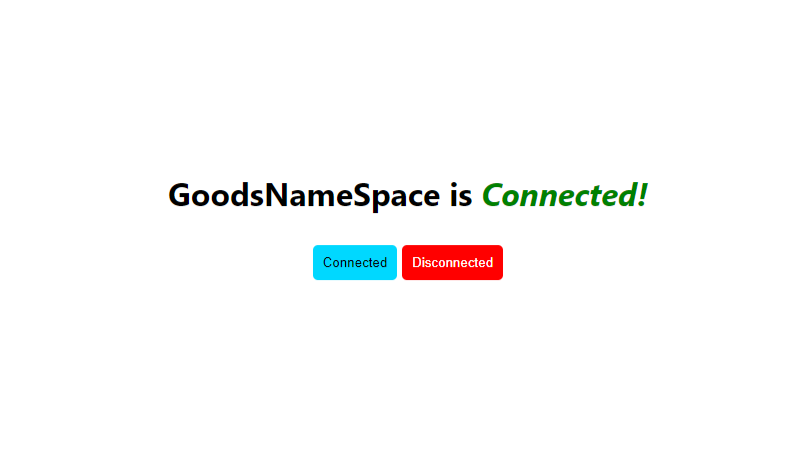
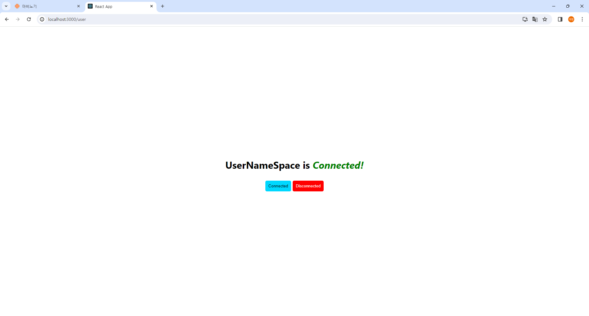
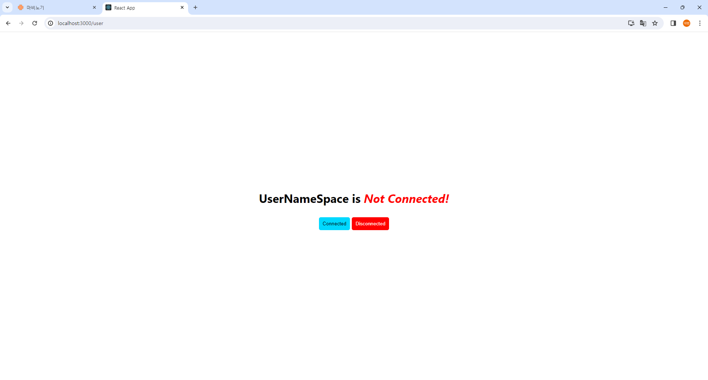

### 네임 스페이스 (133p)

<font size=2>네임스페이스(namespace)는 서비스를 내부적으로 구분할 수 있는 공간을 의미한다.</font><br />
<font size=2>예를 들어 옷 판매 사이트가 있다고 가정하겠다. 옷 판매 사이트는 여러 개의 도메인이 있다.</font><br />
<font size=2>주문, 상품, 배송 등 관리 포인트가 있고 이런 관리 포인트를 네임스페이스로 구분지어 관리할 수 있다.</font><br /><br />

<font size=2>앞에서는 룸이라는 개념을 이용해서 단체방을 생성했다.</font><br />
<font size=2>여기서는 단체방이라고 말했지만 사실은 룸을 이용해서 관리 포인트를 구분한 것과 같다.</font><br />
<font size=2>그렇다면 네임스페이스를 사용하지 않고 룸만으로도 충분히 사관리할 수 있지 않을까?</font><br /><br />

<font size=2>가능하긴 하다. 하지만 네임스페이스는 룸의 상위 버전으로 용도가 조금 다르다.</font><br />
<font size=2>만약 네임스페이스를 이용해 옷 판매 사이트의 상품이라는 공간을 만들었다면 룸을 이용해 신발, 하의, 상의와 같은 상세한 상품 카테고리를 만들 수도 있다.</font><br /><br />

<font size=2>라우터에 따른 네임스페이스에 접속 유무를 확인할 수 있는 단순한 예제를 만들어보겠다.</font><br />
<font size=2>Connect 버튼을 클릭했을 때 "Connected"라는 초록색 글자가 보이면 우리가 지정한 네임스페이스로 정상적으로 연결될 것이다.</font><br />

### 프로젝트 초기 설정 (134p)

<font size=2>namespace 폴더를 생성하고 그 아래에 client와 server 폴더를 만든다.</font><br />

```
> mkdir namespace
> cd namespace
> mkdir server
> npx create-react-app client
```

<font size=2>기존에 만들었던 프로젝트와 동일하게 CRA를 이용해서 client 폴더를 생성했다.</font><br />

### 클라이언트 사이드 (134p)

```
필요한 라이브러리
 • socket.io-client : socket.io를 실행하기 위한 라이브러리이다.
 • react-router-dom : 이번 예제에 필요한 라우팅 라이브러리이다.
```

<font size=2>이제 클라이언트 사이드부터 구현을 시작하겠다. 먼저 필요한 라이브러리부터 설치한다.</font><br />

```
> npm i socket.io-client
> npm i react-router-dom
```

<font size=2>이제 앞에서 진행했던 프로젝트와 동일하게 client 폴더에 사용하지 않는 파일과 폴더를 삭제하겠다.</font><br />

```
 - App.test.js
 - logo.svg
 - reportWebVitals.js
 - setupTests.js
```

<font size=2>index.js의 사용하지 않는 부분은 제거하겠다.</font><br />

```
import React from 'react';
import ReactDOM from 'react-dom/client';
import './index.css';
import App from './App';

const root = ReactDOM.createRoot(document.getElementById('root'));
root.render(<App />);
```

<font size=2>App.js에서 logo 파일을 사용하는 부분도 삭제한다.</font><br />

```
import './App.css';

const App = () => {
  return (
    <div className="App">
      <header className="App-header">
        <p>
          Edit <code>src/App.js</code> and save to reload.
        </p>
        <a
          className="App-link"
          href="https://reactjs.org"
          target="_blank"
          rel="noopener noreferrer"
        >
          Learn React
        </a>
      </header>
    </div>
  );
}

export default App;
```

### App.js (137p)

<font size=2>이제 App.js와 라우팅에 필요한 Page를 하나씩 만들겠다.</font><br />

```
// 1
import {
  BrowserRouter as Router,
  Routes,
  Route,
  Navigate,
} from "react-router-dom";
import GoodsPage from "./GoodsPage";
import UserPage from "./UserPage";
import './App.css';

const App = () => {
  return (
    <Router>
      <Routes>
        <Route path="/" element={<Navigate replace to="/goods" />} />
        <Route path="/goods" element={<GoodsPage />} />
        <Route path="/user" element={<UserPage />} />
      </Routes>
    </Router>
  );
}

export default App;
```

<font size=2>1. 라우팅을 위한 함수를 불러왔다. 또한 각각 라우팅에 구분되는 Page 컴포넌트들도 추가했다.</font><br /><br />
<font size=2>2. 우리가 설정한 routing은 /goods와 /user 두 가지 이다.</font><br />
<font size=2>만약 루트("/") 경로로 접근한다면 자동으로 /goods로 리다이렉트되도록 설정했다.</font><br /><br />

### App.css (138p)

<font size=2>App.css 내용은 간단하다. 활성/비활성화 처리에 필요한 색상을 스타일링했다.</font><br />

```
.text-wrap {
  height: 100vh;
  display: flex;
  flex-direction: column;
  justify-content: center;
  align-items: center;
  gap: 10px;
}
.active {
  color: green;
}
.deactive {
  color: red;
}
.btn-box {
  display: flex;
  flex-direction: row;
  gap: 5px;
}
.active-btn {
  border: 0;
  padding: 10px;
  border-radius: 5px;
  background-color: #00d8ff;
  cursor: pointer;
}
.deactive-btn {
  border: 0;
  padding: 10px;
  border-radius: 5px;
  background-color: red;
  color: #fff;
  cursor: pointer;
}
```

### socket.js (139p)

```
import { io } from "socket.io-client";

// 1
export const socketGoods = io("http://localhost:5000/goods", {
  autoConnect: false,
});

// 2
export const socketUser = io("http://localhost:5000/user", {
  autoConnect: false,
});
```

<font size=2>1~2. 지금까지와는 다른 방식으로 socket.io 객체를 초기화했다.</font><br />
<font size=2>앞으로 Part 2에서 사용할 예제는 위와 같은 방식으로 진행될 예정이다.</font><br />
<font size=2>이렇게 객체를 하나의 파일에서 따로 관리할 경우 개발 환경에 따른 분기 처리가 쉽고 가독성 또한 좋아진다.</font><br /><br />

<font size=2>두 개의 객체가 준비되어 있다.</font><br />
<font size=2>socketGoods는 goods 네임스페이스로 접속된 소켓 객체이고 아래에 있는 socketUser는 user 네임스페이스에 접속된 소켓 객체이다.</font><br />
<font size=2>마지막으로 autoConnect: false라는 속성이 보인다.</font><br />
<font size=2>이 속성을 적용할 경우 리액트 컴포넌트가 마운트될 때 자동으로 소켓이 연결되는 것이 아니라 수동으로 socket.connect()라는 함수를 이용해서 연결해야 한다.</font><br />

```
io([url][, options])

socket.io에서는 소켓을 연결할 때 다양한 옵션이 있다.
예를 들어 'reconnection', 'autoConnect', 'timeout' 등 연결에 필요한 항목을 선택할 수 있다.

 • 참고 : https://socket.io/docs/v4/client-api/
```

### UserPage.js와 GoodsPage.js (140p)

<font size=2>UserPage.js와 GoodsPage.js의 코드가 비슷하기 때문에 한 번에 설명하겠다.</font><br />

```
UserPage.js

import React, { useEffect, useState } from "react";
import { socketUser } from "./socket";

const UserPage = () => {
  const [ isConnect, setIsConnect ] = useState(false);
  
  useEffect(() => {
    const onConnect = () => {
      setIsConnect(true);
    }

    const onDisConnect = () => {
      setIsConnect(false);
    }

    socketUser.on("connect", onConnect);
    socketUser.on("disconnect", onDisConnect);

    return () => {
      socketUser.off("connect", onConnect);
      socketUser.off("disconnect", onDisConnect);
    };
  }, []);

  const onConnectHandler = () => {
    socketUser.connect();
  };

  const onDisConnectHandler = () => {
    socketUser.disconnect();
  };

  return (
    <div className="text-wrap">
      <h1>
        UserNameSpace is
        {isConnect ? (
          <em className="active">Connected!</em>
        ) : (
          <em className="deactive">Not Connected!</em>
        )}
      </h1>
      <div className="btn-box">
        <button onClick={onConnectHandler} className="active-btn">
          Connected
        </button>
        <button onClick={onDisConnectHandler} className="deactive-btn">
          Disconnected
        </button>
      </div>
    </div>
  );
};

export default UserPage;
```

```
GoodsPage.js

import React, { useEffect, useState } from "react";
// 1
import { socketGoods } from "./socket";

const GoodsPage = () => {
  // 2
  const [ isConnect, setIsConnect ] = useState(false);
  
  // 3
  useEffect(() => {
    const onConnect = () => {
      setIsConnect(true);
    }

    const onDisConnect = () => {
      setIsConnect(false);
    }

    socketGoods.on("connect", onConnect);
    socketGoods.on("disconnect", onDisConnect);

    return () => {
      socketGoods.off("connect", onConnect);
      socketGoods.off("disconnect", onDisConnect);
    };
  }, []);

  // 4
  const onConnectHandler = () => {
    socketGoods.connect();
  };

  // 5
  const onDisConnectHandler = () => {
    socketGoods.disconnect();
  };

  return (
    <div className="text-wrap">
      <h1>
        GoodsNameSpace is
        {isConnect ? (
          <em className="active">Connected!</em>
        ) : (
          <em className="deactive">Not Connected!</em>
        )}
      </h1>
      <div className="btn-box">
        <button onClick={onConnectHandler} className="active-btn">
          Connected
        </button>
        <button onClick={onDisConnectHandler} className="deactive-btn">
          Disconnected
        </button>
      </div>
    </div>
  );
};

export default GoodsPage;
```

<font size=2>1. 미리 정의한 socket.js에서 socketGoods 객체를 불러왔다.</font><br /><br />

<font size=2>2. isConnect 변수를 설정했다.</font><br />
<font size=2>네임스페이스에 소켓이 연결되었다면 true, 아니면 false 값을 가진다.</font><br /><br />

<font size=2>3. useEffect에 'connect', 'disconnect' 이벤트 리스너를 등록했다.</font><br />
<font size=2>소켓이 연결되었다면 isConnect를 true로 업데이트한다.</font><br /><br />

<font size=2>4. 화면에 Connected 버튼을 클릭하면 실행된다.</font><br />
<font size=2>socket.io의 connect() 메소드는 소켓을 연결할 때 사용한다.</font><br /><br />

<font size=2>5. Disconnect 버튼을 클릭하면 실행된다.</font><br /><br />

```
네임스페이스를 여러 개 연결할 경우 소켓이 여러 번 연결되는 건가?

결론부터 말하자면 아니다.
동일한 메인 도메인의 하위 경로를 추가해서 네임스페이스를 만들었다.
이럴 경우 socket.io에서는 하나의 웹 소켓 연결만을 생성한 후에 패킷을 알맞은 목적지에 전송하도록 분산 처리한다.

만약 접속의 메인 도메인 주소가 달라진다면 웹 소켓 연결은 두 번 생기게 된다.
```

### 서버 사이드 (144p)

<font size=2>이제 네임스페이스를 확인할 수 있는 마지막 구현인 서버 사이드로 넘어가겠다.</font><br />
<font size=2>server 폴더로 이동한 후에 server.js 파일을 생성한다.</font><br /><br />

<font size=2>또 socket.io 라이브러리를 사용하기 때문에 npm이 필요하다.</font><br />
<font size=2>npm을 이용해서 package.json을 생성한다.</font><br />

```
> npm init
```

<font size=2>npm init 이라는 명령어를 통해서 자동으로 package.json 파일이 생성된 것을 확인할 수 있다.</font><br />
<font size=2>이제 server.js를 만들면서 socket.io를 설치하겠다.</font><br />

### server.js

```
필요한 라이브러리
 • socket.io : socket.io를 사용하기 위한 소켓 라이브러리이다.

> npm install socket.io
```

<font size=2>이제 본격적으로 server.js를 구현하겠다.</font><br />

```
const { Server } = require("socket.io");

const io = new Server("5000", {
  cors: {
    origin: "http://localhost:3000",
  },
});

// 1
io.of("/goods").on("connection", (socket) => {
  console.log("goods connected");
  socket.on("shoes", (res) => {});
  socket.on("pants", (res) => {});
});

// 2
io.of("/user").on("connection", (socket) => {
  console.log("user connected");
  socket.on("admin", (res) => {});
});
```

<font size=2>1~2. 네임스페이스를 위한 설정이라고 했지만 코드는 너무 간단하다.</font><br />
<font size=2>네임스페이스를 설정하기 위해서 단지 of() 메소드를 이용하면 된다.</font><br />
<font size=2>ok([네임스페이스])를 지정하면 해당 URL로 설정할 수 있다.</font><br /><br />

<font size=2>이 예제의 경우 상품과 사용자 네임스페이스를 만들었고 각각의 소켓 안에 신발과 바지와 같은 카테고리를 생성했다.</font><br />
<font size=2>네임스페이스 하위의 나머지 기능들은 지금까지 우리가 배운 socket.io의 기능과 동일하다.</font><br />
<font size=2>그렇다면 우리가 작성한 코드가 제대로 동작하는지 확인해보겠다.</font><br />
<font size=2>터미널을 두 개 열고 각각 클라이언트와 서버를 실행한다.</font><br /><br />

<font size=2>먼저 /goods 부터 확인하겠다. http://localhost:3000/goods로 접속한다.</font><br />



<font size=2>이후에 Connected 버튼을 클릭한다. 아래처럼 나오면 성공이다.</font><br />


<font size=2>이번에는 /user를 확인하겠다. http://localhost:3000/user로 접속한다.</font><br />




<font size=2>사용자 네임스페이스도 동일하게 나오는 것을 확인할 수 있다.</font><br /><br />

<font size=2>socket.io의 주요한 기능을 배울 수 있었다.</font><br />
<font size=2>public, broadcast, private이라는 대표적인 3개의 통신 방법과 룸 생성, 마지막으로 네임스페이스를 이용해서 도메인을 분리하는 것까지 확인했다.</font><br />
<font size=2>이제는 지금까지 배운 내용을 토대로 실전 예제를 만들어볼 차례이다.</font><br />