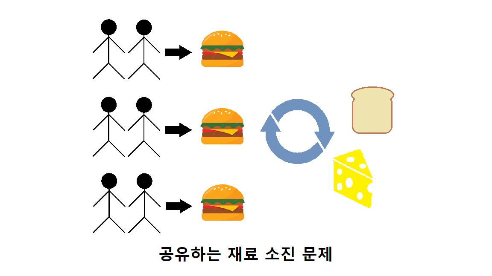

# 리엑트로 배우는 소켓 프로그래밍
<br />

## 02. nodejs (36p)
<font size=2>자바스크립트는 지금까지 웹을 지탱하는 중요한 요소로 동작하고 있다.</font><br />
<font size=2>1990년대 자바스크립트가 등장하면서 웹 브라우저 세계는 엄청난 진화를 시작했다.</font><br />
<font size=2>기존의 웹은 HTML과 CSS로 정적인 모습만 보여줬지만, 자바스크립트를 이용해 사용자와 웹이 동적으로 상호작용을 할 수 있게 되었다.</font><br />
<font size=2>또한 사용자 친화적인 다양한 라이브러리와 프레임워크가 대거 등장하면서 웹 플랫폼 시장을 빠른 속도로 성장시켰다.</font><br /><br />

<font size=2>현재는 자바스크립트가 브라우저 환경을 넘어서 서버와 앱과 사물 인터넷의 영역까지 제작할 수 있는 스크립트 언어가 되었다.</font><br /><br /><br />

### nodejs의 탄생 (36p)
<font size=2>2009년 5월, 라이언 달(Ryan Dahl)이라는 개발자가 nodejs를 발표한다.</font><br />
<font size=2>당시 웹에서는 구글 크롬 브라우저에 대한 관심이 폭발적이었다.</font><br />
<font size=2>크롬 브라우저에는 구글이 새로 개발한 자바스크립트 엔진인 v8이 탑재되었기 때문이다.</font><br />
<font size=2>v8은 C++로 개발되어 자바스크립트 코드를 기반으로 기계어 코드를 생성해서 실행하기 때문에 현존하는 자바스크립트 엔진의 성능을 압도했다.</font><br />
<font size=2>이런 빠른 성능을 기반으로 자바스크립트를 이용한 다양한 시도가 있었고 그 첫 번째 자이언트 스탭이 nodejs의 탄생이었다.</font><br /><br />

<font size=2>흔히 nodejs라고 하면 서버를 먼저 떠올린다.</font><br />
<font size=2>자바스크립트를 이용해서 프런트엔드를 넘어 백엔드까지 제작을 가능하게 했기 때문이 아닐까 추측한다.</font><br />
<font size=2>정확히 말하면 nodejs는 자바스크립트를 실행시키는 런타임 환경을 말한다.</font><br />
<font size=2>nodejs 공식 사이트에서도 nodejs를 백엔드 제작 툴이 아닌 런타임 환경으로 소개하고 있다.</font><br />
<font size=2>그리고 nodejs하면 빠지지 않는 키워드가 바로 비동기와 논블로킹(non-blocking)이다.</font><br /><br /><br />

### 멀티 스레드 기반 동기 방식 (37p)
<font size=2>흔히 nodejs의 장점이라고 하면 빠른 네트워크 처리를 많이 꼽는다.</font><br />
<font size=2>nodejs는 서버 환경에서 기존 웹 서버와는 다른 방식을 채택하고 있기 때문이다.</font><br />
<font size=2>기존 웹 서버들은 요청을 처리할 때 동기 방식으로 일을 처리한다.</font><br />
<font size=2>순차적으로 일을 처리하는 동기 방식에서는 다른 요청이 들어오면 앞의 일을 끝내야 처리할 수 있다.</font><br />
<font size=2>결국 병목이 발생하는데 이런 문제를 흔히 I/O(입출력) 블로킹이라고 한다.</font><br />
<font size=2>여기서 I/O가 나온 이유는 서버 부하의 원인이 대부분 I/O에서 발생하기 때문이다.</font><br /><br />

<font size=2>다음 그림은 동기 방식으로 작동하는 햄버거 주문 과정을 나타내고 있다.</font><br />
<font size=2>이 가게에서는 한 번에 한 명의 손님만 처리한다.</font><br />
<font size=2>한 손님이 주문하고 그 주문이 완료될 때까지 기다리는 동안 다른 손님을 주문을 할 수 없다.</font><br />
<font size=2>따라서 한 손님이 복잡한 주문을 한다면 그 주문을 처리하는 동안 다른 모든 손님은 기다려야 한다.</font><br />
<font size=2>이런 식으로 요청을 처리하는 방식은 효율성이 떨어진다.</font><br />


<font size=2>I/O 블로킹을 해결하기 위해 기존 서버는 스레드를 이용하게 됐다.</font><br />
<font size=2>멀티 스레드는 서버로 오는 요청을 병렬 처리할 수 있도록 했다.</font><br />
<font size=2>예를 들어 10명의 사람이 동시에 햄버거를 주문한다면 여러 개의 카운터를 만들어 동시에 주문을 받을 수 있다.</font><br />


<font size=2>이렇게 보면 너무 순조로운 방법 같지만 이 방법에도 한계가 있다.</font><br />
<font size=2>스레드는 서버의 CPU 자원을 나눠서 갖는 형태이기 때문에 자원이 고갈되면 요청을 처리하지 못한다.</font><br />
<font size=2>또한 공통된 자원을 어떻게 공유할 것인가에 대한 문제도 있다.</font><br />


<br /><br />

### 이벤트 기반 비동기 방식의 등장 (38p)
<font size=2>앞서 말한 스레드의 한계를 극복하고자 비동기 방식이 등장했다.</font><br />
<font size=2>놀랍게도 비동기 방식은 단일 스레드로 동작한다.</font><br />
<font size=2>하지만 의문점이 있다.</font><br />
<font size=2>단일 스레드라면 어떻게 많은 요청을 한 번에 처리할 수 있는 것인가?</font><br />
<font size=2>이런 마법을 가능하게 만드는 기술은 바로 이벤트 기반 비동기 방식이다.</font><br /><br />

<font size=2>이벤트 기반 방식은 자바스크립트에서 사용되는 이벤트와 콜백(callback) 함수를 통해 작업을 처리하는 방식이다.</font><br />
<font size=2>이벤트가 발생하면 해당 이벤트를 감지하고, 이벤트가 발생했음을 알려주는 콜백 함수가 실행된다.</font><br />
<font size=2>이를 통해 우리는 이벤트가 발생했을 때 필요한 작업을 처리할 수 있다.</font><br />
<font size=2>예를 들어, A, B, C 세 가지 종류의 햄버거를 한 번에 주문해서 먹고 싶다고 가정해보자.</font><br />
<font size=2>만약 우리가 몸을 복사하는 초능력을 가지고 있다면 세 종류의 햄버거를 동시에 주문하고 동시에 받아올 수 있을 것이다.</font><br />
<font size=2>이처럼 몸을 복사하는 방법이 동기 방식의 멀티 스레드이다.</font><br /><br />

<font size=2>하지만 현실적으로는 그런 초능력을 가지고 있지 않기 때문에 효율적인 방법이 필요하다.</font><br />
<font size=2>그래서 음식이 완성되면 우리를 부르는 요청을 보내게 한다.</font><br />
<font size=2>이렇게 되면 음식이 완성되는 대로 빠르게 해당 위치로 이동해서 음식을 받아올 수 있다.</font><br />
<font size=2>다시 말해, 이벤트가 발생하면 콜백 함수를 실행하여 필요한 작업을 수행하는 것이다.</font><br />
<font size=2>이것이 단일 스레드 비동기 처리 방식이다.</font><br />


<font size=2>이렇게 비교하면 멀티 스레드가 무조건 성능이 좋을 것 같지만 만약 만들어지는 음식 대기 시간이 동일하다면 결국 같은 시간에 같은 결과를 만들어 낼 것이다.</font><br />
<font size=2>단일 스레드이기 때문에 앞에서 설명했던 멀티 스레드의 단점을 극복할 수 있다.</font><br />
<font size=2>그러나 만약 단일 스레드가 동작을 멈춘다면 시스템 전체에 악영향을 미칠 수 있다.</font><br />
<br /><br />

### nodejs 웹서버 (39p)
<font size=2>앞에서 nodejs의 배경과 장단점을 살펴봤다.</font><br />
<font size=2>이제는 nodejs를 이용해서 얼마나 간단히 서버를 설계할 수 있는지 살펴보겠다.</font><br />
<font size=2>index.html을 서빙하는 nodejs 서버를 만들려고 한다.</font><br /><br />

### 프로젝트 초기 설정 (40p)
<font size=2>먼저 nodejs를 설치한다.</font><br />
<font size=2>지금 nodejs 설정을 해두면 Part 2의 실전 예제를 원활하게 진행할 수 있다.</font><br /><br />

<font size=2>https://nodejs.org/en 사이트에 접속해서 LTS 버전을 운영체제에 맞게 다운로드 한다.</font><br />


<font size=2>다운로드 이후에 mac의 경우 터미널, Windows는 cmd 창을 열고 다음 명령어를 입력해보자.</font><br />

```
> node -v
v현재 버전
```

<font size=2>설치한 버전이 나온다면 설치 설공이다.</font><br /><br />

### server.js (41p)
<font size=2>이제는 server.js 파일을 생성하겠다.</font><br />
<font size=2>node-server-ex라는 빈 폴더를 만들고 그 아래에 server.js 파일을 만든다.</font><br /><br />

<font size=2>server.js 파일을 열고 다음과 같이 코드를 작성한다.</font><br />

```
// 1
const http = require("http");
const fs = require("fs").promises;
const url = require("url");

// 2
const server = http
  .createServer(async (req, res) => {
    // 3
    const pathname = url.parse(req.url).pathname;
    const method = req.method;
    let data = null;

    // 4
    if (method === "GET") {
      switch (pathname) {
        case "/":
          res.writeHead(200, {
            "Content-Type": "text/html; charset=utf-8",
          });
          data = await fs.readFile("./index.html");
          res.end(data);
          break;
        default:
          res.writeHead(400, {
            "Content-Type": "text/html; charset=utf-8",
          });
          data = await fs.readFile("./index.html");
          res.end(data);
      }
    }
  })
  .listen(5000);

// 5
server.on("listening", () => {
  console.log("5000 port is running");
});

// 6
server.on("error", (err) => {
  console.log(err);
});
```

<font size=2>1. nodejs에서는 require라는 문법을 이용해서 모듈과 라이브러리를 불러올 수 있다.</font><br />
<font size=2>예제에서 사용할 http, fs, url 이라는 모듈을 각각 불러왔다.</font><br />
<font size=2> • http : 기본 모듈로 웹 서버를 만들 때 사용한다.</font><br />
<font size=2> • fs : 파일을 읽을 때 사용한다.</font><br />
<font size=2> • url : 요청 url을 파싱하여 간편하게 사용할 수 있도록 한다.</font><br />

```
http 모듈로만 서버를 만드나?

실무에서는 기본 http 모듈보다 express라는 외부 모듈을 많이 사용한다.
express 모듈을 사용하면 더 간결하게 웹 서버의 기능을 사용할 수 있다.

 * https://expressjs.com/en/guide/routing.html

우리가 위에서 작성한 라우팅 또한 express를 이용하면 더 직관적으로 코딩할 수 있다.

const express = require("express");
const app = express();

// response with "hello world" when a GET request is made to the homepage
app.get("/", function(req, res) => {
  res.send("hello world");
});
```
<br /><br />

<font size=2>2. http.createServer() 메소드를 이용해서 서버를 만든다.</font><br />
<font size=2>그 아래 36행에서 listen(5000) 메소드를 이용해서 포트 5000번으로 서버를 생성한다.</font><br />

```
 .listen(5000);
```
<br /><br />


<font size=2>3. url.parse()라는 메소드를 이용해서 접속한 url 정보를 파싱한다.</font><br />
<font size=2>만약 파싱된 정보를 살펴보고 싶다면 아래와 같이 코드에 console.log()를 추가해서 다음과 같은 속성이 있는 걸 확인할 수 있다.</font><br />

```
const method = req.method;
let data = null;

console.log(url.parse(req.url));

// 4
if( method === "GET" ) {
  ...
}
```


<font size=2>그중에서 우리는 pathname을 사용한다.</font><br />

```
Url {
  protocol: null,
  slashes: null,
  auth: null,
  host: null,
  port: null,
  hostname: null,
  hash: null,
  search: null,
  query: null,
  pathname: "/",
  path: "/",
  href: "/",
}
```
<br /><br />

<font size=2>4. method 값을 이용해서 "GET"으로 넘어온 경우 분기문 안에 들어가도록 했다.</font><br />

```
const method = req.method;

node 서버가 제공하는 req 객체에는 요청에 해당하는 다양한 정보가 들어있다.
기본적으로 HTTP 프로토콜과 REST API를 이용한 웹 서비스를 만들기 때문에 req 객체를 이용해 다양한 기능을 구현할 수 있다.
```
<br /><br />

<font size=2>5. 서버에 최초로 진입할 때 실행되는 함수이다.</font><br /><br />

<font size=2>6. 서버에 오류가 발생할 때 실행된다.</font><br /><br />

### index.js (45p)
<font size=2>이제 node 서버가 서빙할 HTML을 만든다.</font><br />
<font size=2>위의 node-server-ex 폴더 아래 index.html을 만든다.</font><br />
<font size=2>index.html 내용은 간단하다.</font><br />

```
<!DOCTYPE html>
<html lang="en">
  <head>
    <meta charset="UTF-8" />
    <meta http-equiv="X-UA-Compatible" content="IE=edge" />
    <meta name="viewport" content="width=device-width, initial-scale=1.0" />
    <title>Document</title>
  </head>
  <style>
    body {
      background-color: #ffbb00;
    }
    .center {
      display: flex;
      flex-direction: row;
      justify-content: center;
    }
    .content {
      max-width: 900px;
      width: 100%;
    }
    h1 {
      color: #fff;
      margin-top: 50px;
    }
    section {
      line-height: 25px;
      font-size: 1rem;
    }
  </style>
  <body>
    <div class="center">
      <div class="content">
        <h1>What is a Nodejs?</h1>
        <section>
          Node.js is similar in design to, and influenced by, systems like Ruby's Event Machine and Python's Twisted. Node.js takes the event model a bit further. It presents an event loop as a runtime construct instead of as a library. In other systems, there is always a blocking call to start the event-loop. Typically, behavior is defined through callbacks at the beginning of a script, and at the end a server is started through a blocking call like EventMachine::run(). In Node.js, there is no such start-the-event-loop call. Node.js simply enters the event loop after executing the input script. Node.js exits the event loop when there are no more callbacks to perform. This behavior is like browser JavaScript — the event loop is hidden from the user.
        </section>
      </div>
    </div>
  </body>
</html>
```

<font size=2>이제 서버를 실행할 차례이다.</font><br />
<font size=2>폴더의 루트 경로로 이동한 후에 다음과 같이 node 명령어를 실행한다.</font><br />

```
> node server.js
5000 port is running
```

<font size=2>이제 브라우저를 열고 http://localhost:5000 으로 접속한다.</font><br />
<font size=2>우리가 작성한 index.html 내용이 노출되면 성공이다.</font><br /><br />

<font size=2>지금까지 nodejs의 기본적인 사용법을 학습했다.</font><br />
<font size=2>지금의 내용이면 앞으로 작성할 소켓 서버를 구현하는 데 문제가 없다.</font><br />
<font size=2>추가적인 기능이나 모듈은 예제를 진행하면서 하나씩 알아가보겠다.</font><br />
<font size=2>다음 장에서는 드디어 소켓을 이야기할 차례이다.</font><br />