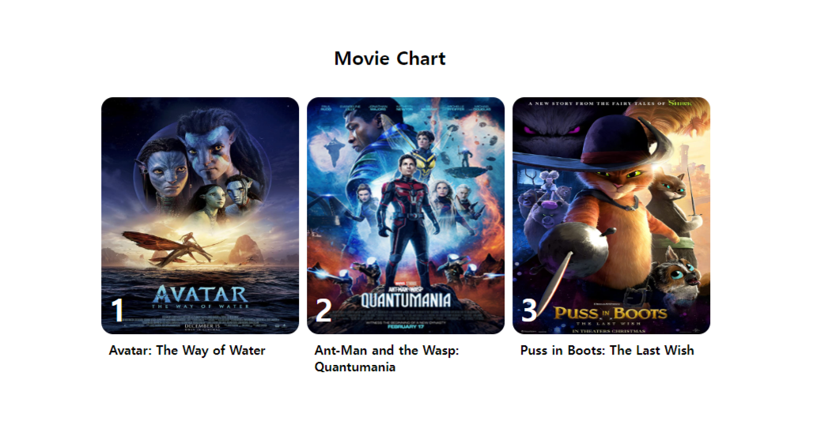

## 극장 좌석 예약 서비스 (185p)

<font size=2>좌석 예약 서비스는 우리의 일상에서 흔히 접할 수 있는 시스템이다.</font><br />
<font size=2>극장, 기차, 식당 등 많은 종류가 있지만 극장의 좌석 예약 서비스를 만들면서 웹 소켓을 이해하겠다.</font><br />
<font size=2>3개의 영화 중 하나를 선택해서 클릭할 수 있고, 하나의 영화를 선택하면 좌석을 선택할 수 있는 UI를 보여준다.</font><br />
<font size=2>좌석마다 이름이 붙어있고 파란색으로 선택한 영역이 표시된다.</font><br />
<font size=2>최종적으로 Confirm 버튼을 클릭하면 선택한 부분이 빨간색으로 표시된다.</font><br />
<font size=2>물론 동시에 접속한 고객들의 선택 좌석 또한 빨간색으로 동일하게 표시된다.</font><br />

### 프로젝트 초기 설정 (186p)

<font size=2>먼저 movie-theater라는 프로젝트 폴더를 생성한다.</font><br />
<font size=2>그 아래에 server와 client 폴더를 만든다. client는 CRA를 이용해 만든다.</font><br />

```
> mkdir server
> npx create-react-app client
```

<font size=2>server 폴더로 이동해서 npm 프로젝트를 설정하고 server.js 파일을 생성한다.</font><br />

```
> cd server
> npm init
```

<font size=2>좌석 예약 프로젝트에서 사용할 images 폴더도 생성한다.</font><br />

```
> cd client/src
> mkdir images
```

```
이미지 파일 확인하기

프로젝트에 사용하느 파일은 깃허브 주소를 참고하면 된다.
https://github.com/devh-e/socket-programming-using-react/tree/master/part2/movie-theater/client/src/images
```

<font size=2>깃허브에서 다운로드한 이미지 파일을 images 폴더에 넣어준다.</font><br />
<font size=2>마지막으로 client 폴더에 사용하지 않는 파일을 삭제해준다.</font><br />

```
 - App.css
 - App.test.js
 - index.css
 - logo.svg
 - reportWebVitals.js
 - setupTests.js
```

<font size=2>App.js에서 방금 지웠던 import 항목들과 로고를 사용하는 부분을 삭제한다.</font><br />

```
const App = () => {
  return (
    <div className="App">
      <header className="App-header">
        <p>
          Edit <code>src/App.js</code> and save to reload.
        </p>
        <a
          className="App-link"
          href="https://reactjs.org"
          target="_blank"
          rel="noopener noreferrer"
        >
          Learn React
        </a>
      </header>
    </div>
  );
}

export default App;
```

<font size=2>추가적으로 index.js에서 참조하지 않는 파일과 React.strictMode를 제거해준다.</font><br />

```
import React from 'react';
import ReactDOM from 'react-dom/client';
import App from './App';

const root = ReactDOM.createRoot(document.getElementById('root'));
root.render(<App />);
```

### 서버 사이드 (189p)

```
필요한 라이브러리

 • nodemon : nodejs 서버를 모니터링하고 쉽게 재시자하기 위해 사용한다.
 • socket.io : 소켓 통신을 위해 사용한다.
```

<font size=2>서버를 시작하기 위해 package.json에 다음 스크립트를 추가한다.</font><br />

```
"start": "nodemon server.js",
```

<font size=2>극장 좌석 예약 서비스의 가장 중요한 데이터는 바로 좌석의 배치이다.</font><br />
<font size=2>좌석의 활성/비활성화를 표현하기 위해서는 정형화된 데이터가 필요하다.</font><br />
<font size=2>그래서 data.js라는 파일을 따로 만들어서 2차원 배열로 좌석을 생성한다.</font><br />

```
module.exports.seats = [
  [
    { status: 1, seatNumber: "A-0" },
    { status: 1, seatNumber: "A-1" },
    { status: 0, seatNumber: "A-2" },
    { status: 0, seatNumber: "A-3" },
    { status: 0, seatNumber: "A-4" },
    { status: 0, seatNumber: "A-5" },
    { status: 0, seatNumber: "A-6" },
    { status: 0, seatNumber: "A-7" },
    { status: 0, seatNumber: "A-8" },
    { status: 0, seatNumber: "A-9" },
    { status: 1, seatNumber: "A-10" },
    { status: 1, seatNumber: "A-11" },
  ],
  [
    { status: 1, seatNumber: "B-0" },
    { status: 1, seatNumber: "B-1" },
    { status: 0, seatNumber: "B-2" },
    { status: 1, seatNumber: "B-3" },
    { status: 1, seatNumber: "B-4" },
    { status: 1, seatNumber: "B-5" },
    { status: 1, seatNumber: "B-6" },
    { status: 1, seatNumber: "B-7" },
    { status: 1, seatNumber: "B-8" },
    { status: 0, seatNumber: "B-9" },
    { status: 1, seatNumber: "B-10" },
    { status: 1, seatNumber: "B-11" },
  ],
  [
    { status: 1, seatNumber: "C-0" },
    { status: 1, seatNumber: "C-1" },
    { status: 0, seatNumber: "C-2" },
    { status: 1, seatNumber: "C-3" },
    { status: 1, seatNumber: "C-4" },
    { status: 1, seatNumber: "C-5" },
    { status: 1, seatNumber: "C-6" },
    { status: 1, seatNumber: "C-7" },
    { status: 1, seatNumber: "C-8" },
    { status: 0, seatNumber: "C-9" },
    { status: 1, seatNumber: "C-10" },
    { status: 1, seatNumber: "C-11" },
  ],
  [
    { status: 1, seatNumber: "D-0" },
    { status: 1, seatNumber: "D-1" },
    { status: 0, seatNumber: "D-2" },
    { status: 1, seatNumber: "D-3" },
    { status: 1, seatNumber: "D-4" },
    { status: 1, seatNumber: "D-5" },
    { status: 1, seatNumber: "D-6" },
    { status: 1, seatNumber: "D-7" },
    { status: 1, seatNumber: "D-8" },
    { status: 0, seatNumber: "D-9" },
    { status: 1, seatNumber: "D-10" },
    { status: 1, seatNumber: "D-11" },
  ],
  [
    { status: 1, seatNumber: "E-0" },
    { status: 1, seatNumber: "E-1" },
    { status: 0, seatNumber: "E-2" },
    { status: 1, seatNumber: "E-3" },
    { status: 1, seatNumber: "E-4" },
    { status: 1, seatNumber: "E-5" },
    { status: 1, seatNumber: "E-6" },
    { status: 1, seatNumber: "E-7" },
    { status: 1, seatNumber: "E-8" },
    { status: 0, seatNumber: "E-9" },
    { status: 1, seatNumber: "E-10" },
    { status: 1, seatNumber: "E-11" },
  ],
  [
    { status: 1, seatNumber: "F-0" },
    { status: 1, seatNumber: "F-1" },
    { status: 0, seatNumber: "F-2" },
    { status: 1, seatNumber: "F-3" },
    { status: 1, seatNumber: "F-4" },
    { status: 1, seatNumber: "F-5" },
    { status: 1, seatNumber: "F-6" },
    { status: 1, seatNumber: "F-7" },
    { status: 1, seatNumber: "F-8" },
    { status: 0, seatNumber: "F-9" },
    { status: 1, seatNumber: "F-10" },
    { status: 1, seatNumber: "F-11" },
  ],
  [
    { status: 1, seatNumber: "G-0" },
    { status: 1, seatNumber: "G-1" },
    { status: 0, seatNumber: "G-2" },
    { status: 1, seatNumber: "G-3" },
    { status: 1, seatNumber: "G-4" },
    { status: 1, seatNumber: "G-5" },
    { status: 1, seatNumber: "G-6" },
    { status: 1, seatNumber: "G-7" },
    { status: 1, seatNumber: "G-8" },
    { status: 0, seatNumber: "G-9" },
    { status: 1, seatNumber: "G-10" },
    { status: 1, seatNumber: "G-11" },
  ],
]
```

<font size=2>status는 총 4개의 값을 가지고 있다.</font><br />

```
  0:통로, 화면에 노출되지 않는다.
  1:빈 좌석, 화면에 회색으로 표현된다.
  2:임시 선택된 좌석, 사용자가 선택한 자리로 파란색으로 표시된다.
  3:최종 확정된 좌석, 사용자가 자리를 선택한 후 Confirm 버튼을 클릭한 상태이다.
```

<font size=2>seatNumber는 각 좌석의 이름을 의미한다.</font><br />
<font size=2>seatNumber는 데이터를 찾는 아이디 값으로도 활용된다.</font><br />

### server.js (193p)

```
const { Server, Socket } = require("socket.io");
const { seats } = require("./data");

// 1
const io = new Server("5000", {
  cors: {
    origin: "http://localhost:3000",
  }
});

// 2
let avatar = [...seats];
let antman = [...seats];
let cats = [...seats];

// 3
const setSeats = (roomNumber, seat) => {
  let temp = [];
  const setStatus = (seats) => {
    return seats.map((i) => {
      let temp = {...i};
      if ( i.seatNumber === seat ) {
        temp = { ...i, status: 3 };
      }
      return temp;
    });
  }
  if( roomNumber === "1" ) {
    temp = [...avatar].map((s) => setStatus(s));
    avatar = [...temp];
  } else if( roomNumber === "2" ) {
    temp = [...antman].map((s) => setStatus(s));
    avatar = [...temp];
  } else {
    temp = [...cats].map((s) => setStatus(s));
    avatar = [...temp];
  }
  return temp;
};

io.on("connection", (socket) => {
  // 4
  socket.on("join", (movie) => {
    socket.join(movie);
    let tempSeat = [];
    
    if( movie === "1" ) {
      tempSeat = avatar;
    } else if( movie === "2" ) {
      tempSeat = antman;
    } else {
      tempSeat = cats;
    }
    
    io.sockets.in(movie).emit("sSeatMessage", tempSeat);
  });

  // 5
  socket.on("addSeat", (seat) => {
    const myRooms = Array.from(socket.rooms);

    io.sockets
      .in(myRooms[1])
      .emit("sSeatMessage", setSeats(myRooms[1], seat));
  });

  socket.on("disconnect", () => {
    console.log("logout");
  });
});
```

<font size=2>1. socket.io를 이용해서 소켓 서버를 생성한다. 포트는 5000번으로 설정한다.</font><br />
<font size=2>또한 CORS 설정으로 localhost:3000으로 오는 요청을 허락한다.</font><br /><br />

<font size=2>2. data.js에서 좌석 배치 데이터를 불러온다. 3개의 영화가 있다.</font><br />
<font size=2>각 영화마다 좌석 배치를 만들기 위해 각각의 변수를 생성해서 관리한다.</font><br />
<font size=2>이 부분은 실제 DB가 있다면 DB로 관리되어야 할 포인트이다.</font><br />
<font size=2>그러나 간편한 구현을 위해 인-메모리 방식을 선택했다.</font><br /><br />

<font size=2>3. setSeats()는 최종 확정된 좌석의 상태를 변환하는 함수이다.</font><br />
<font size=2>roomNumber 1, 2, 3은 각각 영화 Avater, Antman, Cats를 뜻한다.</font><br />
<font size=2>socket.io에서 생성된 room에 따라 영화와 자리를 구분하고 클라이언트에서 받은 정보를 토대로 좌석의 status를 3으로 변경한 후 배열 객체를 반환한다.</font><br /><br />

<font size=2>4. 좌석을 선택하는 페이지에 접속하면 소켓의 'join'이라는 이벤트를 통해서 서버에 요청을 보낸다.</font><br />
<font size=2>socket.join() 함수는 socket.io의 room을 배정하는 기능을 담당한다.</font><br />
<font size=2>클라이언트에서 영화에 구분값이 1, 2, 3을 접속한 사용자에 맞게 join()에 할당한다.</font><br />
<font size=2>마지막으로 자신이 속해 있는 room에만 저장된 현재 좌석 상태 배치도를 클라이언트에 전송한다.</font><br /><br />

<font size=2>5. 클라이언트에서 Confirm 버튼을 누르면 'addSeat'라는 이벤트가 호출된다.</font><br />
<font size=2>현재 접속해 있는 소켓의 room 번호를 찾고 해당 room에 속해 있는 접속자에게 업데이트된 좌석 배치도를 전송한다.</font><br /><br />

### 클라이언트 사이드 (195p)

<font size=2>이제는 클라이언트 사이드를 구현하겠다. 먼저 필요한 라이브러리를 설치한다.</font><br />

```
필요한 라이브러리

 • socket.io-client : 클라이언트 소켓 통신에 필요한 socket.io이다.
 • react-router-dom : 리엑트 페이지의 라우터를 담당한다. /과 /seat이라는 두 개의 라우팅이 있다.
 • classnames : 여러 개의 CSS 속성을 할당하기 위해 사용한다.
```

### socket.js (197p)

<font size=2>소켓을 연결하기 위해 src폴더 아래에 socket.js 파일을 추가한다.</font><br />
<font size=2>socket.js 파일은 웹 소켓을 연결하기 위한 socket.io 객체를 초기화한다.</font><br />
<font size=2>autoConnect:false로 설정해서 사용자가 영화를 선택하는 화면에서 연결되도록 한다.</font><br />

```
import { io } from "socket.io-client";

export const socket = io("http://localhost:5000", {
  autoConnect: false,
});
```

### HomeContainer.js (198p)

<font size=2>이제 폴더 구조를 설정한다.</font><br />
<font size=2>컨테이너를 추가해서 라우팅되는 페이지마다 알맞은 컨테이너가 출력되도록 하겠다.</font><br />
<font size=2>src 폴더 아래에 containers 폴더를 만들고 homeContainer와 seatContainer 폴더를 만든다.</font><br />

```
 - src
  - socket.js
  - containers
   - homeContainer
   - seatContainer
```

<font size=2>HomeContainer는 사용자가 우리 사이트를 방문하면 처음으로 노출되는 화면이다.</font><br />
<font size=2>HomeContainer에 현재 상영작인 3개의 영화를 노출할 계획이다.</font><br />
<font size=2>homeContainer 폴더 아래 HomeContainer.js와 HomeContainer.module.css를 추가한다.</font><br />

```
HomeContainer.module.css

.home_container {
  height: 100vh;
  display: flex;
  flex-direction: column;
  align-items: center;
  justify-content: center;
}
.title {
  text-align: left;
}
.wrap_movies {
  display: flex;
  flex-direction: row;
  flex-wrap: nowrap;
  gap: 10px;
  list-style: none;
}
.movie {
  display: flex;
  flex-direction: column;
  cursor: pointer;
  border-radius: 15px;
}
.movie:hover {
  box-shadow: 5px 5px 5px #cecece;
}
.img_wrap {
  position: relative;
}
.number {
  position: absolute;
  bottom: 10px;
  left: 10px;
  color: #fff;
  font-size: 40px;
  padding: 0;
  margin: 0;
}
.img {
  border-radius: 15px;
}
.movie_title {
  font-weight: bold;
  padding: 5px 10px;
  color: #000;
}
```

<font size=2>module을 사용했기 때문에 CSS의 계층 구조를 사용하지 않았다.</font><br />

```
import React, { useEffect } from "react";
import styles from "./HomeContainer.module.css";
import classNames from "classnames/bind";
import avatar from "../../images/avatar.png";
import antman from "../../images/antman.png";
import cat from "../../images/cat.png";
import socket from "socket.io-client";
import { Link } from "react-router-dom";

// 1
const cx = classNames.bind(styles);

const HomeContainer = () => {
  useEffect(() => {
    socket.connect();
  }, []);

  return (
    <div className={cx("home_container")}>
      <h2 className={cx("title")}>Movie Chart</h2>
      <ul className={cx("wrap_movies")}>
        <li className={cx("movie")}>
          // 2
          <Link
            to={`/seat/1/Avatar: The Way of Water`}
            style={{ textDecoration: "none" }}
          >
            <div className={cx("img_wrap")}>
              
              <h3 className={cx("number")}>1</h3>
            </div>
            <div className={cx("movie_title")}>
              Avatar: The Way of Water
            </div>
          </Link>
        </li>
        <li className={cx("movie")}>
          <Link
            to={`/seat/2/Ant-Man and the Wasp:Quantumania`}
            style={{ textDecoration: "none" }}
          >
            <div className={cx("img_wrap")}>
              
              <h3 className={cx("number")}>2</h3>
            </div>
            <div className={cx("movie_title")}>
              Ant-Man and the Wasp:
              <br /> Quantumania
            </div>
          </Link>
        </li>
        <li className={cx("movie")}>
          <Link
            to={`/seat/3/Puss in Boots: The Last Wish`}
            style={{ textDecoration: "none" }}
          >
            <div className={cx("img_wrap")}>
              
              <h3 className={cx("number")}>1</h3>
            </div>
            <div className={cx("movie_title")}>
              Puss in Boots: The Last Wish
            </div>
          </Link>
        </li>
      </ul>
    </div>
  );
};

export default HomeContainer;
```

<font size=2>1. classNames라는 라이브러리를 이용해 스타일을 연결한다.</font><br />
<font size=2>이후에는 cx() 형태로 정의된 스타일을 사용할 수 있다.</font><br />
<font size=2>cx('home_container') 문법을 사용하면 조건문을 이용한 스타일도 가능하다.</font><br /><br />

<font size=2>2. react-router-dom에서 제공하는 <Link> 태그를 사용한다.</font><br />
<font size=2>to 속성을 사용하면 라우팅하는 페이즈이 pathVariable을 쉽게 사용할 수 있다.</font><br />
<font size=2>이동한 페이지 또한 쉽게 path에 속해 있는 변수값을 추출할 수 있다.</font><br /><br />

### SeatContainer.js (203p)

<font size=2>seatContainer 폴더 아래 SeatContainer.js와 SeatContainer.module.css를 추가한다.</font><br />

```
SeatContainer.module.css

.seat_container {
  height: 100vh;
  display: flex;
  flex-direction: column;
  align-items: center;
  justify-content: center;
}
.title {
  text-align: left;
}
.screen {
  margin-top: 50px;
  background-color: #cecece;
  width: 200px;
  text-align: center;
}
.wrap_seats {
  display: flex;
  flex-direction: row;
  gap: 10px;
  list-style: none;
  flex-wrap: wrap;
  padding: 20px;
  width: 240px;
}
.seat {
  width: 10px;
  height: 10px;
  cursor: pointer;
  border-radius: 50%;
}
.default {
  background-color: #cecece;
}
.default:hover {
  background-color: blue;
}
.empty {
  background-color: #fff;
  cursor: default;
}
.active {
  background-color: blue;
}
.soldout {
  background-color: red;
  cursor: default;
}
.r_wrap {
  width: 240px;
  display: flex;
  flex-direction: row;
  justify-content: space-between;
}
.r_title {
  margin: 0;
}
.r_confirm {
  border: 0;
  padding: 5px 10px;
  border-radius: 5px;
  background-color: #6cc0ff;
  color: #fff;
  cursor: pointer;
}
```

```
SeatContainer.js

import { useEffect, useState, useRef } from "react";
import { useParams } from "react-router-dom";
import styles from "./SeatContainer.module.css";
import classNames from "classnames/bind";
import socket from "socket.io-client";

const cx = classNames.bind(styles);

const SeatContainer = () => {
  // 1
  const { id, title } = useParams();
  const [ booked, setBooked ] = useState("");
  const [ seats, setSeats ] = useState([]);
  const [ isDisabled, setIsDisabled ] = useState(false);

  // 2
  useEffect(() => {
    socket.emit("join", id);

    return () => {
      socket.disconnect();
    }
  }, []);

  // 3
  useEffect(() => {
    const setSeat = (data) => {
      setSeats(data);
    };

    socket.on("sSeatMessage", setSeat);

    return () => {
      socket.off("sSeatMessage", setSeat);
    };
  }, []);

  // 4
  const onClickHandler = (e) => {
    if( isDisabled ) return;

    const { id, status } = e.target.dataset;

    if( status === "3" || status === "0" ) return;

    setBooked(id);

    const tempSeats = seats.map((s) => {
      return s.map((i) => {
        let temp = {...i};
        
        if( i.seatNumber === id ) {
          temp = {...i, status: 2};
        } else {
          temp = {...i, status: i.status === 2 ? 1 : i.status};
        }
        return temp;
      });
    });

    setSeats(tempSeats);
  };

  // 5
  const onConfirmHandler = () => {
    if( !booked ) return;

    socket.emit("addSeat", booked);
    setIsDisabled(true);
  };

  return (
    <div className={cx("seat_container")}>
      <h2 className={cx("title")}>{title}</h2>
      <div className={cx("screen")}>screen</div>
      <ul className={cx("wrap_seats")}>
        // 6
        {seats.map((v) => {
          return v.map((i, idx) => {
            <li
              key={`seat_${idx}`}
              data-id={i.seatNumber}
              data-status={i.status}
              className={cx(
                "seat",
                i.status === 0 && "empty",
                i.status === 1 && "default",
                i.status === 2 && "active",
                i.status === 3 && "soldout"
              )}
              onClick={onClickHandler}
            ></li>
          });
        })}
      </ul>
      <div className={cx("r_wrap")}>
        <h4 className={cx("r_title")}>{booked}</h4>
        {!isDisabled && (
          <button
            className={cx("r_confirm")}
            onClick={onConfirmHandler}
          >
            Confirm
          </button>
        )}
      </div>
    </div>
  );
};

export default SeatContainer;
```

<font size=2>1. useParam()을 이용해서 param path로 들어온 id와 title 값을 추출한다.</font><br /><br />

<font size=2>2. 좌석 페이지에 최초로 진입할 때 소켓의 'join' 이벤트를 호출한다.</font><br />
<font size=2>호출과 동시에 지금 어느 상영관인지를 구분하기 위해 구분값으로 아이디 값을 함께 전송한다.</font><br />
<font size=2>전송된 아이디 값은 socket.io의 room 구분값으로 사용된다.</font><br />

```
return () => {
  socket.disconnect();
}
```

<font size=2>또한 페이지가 언마운트되었을때 소켓 연결을 해제하기 위한 콜백 함수를 정의했다.</font><br /><br />

<font size=2>3. 'sSeatMessage'는 페이지에 진입할 때 서버에 저장된 좌석 배치를 받아오는 이벤트다.</font><br />
<font size=2>이 이벤트를 통해서 접속자는 남아 있는 좌석을 파악하고 예약할 수 있다.</font><br />
<font size=2>받아온 데이터는 setSeats라는 객체에 저장되서 관리된다.</font><br /><br />

<font size=2>4. onClickHandler()는 사용자가 좌석을 클릭하면 호출된다.</font><br />
<font size=2>회색을 클릭하는 경우 파란색으로 변하게 되고 빨간색 혹은 통로쪽은 클릭할 수 없도록 return 처리를 했다.</font><br /><br />

<font size=2>5. onConfirmHandler()는 Confirm 버튼을 클릭하면 실행된다.</font><br />
<font size=2>최종적으로 선택된 좌석의 이름 값을 소켓 서버로 전송한다.</font><br />
<font size=2>이걸 받은 서버는 빨간색으로 status를 변경하고 다시 클라이언트에게 업데이트된 내용을 돌려준다.</font><br />
<font size=2>Confirm 버튼을 한 번 클릭했기 때문에 Confirm 버튼을 보이지 않게 하는 처리를 추가했다.</font><br /><br />

<font size=2>6. map()을 이용해서 좌석을 배치하는 문장이다.</font><br />
<font size=2>classnames 라이브러리를 이용해서 status 값에 따른 CSS 처리를 추가했다.</font><br /><br />

<font size=2>마지막으로 containers 폴더에 index.js를 추가한다.</font><br />
<font size=2>export 설정을 함으로써 다른 컴포넌트에서 사용할 때 간단하게 import 할 수 있다.</font><br />

```
export { default as HomeContainer } from "./homeContainer/HomeContainer";
export { default as SeatContainer } from "./seatContainer/SeatContainer";
```

### App.js (209p)

```
import { BrowserRouter as Router, Routes, Route } from "react-router-dom";
import { HomeContainer, SeatContainer } from "./containers";

const App = () => {
  return (
    <Router>
      <Routes>
        <Route path="/" element={<HomeContainer />} />
        <Route path="/seat/:id/:title" element={<SeatContainer />} />
      </Routes>
    </Router>
  );
}

export default App;
```

<font size=2>react-router-dom을 이용해서 라우팅을 설계한다.</font><br />
<font size=2>:id, :title을 이용해서 동적으로 path 값을 변경할 수 있다.</font><br /><br />

### 테스트 (209p)

<font size=2>이제는 http://localhost:3000으로 접속해서 우리가 만든 서비스가 잘 동작하는지 확인한다.</font><br />



<font size=2>이 중 아바타를 선택한다. 선택한다면 다음과 같이 좌석을 선택하는 화면이 나온다.</font><br />
<font size=2></font><br />
<font size=2></font><br />
<font size=2></font><br />
<font size=2></font><br />
<font size=2></font><br />